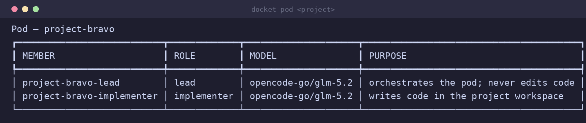
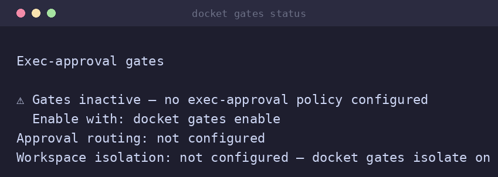
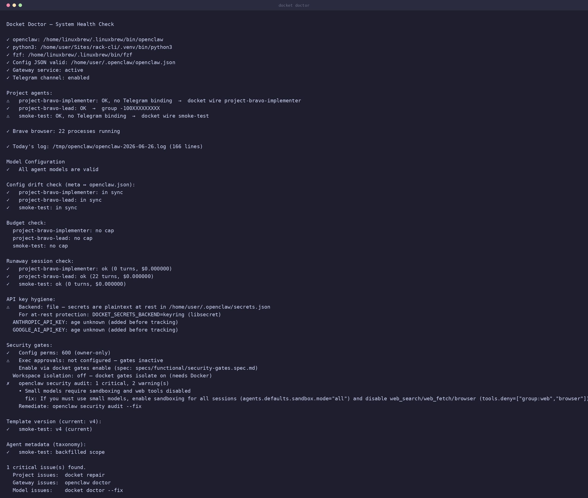

# docket — ops/control plane for OpenClaw agent fleets

[](https://github.com/yielab/docket/actions/workflows/ci.yml)
[](LICENSE)
[](https://www.python.org/)
[](specs/)

> **docket** is the ops/control plane for people running [OpenClaw](https://openclaw.dev) agents
> across multiple projects. It solves three problems the field has converged on as genuinely hard:
> **coordinated Lead-owned context** (the anti-fragility pattern vs solo-agent chaos),
> **per-project runtime-resource isolation** (disjoint workspaces, port ranges, and git worktrees
> per Implementer), and a **governance/HITL/audit spine** (approval gates, headless approval
> channel, full audit log, budget caps). One `docket` command keeps it all running.
>
> *An ops/control plane, not an agent framework (vs CrewAI/LangGraph/AutoGen) — and a
> governed multi-project fleet, not a solo personal assistant (vs raw OpenClaw).*

*Independent project. Not affiliated with or endorsed by OpenClaw or the OpenClaw Foundation.*

> [!WARNING]
> **Early-stage / beta software — use with care.** docket is under active development and has
> **not** reached a stable release. Every feature marked **✅ Working** below is implemented and
> covered by the automated suite (pytest + golden parity + `ruff`/`mypy --strict`), but
> **passing automated tests is not the same as being production-ready.** Most features have not
> yet had hands-on QA against real fleets, varied OpenClaw versions, or messy real-world edge
> cases. Expect rough edges, breaking changes between versions, and occasional gaps between the
> docs and actual behavior. **Verify anything important yourself before relying on it**, and treat
> every dollar figure as an estimate, not a bill (see [Cost reporting and its limits](#cost-reporting-and-its-limits)).

<p align="center">
  
</p>

<p align="center"><em>The whole loop in one terminal: <strong>provision → delegate → govern → keep healthy.</strong></em></p>

## Why

Running one OpenClaw agent is easy. Running a fleet across several projects surfaces three
problems the field treats as genuinely hard:

### 1 — Coordinated Lead-owned context

A **Lead** agent owns context, memory, and human communication for a project; **workers**
(Implementer, Reviewer, Tester) receive bounded tasks and report back. The Lead never edits
code. This is not multi-agent for its own sake — it is the separation of duties that turns
"an agent changed the code" into "a change was reviewed before it landed."

See **[Agent Teams (Pods)](docs/AGENT-TEAMS.md)**, the core reference.

### 2 — Per-project runtime-resource isolation

Three isolation layers, each independent:

- **Context**: each agent gets a session key (`agent:<id>:<project>`) — no cross-project memory
  bleed, even when two pods run the same model.
- **Runtime resources**: each pod gets a **non-overlapping port range** and a **scratch
  directory** (allocated once, freed on delete) so two projects can run dev servers and test
  databases simultaneously without colliding.
- **Git worktrees**: for repo pods the Implementer works in a dedicated `git worktree` on its
  own branch (`docket/<project>/<member-id>`) — the convergent isolation pattern every major
  coding-agent tool has landed on (Cursor, Codex, etc.). Falls back to the flat workspace
  gracefully when git is unavailable or the codebase isn't a repo.

### 3 — Governance / HITL / audit spine

docket's security model is **layered**: instruction-level constraints by default; enforced
tool-approval gates, a headless approval HTTP channel, Telegram approval routing, Docker
workspace isolation, and a full audit log are available opt-in (`docket gates enable`). Every
risky action can require human sign-off before it executes; the headless channel means CI jobs
and automation can vote without a Telegram account. Approvals fail closed on timeout.

---

**Everything else** (provisioning, health, cost guardrails) is operational tooling that keeps
this three-layer stack running reliably:

- **One-command provisioning**: `docket add` provisions a pod (Lead + Implementer by default);
  `docket add --from agents.yaml` provisions a declarative, version-controlled fleet.
- **Real pod dispatch**: `docket pod <project> dispatch` runs one full Lead → Implementer →
  Reviewer → Tester pipeline turn, budget-gated and traced. `docket serve --dispatch` drives
  every pod's queue in the background.
- **Config drift detection**: `docket doctor` and `docket maintain check` catch runaway loops,
  stale sessions, and autonomy regressions silently introduced by OpenClaw updates.
- **Budget guardrails**: per-agent USD cap that auto-pauses on breach (from the daemon's
  recorded spend, not a pricing estimate). A role→cheapest-adequate-model policy and
  `docket cost` reporting round it out.
- **Read API for dashboards**: `docket serve` exposes a versioned read-only API
  (`/status.json`, `/metrics`, `/health`) dashboards can consume. docket governs and keeps
  agents healthy; a purpose-built dashboard reads from it.

## Install

```bash
# Homebrew (macOS/Linux) — recommended
brew tap yielab/docket-cli https://github.com/yielab/docket
brew install docket-cli

# Or the install script
curl -fsSL https://raw.githubusercontent.com/yielab/docket/main/install.sh | bash

# Or from source
git clone https://github.com/yielab/docket.git
cd docket && ./install.sh   # installs to ~/.local; DOCKET_PREFIX to override

# Then bootstrap OpenClaw + the specialist team
docket install
```

```bash
uv pip install .   # or: pip install .  — then run `python -m docket --version`
```

> Installs to `~/.local` (no `sudo`); add `~/.local/bin` to `PATH` if it isn't already.

**Prerequisites:** Python 3.11+ · the [OpenClaw](https://openclaw.dev) daemon · `systemctl`
(degrades gracefully on macOS) · `bash` (launcher/installer only) · `fzf` (optional, interactive
picker). The package pulls in Typer, Rich, Pydantic, pydantic-settings, and filelock.

## 60-second tour

```bash
docket add myproject ~/code/myproject    # provision a pod (Lead + Implementer)
docket pod myproject                     # inspect pod members, roles, isolation details
docket pod myproject delegate "Add auth" # queue a task for the pod
docket pod myproject dispatch            # run Lead → Implementer pipeline once
docket list                              # see every agent, scope, and pod at a glance
docket doctor                            # fleet health: drift, runaway, stale sessions
docket gates status                      # governance posture: approval gates, audit log
docket profile myproject --budget 5      # cap spend; auto-pauses on breach
docket cost myproject                    # token usage + recorded dollar spend
```

That's the loop: **provision → delegate → dispatch → keep healthy → keep in budget.**

## See it in action

<table>
<tr>
<td width="50%">

**`docket pod <project>` — pod structure**



</td>
<td width="50%">

**`docket gates status` — governance posture**



</td>
</tr>
<tr>
<td width="50%">

**`docket doctor` — fleet health**



</td>
<td width="50%">

**`docket models` — role→model policy**


</td>
</tr>
</table>

> Screenshots are from a real run against a live OpenClaw install; project names are anonymized.

## How it relates to OpenClaw

OpenClaw already spawns and coordinates agents (`agents.md`, `@mention` delegation). docket
wraps OpenClaw to add the operational layer a fleet needs:

| Need | OpenClaw native | docket adds |
|------|-----------------|-------------|
| Spawn / coordinate agents | ✅ `agents.md`, `@mention` | (uses it) |
| One-command per-project pod provisioning | — | ✅ `docket add` (stack auto-detect) |
| Project isolation: session keys (no context leak) | partial | ✅ `agent:<id>:<project>` per pod member |
| Project isolation: runtime resources (ports + scratch) | — | ✅ disjoint port range + scratch dir per pod |
| Project isolation: git worktree per Implementer | — | ✅ dedicated branch + worktree; flat-workspace fallback |
| Pod pipeline dispatch (Lead → Implementer → Reviewer → Tester) | — | ✅ `docket pod <p> dispatch` / `serve --dispatch` |
| Declarative fleet from version-controlled YAML | — | ✅ `docket add --from` |
| Drift / health / runaway detection | — | ✅ `docket doctor` |
| Role → cheapest-adequate-model policy | manual | ✅ one-command repolicy |
| Per-agent USD budget cap + auto-pause | — | ✅ `docket profile <id> --budget` |
| Cost reporting (recorded spend + spike detection) | — | ✅ `docket cost [--history]` |
| Approval gates + headless channel + audit log (HITL) | — | ✅ opt-in; `GET/POST /approvals`, Telegram routing |
| Pre-merge verification gate | — | ✅ `verifyCmd` per pod; non-zero → task stays `pending` |
| Scheduled + webhook-triggered pod dispatch | — | ✅ `@every N` / `HH:MM` UTC + `POST /dispatch/<project>` |
| Workflow validate + dry-run plan | — | ✅ `docket workflow <id> validate/plan` |
| Versioned read API for dashboards | — | ✅ `/status.json` v1, `/metrics`, `/health` |

If a row isn't true for your setup, treat it as aspirational — honesty is the point of this table.

**vs agent frameworks (CrewAI/LangGraph/AutoGen):** docket is an ops/control plane — it does
not implement agent reasoning, tool use, or orchestration logic. That's the daemon's job.
docket governs, provisions, isolates, and monitors.

**vs raw OpenClaw:** OpenClaw gives you one agent at a time. docket adds the multi-project fleet
layer: structured pods, runtime isolation, a governance spine, and the operational tooling to
keep everything healthy at scale.

## Cost reporting and its limits

docket's cost numbers come in two flavors:

- **Recorded spend (trustworthy).** Dollar figures in `docket cost` and the budget cap come
  straight from OpenClaw's session usage logs — the daemon records what each call actually cost.
  This does not depend on any pricing table docket maintains, so the budget auto-pause fires on
  real money.
- **Comparative estimates (best-effort).** "What this would cost on a cheaper model" and role→model
  price labels are computed from a **hardcoded pricing table** (~13 models, snapshotted from a known
  OpenClaw catalog). Model prices change; treat these as estimates. Models not in the table show
  `n/a` for the estimate (recorded spend is still tracked). `docket cost` and `docket models` print
  the snapshot date so you can judge staleness. Override or extend in `~/.openclaw/docket-models.json`.

> [!IMPORTANT]
> **No figure docket prints is your provider's invoice.** Even "recorded spend" is an
> *accounting calculation* — it is what OpenClaw's usage logs report, derived from token counts
> and per-model rates. It will **not** match your provider's final bill exactly: prompt caching,
> minimum charges, rounding, taxes, free-tier credits, and provider-side pricing changes all
> drift the real number. Use docket's cost figures for **relative** decisions (which agent is
> expensive, when a run spikes, whether to auto-pause) — and always **reconcile against your
> provider's own billing dashboard** before treating any number as money owed.

Within those limits: the recorded-spend and budget-cap numbers track real usage and are what the
auto-pause fires on; treat model-to-model savings comparisons as directional only.

## Project Status

> **What the badges mean.** This is **beta** software. **✅ Working** means a feature is
> implemented and exercised by the automated test suite — *not* that it has been QA-hardened in
> production. Automated coverage catches regressions; it does not replace manual verification
> against your own OpenClaw install. **✅ Opt-in** means the same, for a feature that is off by
> default and must be turned on explicitly. Until a tagged stable release, assume each row still
> needs hands-on validation in your environment.

| Feature | Status | Notes |
|---------|--------|-------|
| Agent lifecycle (add/delete/maintain) | ✅ Working | Full CRUD via `docket maintain` |
| Session scoping & isolation | ✅ Working | Multi-project isolation via session keys |
| Runtime-resource isolation (ports + scratch) | ✅ Working | Disjoint port range + scratch dir per pod; freed on delete |
| Git worktree isolation for Implementers | ✅ Working | Dedicated branch + worktree per repo-pod Implementer; flat-workspace fallback |
| Project pods + org specialists | ✅ Working | Per-project pods (Lead + Implementer, optional Reviewer/Tester) + shared security/knowledge/manager |
| Pod pipeline dispatch | ✅ Working | `docket pod <p> dispatch` / `serve --dispatch` — budget-gated, traced, pod-local |
| Pre-merge verification gate | ✅ Working | `verifyCmd` per pod; non-zero → task stays `pending` + `verification_failed` trace event |
| Org Portfolio Manager | ✅ Working | Opt-in via `docket install --portfolio`; cross-pod fleet visibility (advisory) |
| Approval gates + headless channel | ✅ Opt-in | `GET/POST /approvals`, Telegram routing, Docker isolation, audit log — `docket gates enable` |
| Scheduled + webhook dispatch | ✅ Working | `@every N` / `HH:MM` UTC schedules + `POST /dispatch/<project>` webhook |
| Lobster workflow validate + plan | ✅ Working | `docket workflow <id> validate/plan` — structural lint + dry-run; daemon executes, not docket |
| Versioned read API | ✅ Working | `/status.json` v1 (pods, scope, budget, model), `/metrics` (Prometheus), `/health` |
| Cost tracking & budget caps | ✅ Working | Role→model policy, per-agent budget, runaway detection |
| API key management | ✅ Working | Centralized key distribution |
| CI pipeline | ✅ Working | GitHub Actions on every push/PR |
| Telegram integration | ✅ Working | Manual wire: create group, add bot, run `docket wire` |
| Secret storage backends | ✅ Working | `file` (0600 JSON, default) or `keyring` (libsecret) via `DOCKET_SECRETS_BACKEND` |
| Manager coordination | ✅ Working | Org task queue with delegation state machine; per-pod work runs via `docket pod <p> dispatch` |

## Concepts

**Agent teams are the heart of docket.** Everything else (isolation, cost guardrails, health
checks) exists to keep *teams of agents* running reliably. The separation of duties — **Lead
plans, Implementer writes, Reviewer/Tester gate** — turns "an agent changed the code" into "a
change was reviewed and validated before it landed." Full model in **[Agent Teams (Pods)](docs/AGENT-TEAMS.md)**.

- **Project pod** — each project is an isolated pod of project-scoped agents. `docket add`
  provisions a lean **Lead + Implementer** by default; add Reviewer/Tester/extra Implementers
  with `docket pod <project> add <role>` or `--pod full` / `--with`. The **Lead never edits
  code** — it plans, owns context/memory + human comms, and dispatches work. Every member has
  its own permission-locked workspace (`700`/`600`) with `SOUL.md`, `AGENTS.md`,
  `HEARTBEAT.md`, `.docket-meta.json`, and a `memory/` log.
- **Real dispatch** — `docket pod <id> dispatch` runs one complete pipeline turn (Lead →
  Implementer → Reviewer if present → Tester if present), budget-gated, traced, and
  **pod-local** — never crosses pod boundaries. `docket serve --dispatch` drives all pods
  continuously from the background.
- **Pre-merge verification** — if a pod has `verifyCmd` set, the dispatch pipeline runs it in
  the Implementer's workspace after each Implementer hop. Non-zero exit leaves the task
  `pending` and emits a `verification_failed` trace event; tasks never silently auto-close.
- **Org specialists** — `security`, `knowledge`, and `manager` are created once by `docket install`
  and shared across the fleet (`scope: org`). An optional org **Portfolio Manager**
  (`docket install --portfolio`) adds cross-pod fleet visibility — advisory only, never a pod member.
- **Session key** (`agent:<id>:<project>`) — the isolation primitive; prevents cross-project
  contamination and enables parallel work. Change with `docket scope <id> set <key>`.
- **Role→model policy** — each role maps to the cheapest adequate model; change a role once and
  every policy-following agent re-resolves. Pin one agent with `docket profile`.
- **Lobster workflow** — deterministic YAML pipelines for repeatable, token-efficient runs.

Configuration is kept in two synchronized places: `.docket-meta.json` per workspace (docket's
view) and `~/.openclaw/openclaw.json` (the daemon's view).

## Command reference

<details>
<summary><strong>Core lifecycle</strong></summary>

```bash
docket install              # Bootstrap OpenClaw + org specialists (security, knowledge, manager)
docket install --portfolio  # + optional org Portfolio Manager (cross-pod fleet visibility)
docket add [id] [path]      # Create a project pod (Lead + Implementer; --pod full / --with for more)
docket add --from spec.yaml # Provision a fleet from a YAML/JSON spec (declarative)
docket pod <id>             # Inspect a pod; `pod <id> add <role>` / `remove <member>` to resize
docket list                 # Show all agents (scope + pod)
docket info <id>            # Display agent details
docket delete <id>          # Remove an agent or a whole pod
```
</details>

<details>
<summary><strong>Cost & configuration</strong></summary>

```bash
docket models               # Role→model policy (set <role> <model>, preset, reset)
docket profile <id> [model] # Pin an agent's model (<provider/model>) or 'default' = follow policy
docket profile <id> --budget 5  # Set a $5 spending cap (auto-pause on breach)
docket scope <id> set <key> # Change project session key
docket keys                 # Manage API keys
docket cost [id]            # Token usage and costs (--json, --history [--days N])
```
</details>

<details>
<summary><strong>Maintenance & health</strong></summary>

```bash
docket maintain [id] check    # Health check and auto-fix
docket maintain [id] clean    # Clear memory logs
docket maintain [id] reset    # Clear memory + heartbeat
docket maintain [id] rebuild  # Full rebuild from metadata
docket maintain [id] sessions # Archive large/old sessions
docket doctor                 # System-wide diagnostics (budget, drift, runaway, gates)
```
</details>

<details>
<summary><strong>Pod dispatch & task queue</strong></summary>

```bash
docket pod <id>                          # Inspect pod members, roles, isolation details
docket pod <id> add <role>               # Grow the pod (reviewer, tester, or a second implementer)
docket pod <id> remove <member-id>       # Remove one pod member
docket pod <id> delegate "Fix login bug" # Queue a task (--priority high)
docket pod <id> queue                    # Show pending tasks + per-task status/cost
docket pod <id> dispatch                 # Run the pod pipeline once (Lead→Implementer→Reviewer→Tester)
docket serve --dispatch                  # Background: drive every pod's queue continuously
```
</details>

<details>
<summary><strong>Security gates (opt-in)</strong></summary>

```bash
docket gates status           # Approval gate state, routing, isolation, audit posture
docket gates enable           # Apply exec-approval gates + allowlist + chat routing
docket gates isolate on       # Confine tool execution to a per-agent Docker sandbox
docket gates disable          # Revert gate defaults
docket install --gates        # Apply gates during initial install
```
</details>

<details>
<summary><strong>Context, workflows & observability</strong></summary>

```bash
docket context [id]              # Recent activity overview
docket context [id] search <q>   # Search indexed memory
docket context [id] snapshot     # Create SNAPSHOT.md for fast agent context
docket context [id] compress     # Archive logs older than 30 days

docket workflow <id> create <name>   # Create a Lobster pipeline template
docket workflow <id> validate <name> # Structural lint — returns errors or "valid"
docket workflow <id> plan <name>     # Dry-run: render the resolved steps

docket pod <project> delegate "Fix bug" # Queue task for that project's pod (--priority high)
docket pod <project> queue              # Show the pod's pending tasks
docket pod <project> dispatch           # Run the pod's pending tasks through the pipeline

docket serve                      # Start read-only HTTP server (/status.json, /metrics, /health)
docket serve --dispatch           # + drive all pod queues in the background
```
</details>

### Role→model policy & provider support

Each agent **role** maps to the cheapest adequate model — the policy — and you can override any role:

| Role | Default (Anthropic) | Why |
| ---- | ------------------- | --- |
| manager, reviewer, tester, knowledge | claude-haiku-4-5 | High-volume, low reasoning-density |
| programmer, security | claude-sonnet-4-6 | Reasoning-dense work |
| repo / task (project agents) | sonnet / haiku | Project-agent type defaults |

Stronger models (opus-class) are an explicit per-agent pin, never a default. Changing the
policy (or switching provider preset) re-resolves every policy-following agent automatically.

```bash
docket models preset openrouter-free   # All roles to OpenRouter free tier
docket models preset openai            # OpenAI (gpt-4.1-nano / gpt-4.1-mini)
docket models preset google            # Google (gemini flash family)
docket models preset anthropic         # Restore Anthropic defaults
docket models set programmer openai/gpt-4.1          # Override one role
docket profile myproject anthropic/claude-opus-4-6   # Pin one agent
docket profile myproject default       # Re-attach to role policy
```

## Engineering: spec-driven development

docket is where I practice spec-driven development: write the specification before the
implementation, use RFC 2119 keywords (MUST/SHOULD/MAY) to make requirements testable, and
measure real coverage. Specs cover the core lifecycle and expand outward.

```bash
./scripts/validate-specs.sh    # Validate spec structure/completeness (blocking in CI)
./scripts/metrics.py --check   # Verify README's quoted numbers match the tree (blocking in CI)
```

See [specs/README.md](specs/README.md) for the SSD documentation and
[CONTRIBUTING.md](CONTRIBUTING.md) for how to add a command.

### By the numbers

- **~13,171 lines** of Python in the shipped `docket` package (`src/docket/`)
- **747 tests** in the pytest suite (`tests/python/`) + a **16-case golden parity suite**
  (`tests/golden/run.sh verify-all`, byte-for-byte against frozen output) + specialist-role evals
- Real lint/format/type gates: `ruff` + `mypy --strict`, all enforced in CI
- **17 specifications** (RFC 2119), validated in CI

```bash
uv run pytest                                        # 747-test Python suite
uv run ruff check . && uv run ruff format --check .  # lint + format
uv run mypy src                                      # strict type check
bash tests/golden/run.sh verify-all                  # 16-case byte-parity suite
./tests/evals/run-evals.sh                           # specialist-role evals
```

## Security

docket manages autonomous agents that can execute commands. Its safety model is **layered**:
agent-level constraints are instruction-based by default, and enforced tool-approval gates,
Telegram approval routing, and Docker workspace isolation are available **opt-in** via
`docket gates enable` / `docket gates isolate on` (or `docket install --gates`).

**Where you run docket matters.** A trusted homelab is a very different risk profile from a
public VPS — see [SECURITY.md](SECURITY.md) for the homelab-vs-VPS guidance, the privilege and
approval-gate model, what docket does and does **not** protect against, secret-storage backends
(keyring vs 0600 JSON), and the responsible-disclosure policy.

## Compatibility

docket tracks the current OpenClaw release line and the v1 `openclaw.json` schema.

| docket-cli | Tested OpenClaw | `openclaw.json` schema | Notes |
|------------|-----------------|------------------------|-------|
| 0.1.x | current release line (2026.x) | v1 | Manual verification; no version pin yet |

See [COMPATIBILITY.md](COMPATIBILITY.md) for the policy and how breaks are tracked.

## What's next

See [ROADMAP.md](ROADMAP.md) for the full phased plan. Near-term priorities:

1. Expand the eval harness (`tests/evals/`) and feed results into model right-sizing
2. Run integration tests in CI; promote the macOS job to a required check
3. CI-test against pinned OpenClaw versions (auto-issue on schema break)
4. Consider turning security gates on by default — headless approval channel is now
   available (Phase 11 CD-4); the flip itself is a separate, explicit decision

## Contributing

Python package with a three-layer architecture (`cli/` → `core/` → `edges/`), where
`edges/adapters/openclaw.py` is the Anti-Corruption Layer — the only module that knows the
OpenClaw file formats. See [CONTRIBUTING.md](CONTRIBUTING.md) for dev setup (`uv`), the
SSD/spec-first flow, code style (`ruff` + `mypy --strict`), and how to add a command. PRs
welcome for OpenClaw integrations, command implementations, test coverage, and docs.

## License

Apache 2.0 — see [LICENSE](LICENSE).
