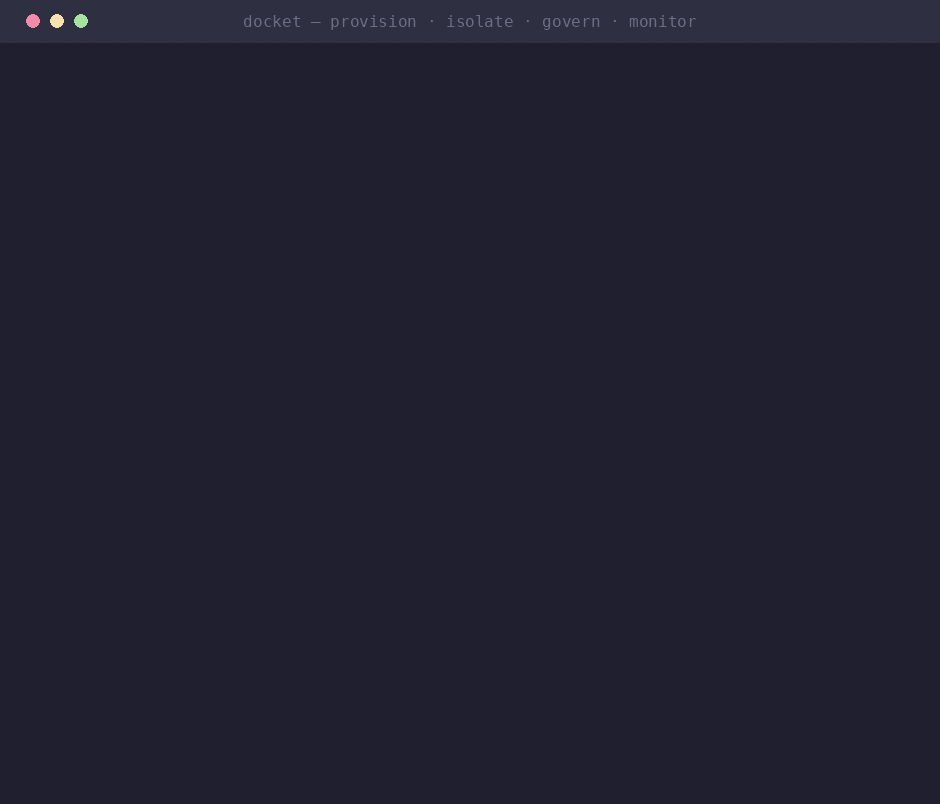
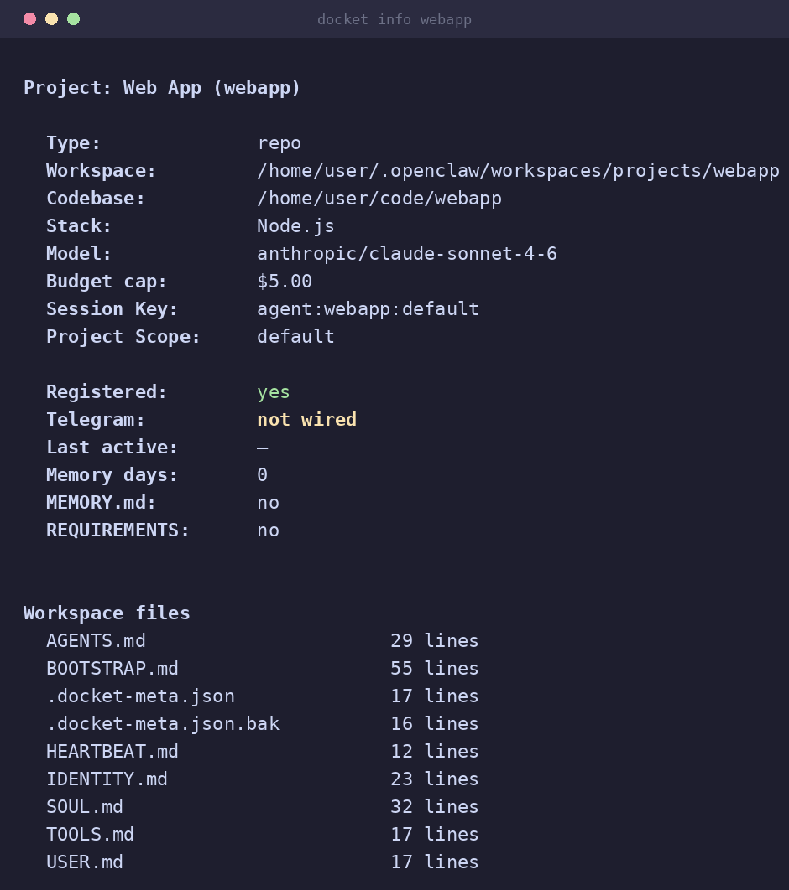
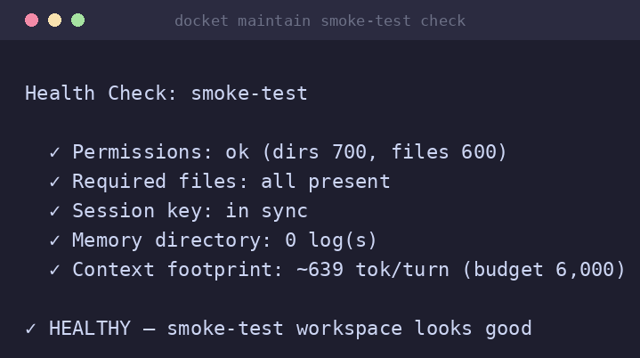
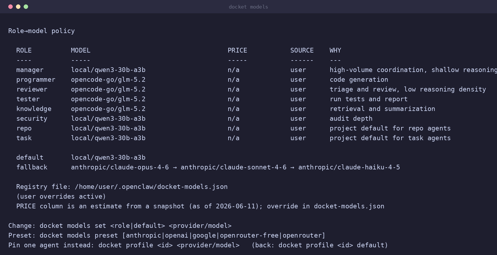

# docket-cli — provision & isolate OpenClaw agent fleets across projects

[](https://github.com/yielab/docket/actions/workflows/ci.yml)
[](LICENSE)
[](https://www.python.org/)
[](specs/)

> Spin up the agents you need for every project — each one properly isolated — in one command.
> **docket** is a Python CLI (Typer + Rich + Pydantic) that provisions per-project
> [OpenClaw](https://openclaw.dev) agents with hard context isolation, keeps them healthy with
> drift detection, and adds budget guardrails so a runaway agent can't quietly bankrupt you.
> The ops layer for people running more than one agent.

*Independent project. Not affiliated with or endorsed by OpenClaw or the OpenClaw Foundation.*

<p align="center">
  
</p>

<p align="center"><em>The whole loop in one terminal: <strong>provision → isolate → keep healthy → keep in budget.</strong></em></p>

## Why

Running one OpenClaw agent is easy. Running a fleet across several projects surfaces three
problems OpenClaw doesn't solve for you:

- **A lone agent isn't a team.** Shipping non-trivial software with agents benefits from the
  same separation of duties a human team has — someone who plans and talks to people, someone who
  writes the code, someone who reviews it, someone who tests it. docket makes that structure
  first-class: each project is an isolated **pod** (Lead plans, Implementer writes,
  Reviewer/Tester gate) and a few **org specialists** are shared across the fleet. That
  separation of duties is what turns "an agent changed the code" into "a change was reviewed
  before it landed" — see **[Agent Teams (Pods)](docs/AGENT-TEAMS.md)**, the core reference.
- **Per-project provisioning is manual and repetitive.** Each project needs its own agent with
  the right workspace, stack detection, memory, and scope. docket bootstraps a properly
  configured project pod in one command (`docket add`, or `docket add --from agents.yaml` for
  a declarative, version-controlled fleet) plus a shared specialist team via `docket install`.
- **Context leak across projects.** One agent's memory bleeding into another's is the
  "noisy neighbor" problem. docket assigns each agent a session key (`agent:<id>:<project>`)
  so memory and context stay hard-isolated per project.
- **Config drift.** OpenClaw updates and autonomy regressions silently change behavior.
  `docket doctor` and `docket maintain check` detect drift, runaway loops, and stale sessions.

And one guardrail so autonomy doesn't get expensive: every agent can carry a per-agent USD
**budget cap** that auto-pauses it on breach, computed from the daemon's actual recorded spend.
A role→cheapest-adequate-model policy and `docket cost` reporting round it out. (Dollar figures
are read from real session usage; comparative *estimates* depend on a pricing table — see
[cost reporting caveats](#cost-reporting-and-its-limits).)

## Install

```bash
# Homebrew (macOS/Linux) — recommended
brew tap yielab/docket-cli https://github.com/yielab/docket
brew install docket-cli

# Or the install script (review it before piping to a shell)
curl -fsSL https://raw.githubusercontent.com/yielab/docket/main/install.sh | bash

# Or from source
git clone https://github.com/yielab/docket.git
cd docket && ./install.sh            # installs to ~/.local by default; DOCKET_PREFIX to override

# Then bootstrap OpenClaw + the specialist team
docket install
```

`./install.sh` copies the thin `bin/docket` launcher and installs the `docket` Python package
(via `uv pip` when available, else `pip --user`). To install the package directly without the
launcher script:

```bash
uv pip install .        # or: pip install .   — then run `python -m docket --version`
```

> Installs to `~/.local` (no `sudo`); add `~/.local/bin` to `PATH` if it isn't already. The old
> `sudo ln -s` symlink method is retired.

**Prerequisites:** Python 3.11+ · the [OpenClaw](https://openclaw.dev) daemon · `systemctl`
(service management; degrades gracefully on macOS) · `bash` (only to run the launcher/installer) ·
`fzf` (optional, interactive picker). The `docket` package pulls in Typer, Rich, Pydantic,
pydantic-settings, and filelock.

## 60-second tour

```bash
docket add myproject ~/code/myproject   # provision an isolated project pod (Lead + Implementer)
docket pod myproject add reviewer       # grow the pod when you want review/tests
docket list                             # see every agent, its scope, and its pod at a glance
docket info myproject                   # workspace, codebase, session key, model
docket doctor                           # fleet health: drift, runaway, stale sessions
docket profile myproject --budget 5     # optional guardrail: cap spend; auto-pauses on breach
docket cost myproject                   # token usage + recorded dollar spend
```

That's the loop docket is built around: **provision → isolate → keep healthy → keep in budget.**

## See it in action

The core loop is provisioning isolated agents and keeping the fleet healthy.

<table>
<tr>
<td width="33%">

**`docket info <id>` — isolation**



</td>
<td width="33%">

**`docket maintain <id> check` — health & auto-fix**



</td>
<td width="33%">

**`docket models` — role→model policy**



</td>
</tr>
</table>

> Screenshots are from a real run against a live OpenClaw install; project names are anonymized.
> The budget guardrail (`docket cost`, `docket profile --budget`) is documented under
> [Cost reporting and its limits](#cost-reporting-and-its-limits) — intentionally not the headline.

## How it relates to OpenClaw

OpenClaw already spawns and coordinates agents (`agents.md`, `@mention` delegation). docket does
**not** reinvent that — it wraps OpenClaw to add the operational layer a fleet needs:

| Need | OpenClaw native | docket adds |
|------|-----------------|-----------|
| Spawn / coordinate agents | ✅ `agents.md`, `@mention` | (uses it) |
| One-command per-project agent provisioning | — | ✅ `docket add` (stack auto-detect) |
| Project isolation (no context leak) | partial | ✅ session keys |
| Declarative fleet from version-controlled YAML | — | ✅ `docket add --from` |
| Drift / health / runaway detection | — | ✅ `docket doctor` |
| Role → cheapest-adequate-model policy | manual | ✅ one-command repolicy |
| Per-agent USD budget cap + auto-pause | — | ✅ `docket profile <id> --budget` |
| Cost reporting (recorded spend + spike detection) | — | ✅ `docket cost [--history]` |

If a row isn't genuinely true for your setup, treat it as aspirational — honesty is the point
of this table.

## Cost reporting and its limits

docket's cost numbers come in two flavors, and they are not equally reliable:

- **Recorded spend (trustworthy).** The dollar figures in `docket cost` and the per-agent budget
  cap come straight from OpenClaw's own session usage logs — the daemon records what each call
  actually cost. This does **not** depend on any pricing table docket maintains, so the budget
  auto-pause fires on real money.
- **Comparative estimates (best-effort).** "What this would cost on a cheaper model" and the
  role→model price labels are computed from a **hardcoded pricing table** (in the `docket` package,
  ~13 models across Anthropic/OpenAI/Google, snapshotted from a known OpenClaw catalog).
  Model prices change and new models appear, so treat these as estimates, not quotes. Models not
  in the table show `n/a` for the estimate (their *recorded* spend is still tracked). `docket cost`
  and `docket models` print the snapshot date so you can judge staleness. You can override or
  extend prices in `~/.openclaw/docket-models.json` (`pricing` key).

In short: trust the recorded-spend and budget-cap numbers; treat model-to-model savings
comparisons as directional.

## Project Status

| Feature | Status | Notes |
|---------|--------|-------|
| Agent lifecycle (add/delete/maintain) | ✅ Working | Full CRUD via `docket maintain` |
| Session scoping & isolation | ✅ Working | Multi-project isolation via session keys |
| Project pods + org specialists | ✅ Working | Per-project pods (Lead + Implementer, optional Reviewer/Tester) + shared security/knowledge/manager |
| Pod pipeline dispatch | ✅ Working | `docket pod <p> dispatch` / `serve --dispatch` runs Lead→Implementer→Reviewer→Tester, one real costed turn per hop — budget-gated, traced, pod-local |
| Org Portfolio Manager | ✅ Working | Opt-in via `docket install --portfolio`; cross-pod planning/visibility over fleet metadata (advisory, never a pod member) |
| Lobster workflow integration | ✅ Working | YAML pipeline support |
| Cost tracking & budget caps | ✅ Working | Role→model policy, per-agent budget, runaway detection |
| API key management | ✅ Working | Centralized key distribution |
| CI pipeline | ✅ Working | GitHub Actions on every push/PR |
| Telegram integration | ✅ Working | Manual wire: create group, add bot, run `docket wire` |
| Security gates | ✅ Opt-in | Exec-approval enforcement + curated allowlist, Telegram approval routing, and Docker workspace isolation via `docket gates enable` / `isolate`; status in `docket doctor`. Opt-in by design (on-by-default pending headless approval routing) |
| Secret storage backends | ✅ Working | `file` (0600 JSON, default) or `keyring` (libsecret, no plaintext at rest) via `DOCKET_SECRETS_BACKEND` |
| Manager coordination | ✅ Working | Org task queue with a full delegation state machine (`docket team delegate` → queue → start → done); per-pod work runs through `docket pod <p> dispatch` |

## Concepts

**Agent teams are the heart of docket** — everything else (isolation, cost guardrails, health
checks) exists to keep *teams of agents* running reliably across many projects. The separation of
duties — **Lead plans, Implementer writes, Reviewer/Tester gate** — is what turns "an agent
changed the code" into "a change was reviewed and validated before it landed." The full model is
in **[Agent Teams (Pods)](docs/AGENT-TEAMS.md)**, the core reference.

- **Project pod** — each project is an isolated pod of project-scoped agents (`docket add`
  provisions a lean **Lead + Implementer** by default; add Reviewer/Tester/extra Implementers
  with `docket pod <project> add <role>` or `--pod full` / `--with`). The **Lead never edits
  code** (it plans, owns context/memory + human comms, and dispatches work); the **Implementer
  runs in the workspace and writes the code**. Every member has its own permission-locked
  workspace (`700`/`600`) with `SOUL.md` (identity + session key), `AGENTS.md`, `HEARTBEAT.md`,
  `.docket-meta.json`, and a `memory/` log — so no role is shared across projects.
- **Real dispatch** — docket actually runs a pod's pipeline, one real costed agent turn per hop:
  Lead → Implementer → Reviewer (if present) → Tester (if present). `docket pod <id> delegate`
  queues a task, `docket pod <id> dispatch` runs it once, and `docket serve --dispatch` drives
  every pod's queue in the background. Each dispatch is budget-gated, traced, and **pod-local
  (no cross-pod path)** — and always explicit/opt-in, never silent.
- **Org specialists** — `security`, `knowledge`, and `manager`, created once by `docket install`
  and shared across the fleet (genuinely cross-cutting; `scope: org`). An optional org
  **Portfolio Manager** (`docket install --portfolio`) adds a cross-pod planning/visibility
  surface over fleet *metadata* — advisory only, never a pod member, and it never edits code.
- **Session key** (`agent:<id>:<project>`) — the isolation primitive; prevents cross-project
  contamination and enables parallel work. Change with `docket scope <id> set <key>`.
- **Role→model policy** — each role maps to the cheapest adequate model; change a role once and
  every policy-following agent re-resolves. Pin one agent with `docket profile`.
- **Lobster workflow** — deterministic YAML pipelines for repeatable, token-efficient runs.

Configuration is kept in two synchronized places: `.docket-meta.json` per workspace (docket's
view) and `~/.openclaw/openclaw.json` (the OpenClaw daemon's view).

## Command reference

<details>
<summary><strong>Core lifecycle</strong></summary>

```bash
docket install              # Bootstrap OpenClaw + org specialists (security, knowledge, manager)
docket install --portfolio  # + an optional org Portfolio Manager (cross-pod planning/visibility)
docket add [id] [path]      # Create a project pod (Lead + Implementer; --pod full / --with for more)
docket add --from spec.yaml # Provision a fleet from a YAML/JSON spec (declarative)
docket pod <id>             # Inspect a pod; `pod <id> add <role>` / `remove <member>` to resize
docket list                 # Show all agents (scope + pod)
docket info <id>            # Display agent details
docket delete <id>          # Remove an agent or a whole pod
```
</details>

<details>
<summary><strong>Cost & configuration</strong></summary>

```bash
docket models               # Role→model policy (set <role> <model>, preset, reset)
docket profile <id> [model] # Pin an agent's model (<provider/model>) or 'default' = follow policy
docket profile <id> --budget 5  # Set a $5 spending cap (auto-pause on breach)
docket scope <id> set <key> # Change project session key
docket keys                 # Manage API keys
docket cost [id]            # Token usage and costs (--json, --history [--days N])
```
</details>

<details>
<summary><strong>Maintenance & health</strong></summary>

```bash
docket maintain [id] check    # Health check and auto-fix
docket maintain [id] clean    # Clear memory logs
docket maintain [id] reset    # Clear memory + heartbeat
docket maintain [id] rebuild  # Full rebuild from metadata
docket maintain [id] sessions # Archive large/old sessions
docket doctor                 # System-wide diagnostics (budget, drift, runaway, gates)
```
</details>

<details>
<summary><strong>Security gates (opt-in)</strong></summary>

```bash
docket gates status           # Exec-approval policy, routing, isolation, audit posture
docket gates enable           # Apply approval gates + curated allowlist + chat routing
docket gates isolate on       # Confine tool execution to a per-agent Docker sandbox
docket gates disable          # Revert gate defaults (escape hatch)
docket install --gates        # Apply gates during install
```
</details>

<details>
<summary><strong>Context, team & workflows</strong></summary>

```bash
docket context [id]              # Recent activity overview
docket context [id] search <q>   # Search indexed memory
docket context [id] snapshot     # Create SNAPSHOT.md for fast agent context
docket context [id] compress     # Archive logs older than 30 days

docket pod <id> delegate "Fix login bug"  # Queue a task for the project pod (--priority high)
docket pod <id> queue                   # Show the pod's queue + per-task status/cost
docket pod <id> dispatch                # Run the pod pipeline once (Lead→Implementer→Reviewer→Tester)
docket serve --dispatch                 # Background: drive every pod's queue (opt-in; plain serve is read-only)

docket team delegate "Fix login bug"   # Queue task for the org manager (--priority high)
docket team queue                       # Show pending tasks
docket team done <task-id>              # Mark task complete

docket workflow <id> create <name>      # Create a Lobster pipeline
```
</details>

### Role→model policy & provider support

docket is provider-agnostic. Each agent **role** maps to the cheapest model adequate for its
workload — that mapping is the policy, and you can override any role:

| Role | Default (Anthropic) | Why |
| ---- | ------------------- | --- |
| manager, reviewer, tester, knowledge | claude-haiku-4-5 | High-volume, low reasoning-density work |
| programmer, security | claude-sonnet-4-6 | Reasoning-dense generation and audits |
| repo / task (project agents) | sonnet / haiku | Project-agent type defaults |

Stronger models (opus-class) are an explicit per-agent pin, never a standing default. Changing
the policy (or switching provider preset) re-resolves every policy-following agent
automatically — pinned agents are never touched.

```bash
docket models preset openrouter-free   # All roles to OpenRouter free tier (no cost)
docket models preset openai            # OpenAI (gpt-4.1-nano / gpt-4.1-mini)
docket models preset google            # Google (gemini flash family)
docket models preset anthropic         # Restore Anthropic defaults
docket models set programmer openai/gpt-4.1          # Override one role
docket profile myproject anthropic/claude-opus-4-6   # Pin one agent
docket profile myproject default       # Re-attach the agent to its role policy
```

The old tier names (economy/standard/premium) are deprecated but still accepted with a
warning. Custom pricing can be added in `~/.openclaw/docket-models.json`.

## Engineering: spec-driven development

docket is where I practice spec-driven development as a discipline: write the specification for a
feature before the implementation, use RFC 2119 keywords (MUST/SHOULD/MAY) to make requirements
testable, and measure how much of the codebase is actually covered. The rollout is in progress —
specs cover the core lifecycle today and are extended outward.

```bash
./scripts/validate-specs.sh    # Validate spec structure/completeness (blocking in CI)
./scripts/spec-coverage.sh     # Report command/feature/test coverage (informational)
```

`spec-coverage.sh` reports **100% command coverage (25/25), 100% feature coverage (10/10),
100% of tracked specs test-backed**. "Covered" means a feature has a structured, validated
spec — not that every feature is fully built (e.g. `security-gates` is specified and shipped
opt-in). The tooling reports honestly, so the number reflects real specs.

See [specs/README.md](specs/README.md) for the full SSD documentation and
[CONTRIBUTING.md](CONTRIBUTING.md) for how to add a command.

### By the numbers

- **~12,700 lines** of Python in the shipped `docket` package (`src/docket/`)
- The full command surface from the Bash era — every command and alias is preserved
  (run `docket help` for the live list)
- **491 tests** in the pytest suite (`tests/python/`) + a **17-case golden parity suite**
  (`tests/golden/run.sh verify-all`, byte-for-byte against frozen output) + specialist-role evals
- Real lint/format/type gates: `ruff` + `mypy --strict`, all enforced in CI
- **16 specifications** (RFC 2119), validated in CI

```bash
uv run pytest                      # 491-test Python suite
uv run ruff check . && uv run ruff format --check .   # lint + format
uv run mypy src                    # strict type check
bash tests/golden/run.sh verify-all   # 17-case byte-parity suite
./tests/evals/run-evals.sh         # specialist-role evals
```

## Security

docket manages autonomous agents that can execute commands. Its safety model is **layered**:
agent-level constraints are instruction-based by default, and enforced tool-approval gates,
Telegram approval routing, and Docker workspace isolation are available **opt-in** via
`docket gates enable` / `docket gates isolate on` (or `docket install --gates`).

**Where you run docket matters.** A trusted homelab is a very different risk profile from a
public VPS — see [SECURITY.md](SECURITY.md) for the homelab-vs-VPS guidance, the privilege and
approval-gate model, what docket does and does **not** protect against, secret-storage backends
(keyring vs 0600 JSON), and the responsible-disclosure policy.

## Compatibility

docket tracks the current OpenClaw release line and the v1 `openclaw.json` schema. It is not yet
pinned to or CI-tested against specific OpenClaw versions — automated weekly compatibility
testing is a tracked roadmap item.

| docket-cli | Tested OpenClaw | `openclaw.json` schema | Notes |
|----------|-----------------|------------------------|-------|
| 0.1.x    | current release line (developed against the 2026.x line) | v1 | Manual verification; no version pin yet |

See [COMPATIBILITY.md](COMPATIBILITY.md) for the policy and how breaks are tracked.

## What's next

See [ROADMAP.md](ROADMAP.md) for the full phased plan. Near-term highlights:

1. Expand the eval harness (`tests/evals/`) and feed results into model right-sizing
2. Run integration tests in CI; promote the macOS job to a required check
3. Turn security gates on by default once headless approval routing lands
4. CI-test against pinned OpenClaw versions (auto-issue on schema break)

## Contributing

Python package with a three-layer architecture (`cli/` → `core/` → `edges/`), where
`edges/adapters/openclaw.py` is the Anti-Corruption Layer — the only module that knows the
OpenClaw file formats. See [CONTRIBUTING.md](CONTRIBUTING.md) for dev setup (`uv`), the
SSD/spec-first flow, code style (`ruff` + `mypy --strict`), and how to add a command. PRs welcome
for OpenClaw integrations, command implementations, test coverage, and docs.

---

*Built and run by Santiago Yie — an 18-year-old backend engineer — to manage his own OpenClaw
fleets, and as a deliberate exploration of spec-driven development, a clean-architecture Python
CLI (Typer + Pydantic, with an Anti-Corruption Layer at the I/O boundary), and cost-aware
multi-agent operations. The "docket" name is OpenClaw-anchored on every public surface;
a searchable rename (e.g. `clawfleet`) is a tracked, deferred decision (see ROADMAP).*

## License

Apache 2.0 — see [LICENSE](LICENSE).
