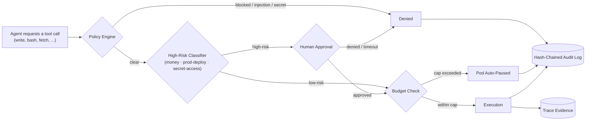

# docket — governance for autonomous coding agents

[](https://github.com/yielab/docket/actions/workflows/ci.yml)
[](LICENSE)
[](https://www.python.org/)
[](specs/)

**docket is a governance layer for AI coding agents.** It sits between an agent's decision and its
execution, and enforces policy, approval, and budget on every tool call — every file write, shell
command, and API request — before that call runs.

Multi-agent frameworks (LangGraph, CrewAI, AutoGen) solve orchestration: who calls whom, in what
order. They do not solve control. Each of them **owns the agent's turn loop**, which is the only
place a guardrail can intercept a tool call before it executes — and none of them guarantee that
interception happens. **docket owns the turn loop for that reason.** There is no second path
underneath it that a tool call can take to reach a shell or an API unchecked.

> [!WARNING]
> docket is beta software (`v0.2.0-beta.2`). Core contracts are spec-first and test-backed, but the
> project has not been hardened against large fleets or adversarial public-host workloads. Expect
> breaking changes between beta releases and verify consequential outcomes yourself.

<p align="center">
  
</p>

## How a tool call is gated

Every action an agent takes flows through one fixed pipeline. There is no configuration that
bypasses it — `docket gates enable/disable` changes where an `ask` verdict is *routed*, not whether
the pipeline runs.


```mermaid
flowchart LR
    A["Agent requests a tool call\n(write, bash, fetch, ...)"] --> B{"Policy Engine"}
    B -- "blocked / injection / secret" --> X["Denied"]
    B -- "clear" --> C{"High-Risk Classifier\n(money · prod-deploy · secret-access)"}
    C -- "high-risk" --> D{"Human Approval"}
    C -- "low-risk" --> E{"Budget Check"}
    D -- "approved" --> E
    D -- "denied / timeout" --> X
    E -- "cap exceeded" --> F["Pod Auto-Paused"]
    E -- "within cap" --> G["Execution"]
    X --> H[("Hash-Chained Audit Log")]
    F --> H
    G --> H
    G --> I[("Trace Evidence")]
```

This is `core/tools.py`'s `dispatch_tool` chokepoint. Every built-in tool and every MCP-registered
external tool passes through it — there is no code path that reaches a handler another way.

## Core guarantees

What this buys a CTO or CISO evaluating whether to let agents touch a real codebase:

- **Fail-closed, not fail-open.** An unrouted approval denies itself after 120 seconds; an async
  pod-dispatch approval denies after 15 minutes. If isolation is enabled but no sandbox backend is
  reachable, the turn is **refused outright** — it never falls back to running unsandboxed.
- **Tamper-evident audit trail.** Every policy verdict, approval decision, and tool execution is
  written to a hash-chained JSONL log, regardless of which channel (CLI, HTTP, MCP, Telegram) made
  the decision. `docket audit verify` detects a broken chain.
- **Deterministic budget control.** Per-agent USD caps (`docket profile <id> --budget`) auto-pause a
  pod the moment it's reached — new tasks are left `blocked`, never silently retried against a
  cheaper path.
- **Structural role boundaries.** A Reviewer has no `write`/`edit`/`bash` tool in its registry at
  all — not a prompt telling it not to use them. A compromised diff has no tool call to make even if
  it convinced the model to try.

## Cost control

- **Per-agent spend caps** that auto-pause a pod instead of degrading silently.
- **Measured token counts**, not estimates — `core.llm.TokenUsage` records real usage; dollar
  figures are a clearly labelled estimate from a local pricing snapshot, never conflated with actual
  spend.
- **Explicit dispatch only.** No background token spend from a queued task — `docket pod <id>
  dispatch` or an authenticated `POST /dispatch/<project>` triggers a paid run; nothing else does.
- **Role-based model routing.** Cheap models for planning roles (Lead), stronger models only where
  code generation happens (Implementer) — configured once via `docket models`.

## Code security

- **One tool chokepoint, no exceptions.** `dispatch_tool` is AST-tested as the sole path a tool call
  can take; a second execution path is treated as a defect, not a feature.
- **Role-scoped tool allowlists.** Tools are removed from a role's registry *before* the model ever
  sees them — Lead has no `write`/`edit`/`bash`; Reviewer is read-only; Implementer alone can change
  code.
- **Argument-aware command classification.** The high-risk classifier reads the full command line,
  including every segment behind `;`, `&&`, `||`, or a pipe, so `git push origin production` is
  caught even though `git status` stays on the allowlist.
- **Domain-allowlisted network egress.** The `fetch` tool denies by default; nothing reaches an
  unlisted domain through it.
- **Opt-in sandboxing.** `docket gates isolate on` runs shell commands inside Docker or bwrap, and
  fails closed if the backend isn't actually available.

## Audit & evidence

- **Every decision is queryable afterward** — task, run, approval, and token count, not just the
  final answer.
- **Hash-chained audit log** covering CLI, HTTP, MCP, and Telegram approval channels alike, each
  entry tagged with the channel that decided.
- **Durable task ledger per pod** (`HEARTBEAT.md`), mechanically kept in sync at claim/hop/finalize,
  so the record survives a context reset even if the agent wrote nothing itself.
- **Crash and recovery evidence.** A corrupt docket-owned JSON file recovers from its validated
  backup without overwriting the good copy — see [Adoption evidence](docs/ADOPTION-EVIDENCE.md) for
  reproducible benchmark results.

## Two ways to use docket

### As a CLI — for developers working a codebase directly

Run a supervised team of agents (Lead, Implementer, and optionally Reviewer/Tester) against your
own repository from the terminal. Every project gets an isolated workspace, its own git worktree,
and its own session history, so work on one project can't bleed into another. This is the fastest
path to a governed agent turn — see [Quick start](#quick-start) below.

### As an embedded engine (`docket-runtime`) — for platforms and CI/CD

The standalone `docket-runtime` package lets an application register and dispatch tools through
docket's policy/approval/trace/audit chokepoint directly — without shelling out to the docket CLI.
It's built for teams embedding governed tool execution inside their own agentic product or CI/CD
pipeline, tested against the OpenHands SDK and PydanticAI. Dependencies are deliberately minimal
(`pydantic` + `filelock`, nothing else). It is **source-built and not published to any package
index** today — see [Architecture](docs/DOCKET.md#embedding-docket-runtime).

## Quick start

**1. Install.**

```bash
brew tap yielab/docket-cli https://github.com/yielab/docket
brew install docket-cli
```

Or a version-pinned installer with no `sudo` required:

```bash
curl -fsSL https://raw.githubusercontent.com/yielab/docket/v0.2.0-beta.2/install.sh \
  | DOCKET_VERSION=0.2.0-beta.2 bash
export PATH="$HOME/.local/bin:$PATH"
```

Requires Python 3.11+, Git, Bash, and a non-streaming OpenAI-compatible chat-completions endpoint
with function-tool support — hosted (OpenRouter, Vercel AI Gateway) or local (llama.cpp, vLLM, LM
Studio).

**2. Point docket at a model.** Every endpoint is registered explicitly — nothing is guessed.

```bash
docket models provider add local http://127.0.0.1:8081/v1 \
  --model local-model --ctx 32768 --max-tokens 4096
docket models set default local/local-model
```

**3. Run a governed task.**

```bash
cd ~/code/myapp
docket init
docket pod myapp delegate "Create FIRST_TURN.md containing: governed first turn"
docket pod myapp dispatch

docket runs list        # what ran
docket trace myapp      # what it did, step by step
docket audit verify     # tamper-evident confirmation of the decision chain
```

`docket init` provisions a minimum Lead + Implementer pod. Dispatch is always explicit — no paid
model work starts merely because a task was queued. For the full walkthrough and hosted-provider
variants, see the [ten-minute quick start](docs/QUICK-START-DOCKET.md).

## Configuration: roles and policies as data

Nothing that matters is hardcoded to a model's judgment. The rule: **a guarantee is a CLI-managed
JSON registry under `~/.docket/`, evaluated by code and audited when it fires.** A file the agent
merely reads for context is advisory, not a guarantee — both are real customization, only one is
governance.

| Configure | File | Command | Enforced by |
| --- | --- | --- | --- |
| Company guardrails (block `prod-db-*`, custom secret patterns, redaction rules) | `~/.docket/policies/*.json` | `docket policies test` / `validate` | `core/policy.py`, at every `pre_input`/`pre_tool_call`/`pre_output` hook |
| Which tools a role can call | `~/.docket/docket-roles.json` | `docket roles add <file.yaml>` — `denied_tools`, `model_class`, `gate_contract` | `dispatch_tool` narrows the tool registry **before** the model sees a tool list |
| Approval routing, sandboxing | `~/.docket/fleet.json` | `docket gates enable/disable`, `docket gates isolate on/off` | Approval-routing and sandbox-resolution paths in `core/tools.py` |
| Per-agent spend caps | `~/.docket/fleet.json` | `docket profile <id> --budget <USD>` | Pod dispatch auto-pause |
| Role → model routing | `~/.docket/docket-models.json` | `docket models set <role> <provider/model>` | Routing only — pair with the rows above for an actual guarantee |

A role is itself declarative data (`core/archetypes.py`): templates, model class, gate contract,
token budget, and a tool allowlist — a custom role is defined the same way the built-in ones are.
Workspace files (`SOUL.md`, `AGENTS.md`, `TOOLS.md`) carry prose context the agent reads once; they
are not mechanically enforced, and the policy/tool-allowlist layer above is what actually stops a
turn from doing what they forbid. Full reference: [Agent teams](docs/AGENT-TEAMS.md).

## Known limits

Read these before trusting docket with anything consequential — they are the honest boundary of
what "governed" currently means. The mechanism above is real and automated-test-backed (see
[Adoption evidence](docs/ADOPTION-EVIDENCE.md) for reproducible results); it has not been hardened
the way the limits below describe.

- **Beta, single-operator software:** no tenant axis, hosted scheduler, quota system, or production
  fleet-scale claim.
- **Compatible HTTP, not provider SDK parity:** the model adapter uses non-streaming
  `/chat/completions` with function tools. A text-only endpoint can answer text turns but cannot
  complete tool-dependent work.
- **Network egress is not fully closed:** the `fetch` tool is allowlisted and inspectable, but an
  allowed shell/interpreter can still reach the network. Run untrusted work inside a stronger host
  or container boundary.
- **Cancellation is cooperative:** `cancel requested` is durable immediately, but active work stops
  only when the owned loop reaches a `safe checkpoint`. An HTTP call or tool handler already
  executing may finish before its result is discarded or retained atomically.
- **Cost is an estimate:** token counts are measured; dollar values use a local pricing snapshot and
  are not a provider invoice.
- **Audit evidence is tamper-evident, not undeletable:** rotation preserves one predecessor link.
  An operator able to delete all docket state can erase both the log and its backup.
- **docket feeds a dashboard; it is not one:** use the authenticated API from an external
  plan-of-record such as Tack, or build your own consumer.
- **The standalone runtime is source-built:** `docket-runtime` exposes a narrow gated-tool facade
  and is **not published to any index**. It does not expose a second public turn loop.

Read [SECURITY.md](SECURITY.md) before exposing a service, and [COMPATIBILITY.md](COMPATIBILITY.md)
before relying on a model endpoint or MCP server.

## Documentation

| Need | Guide |
| --- | --- |
| Install and first governed turn | [Quick start](docs/QUICK-START-DOCKET.md) |
| Roles, pod shapes, handoffs, gates | [Agent teams](docs/AGENT-TEAMS.md) |
| Every command and flag | [Command reference](docs/commands.md) |
| Provider endpoints and coding harnesses | [Models and gateways](docs/MODEL-GATEWAYS.md) |
| Security posture and deployment limits | [Security model](SECURITY.md) |
| Runtime and protocol compatibility | [Compatibility](COMPATIBILITY.md) |
| Deterministic adoption evidence and limits | [Adoption evidence](docs/ADOPTION-EVIDENCE.md) |
| Architecture, state ownership, and embedding `docket-runtime` | [Architecture](docs/DOCKET.md) |
| Pipeline examples | [Workflow guide](docs/WORKFLOW-GUIDE.md) |
| Troubleshooting | [Troubleshooting](docs/troubleshooting.md) |
| Current plans and measured triggers | [Roadmap](ROADMAP.md) |
| Current executable contracts | [Specifications](specs/README.md) |
| Contributing, tests, and CI gates | [Contributing](CONTRIBUTING.md) |

## Contributing

docket uses spec-first, test-first development and a three-layer architecture:
`cli → core → edges`. Two boundaries are non-negotiable:

- `core/tools.py::dispatch_tool` is the sole tool-execution chokepoint.
- `edges/store.py` is the sole writer of docket-owned JSON.

Start with [CONTRIBUTING.md](CONTRIBUTING.md) for setup and validation, then use the
[development harness](docs/DEVELOPMENT-HARNESS.md) for bounded context and agent handoffs. Issues
and focused pull requests are welcome; new features need a measured trigger, an executable
acceptance case, and documentation that states limits as clearly as capabilities.

## License

Apache-2.0. See [LICENSE](LICENSE).
