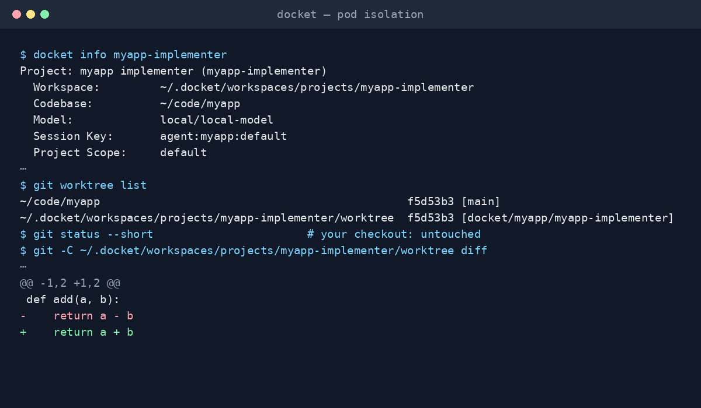
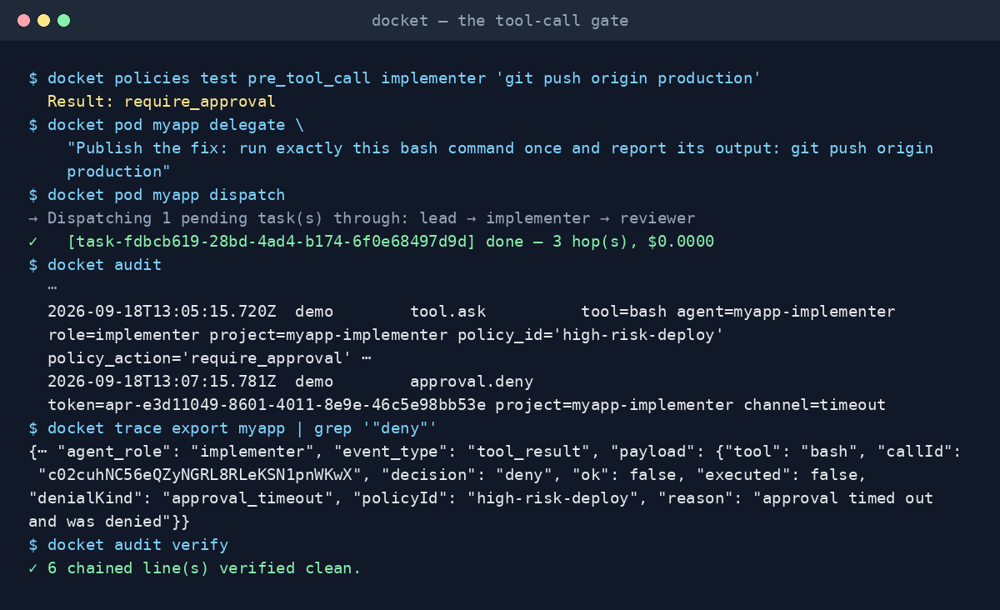

# Docket — governed orchestration for coding-agent teams

[](https://github.com/yielab/docket/actions/workflows/ci.yml)
[](LICENSE)
[](https://www.python.org/)
[](specs/)

Docket runs a Lead-owned team for each codebase and governs every tool call before it executes.
It combines durable orchestration, per-project runtime isolation, approval gates, budget checks,
traces, and a tamper-evident audit log in one local-first CLI.

It is a **runtime and control plane**, not another agent framework or graph DSL. Docket owns the
turn loop so policy enforcement is not optional middleware. It is built for governed fleets, not a
single solo assistant, and it feeds external dashboards rather than shipping a dashboard UI.

> [!WARNING]
> Docket is beta software. The release journey is automated and the core contracts are heavily
> tested, but the project has not been hardened against large fleets or adversarial public-host
> workloads. Expect breaking changes between beta releases and verify important outcomes yourself.

<p align="center">
  
</p>

## Why Docket

Agent models are improving quickly; operating them safely remains a systems problem. Docket focuses
on the boundaries around a turn:

- **Coordinated context:** a Lead owns task decomposition and typed handoffs instead of asking every
  role to reconstruct the whole project history.
- **Runtime-resource isolation:** each project pod receives separate workspaces, session history,
  scratch storage, port ranges, and an Implementer git worktree.
- **Enforced governance:** every Docket-dispatched tool call crosses one policy and approval
  chokepoint before its handler runs.
- **Inspectable outcomes:** tasks, runs, conversations, sessions, traces, token usage, approvals,
  and the audit chain remain queryable after the model turn ends.

The result is deliberately narrower than a general agent framework: Docket rents open protocols
(OpenAI-compatible HTTP and MCP) while owning the execution and evidence path that must not drift.

## Features

| Capability | What ships today | Start here |
| --- | --- | --- |
| Project pods | Lead + Implementer by default; add Reviewer and Tester when the work needs them | `docket init`, `docket pod` |
| Governed turn loop | Policy, high-risk classification, approval, budget, tool execution, and trace evidence in one owned path | `docket gates status`, `docket pod <id> dispatch` |
| Isolation | Per-project workspace/session state, non-overlapping ports and scratch directories, Implementer worktrees | `docket info <member>`, `docket pod <id>` |
| Durable pipelines | Declarative Lead → Implementer → Reviewer → Tester steps with mechanical, verdict, and approval gates | `docket pipeline validate/plan/run` |
| Model routing | Role policies, per-agent pins, compatible endpoint registration, OpenRouter/Vercel presets | `docket models`, `docket profile` |
| Human approval | CLI, HTTP, MCP, Telegram, timeout, and board-labelled decisions share one atomic state transition | `docket approve`, `docket deny` |
| Operations | Run registry, conversation state, traces, metrics, token-based cost estimates, health checks | `docket runs`, `docket trace`, `docket metrics`, `docket doctor` |
| Automation | Explicit scheduled dispatch (`@every`) and authenticated `POST /dispatch/<project>`; no silent background spend | `docket serve --dispatch`, [command reference](docs/commands.md) |
| Control-plane integration | Authenticated task/pod/approval writes plus `/status.json`, `/metrics`, runs and cursor-based trace reads | [integration guide](docs/commands.md#serve) |
| Optional MCP | Expose Docket tools over stdio or register external stdio tool servers | `docket mcp serve`, `docket mcp servers` |
| Mobile control | Telegram can carry conversation context and approval decisions from a phone | `docket wire`, `docket serve --telegram` |

<table>
<tr>
<td width="50%">

</td>
<td width="50%">

</td>
</tr>
<tr>
<td align="center"><strong>Project state stays scoped</strong></td>
<td align="center"><strong>Side effects stay governed</strong></td>
</tr>
</table>

The images are generated from current CLI contracts. See the
[asset workflow](docs/assets/README.md) to reproduce them.

## Quick start

### 1. Install an immutable beta release

```bash
# Homebrew on macOS/Linux
brew tap yielab/docket-cli https://github.com/yielab/docket
brew install docket-cli

# Or the version-pinned installer
curl -fsSL https://raw.githubusercontent.com/yielab/docket/v0.2.0-beta.1/install.sh \
  | DOCKET_VERSION=0.2.0-beta.1 bash
export PATH="$HOME/.local/bin:$PATH"
```

From a checkout, `uv pip install .` (or `pip install .`) installs the same `docket` CLI. The
installer uses `~/.local` by default and never requires `sudo`.

Prerequisites: Python 3.11+, Git, Bash for the launcher/installer, and a non-streaming
OpenAI-compatible chat-completions endpoint with function-tool support. MCP is optional through the
`[mcp]` extra.

### 2. Configure a resolvable provider

For a local compatible server already listening on port 8081:

```bash
docket models provider add local http://127.0.0.1:8081/v1 \
  --model local-model --ctx 32768 --max-tokens 4096
docket models set default local/local-model
docket models set manager local/local-model
docket models set programmer local/local-model
```

Hosted routes use `docket keys add` plus an OpenRouter or Vercel AI Gateway preset. Other compatible
endpoints must be registered explicitly; Docket does not guess a provider URL from a model name.

### 3. Reach the first governed turn

```bash
cd ~/code/myapp
docket init
docket pod myapp delegate "Create FIRST_TURN.md containing: governed first turn"
docket pod myapp dispatch

# Inspect durable outcome evidence
docket runs list
docket trace myapp
docket audit verify
```

`docket init` creates the shared workstation foundation on first use, then provisions a minimum
Lead + Implementer pod for the current project. Dispatch is explicit: Docket does not start paid
model work merely because a task was queued.

For the full artifact-to-first-turn explanation, hosted-provider variants, and expected output, use
the [ten-minute quick start](docs/QUICK-START-DOCKET.md).

## How it works

```text
operator / scheduler / HTTP client
              │
              ▼
       project task queue
              │
              ▼
 Lead ──typed handoff──> Implementer ──> Reviewer ──> Tester
              │                 │              │          │
              └─────────────────┴──────────────┴──────────┘
                                │
                                ▼
                 one tool-dispatch chokepoint
                     policy → approval → handler
                                │
                                ▼
                 task/run/session/trace/audit evidence
```

The Lead coordinates and never edits code. The Implementer receives the project codebase or its own
git worktree. Reviewer and Tester are optional, but when present their verdict gates affect control
flow rather than becoming advisory prose. A mechanical verification command can block advancement
independently of model opinion.

State lives under `~/.docket/` by default (`DOCKET_HOME` relocates it). Docket-owned JSON writes are
atomic and file-locked; the audit JSONL is hash-chained. The CLI, HTTP surface, MCP server, Telegram
channel, and scheduler all converge on the same core operations instead of maintaining parallel
state machines.

## Best practices

1. **Start with the minimum pod.** Lead + Implementer is enough for exploration. Add Reviewer,
   Tester, or custom roles when a concrete quality gate justifies the extra turns.
2. **Give the Implementer an objective check.** Use `docket pod <id> set-verify "<command>"` so a
   nonzero project test blocks advancement even when model prose sounds confident.
3. **Keep dispatch explicit.** Use `docket pod <id> dispatch` interactively. Enable schedules or
   `docket serve --dispatch` only after budgets, provider routing, and approval channels are tested.
4. **Treat approvals as provenance.** Decide through `docket approve`, the authenticated HTTP/API
   surface, MCP, Telegram, or your board integration; preserve the channel label in the audit log.
5. **Inspect evidence, not just the final answer.** Check the task, run, trace, measured token usage,
   mechanical verdict, and audit chain before accepting consequential changes.
6. **Keep Docket local or behind your own boundary.** `docket serve` binds loopback by default and
   does not terminate TLS. Use a trusted same-host client, SSH tunnel, or your own TLS proxy.
7. **Back up Docket state with the project.** Worktrees and generated files are not substitutes for
   version control; the run registry and traces are evidence, not a source-code backup.

## Known limits

- **Beta, single-operator software:** no tenant axis, hosted scheduler, quota system, or production
  fleet-scale claim.
- **Compatible HTTP, not provider SDK parity:** the model adapter uses non-streaming
  `/chat/completions` with function tools. A text-only endpoint can answer text turns but cannot
  complete tool-dependent work.
- **Network egress is not fully closed:** the `fetch` tool is allowlisted and inspectable, but an
  allowed shell/interpreter can still reach the network. Run untrusted work inside a stronger host
  or container boundary.
- **Cancellation is cooperative:** `cancel requested` is durable immediately, but active work stops
  only when the owned loop reaches a `safe checkpoint`. An HTTP call or tool handler already
  executing may finish before its result is discarded or retained atomically.
- **Cost is an estimate:** token counts are measured; dollar values use a local pricing snapshot and
  are not a provider invoice.
- **Audit evidence is tamper-evident, not undeletable:** rotation preserves one predecessor link.
  An operator able to delete all Docket state can erase both the log and its backup.
- **Docket feeds a dashboard; it is not one:** use the authenticated API from an external
  plan-of-record such as Tack, or build your own consumer.
- **The standalone runtime is source-built:** **`docket-runtime`** exposes a narrow gated-tool
  facade and is **not published to any index**. It does not expose a second public turn loop.

Read [SECURITY.md](SECURITY.md) before exposing a service, and [COMPATIBILITY.md](COMPATIBILITY.md)
before relying on a model endpoint or MCP server.

## Documentation

| Need | Guide |
| --- | --- |
| Install and first governed turn | [Quick start](docs/QUICK-START-DOCKET.md) |
| Roles, pod shapes, handoffs, gates | [Agent teams](docs/AGENT-TEAMS.md) |
| Every command and flag | [Command reference](docs/commands.md) |
| Provider endpoints and coding harnesses | [Models and gateways](docs/MODEL-GATEWAYS.md) |
| Security posture and deployment limits | [Security model](SECURITY.md) |
| Runtime and protocol compatibility | [Compatibility](COMPATIBILITY.md) |
| Architecture and state ownership | [Architecture](docs/DOCKET.md) |
| Pipeline examples | [Workflow guide](docs/WORKFLOW-GUIDE.md) |
| Troubleshooting | [Troubleshooting](docs/troubleshooting.md) |
| Current plans and measured triggers | [Roadmap](ROADMAP.md) |
| Current executable contracts | [Specifications](specs/README.md) |

### Embedding

The standalone **`docket-runtime`** package builds from `packages/docket-runtime/`. Its versioned
`docket_runtime` facade lets an embedding application register and dispatch tools through Docket's
policy, approval, trace, and audit chokepoint. It is not published to any index; build it from this
checkout and start with [examples/runtime_embed.py](examples/runtime_embed.py).

### Engineering evidence

- **2,478 tests** in `tests/python/`
- **~30,478 lines** of Python in the shipped package
- **24 specifications** validated in CI
- **37 commands** documented in the command reference
- 18 byte-for-byte CLI golden cases
- Exact-wheel first-turn journeys on Ubuntu and macOS

```bash
uv run pytest                                      # 2,478-test Python suite
uv run ruff check .
uv run ruff format --check .
uv run mypy src
bash tests/golden/run.sh verify-all
bash scripts/validate-specs.sh
uv run python scripts/metrics.py --check
uv run python scripts/render-doc-assets.py --check
uv run python scripts/release_journey.py
```

The deterministic smoke workflow exercises the larger Lead → Implementer → Reviewer → approval →
Tester path without paid credentials:

```bash
uv run python scripts/smoke_workflow.py
```

The optional live-local variant targets an OpenAI-compatible endpoint on `127.0.0.1:8081`; it does
not require an Anthropic key:

```bash
uv run python scripts/smoke_workflow.py --live-model
```

## Contributing

Docket uses spec-first, test-first development and a three-layer architecture:
`cli → core → edges`. Two boundaries are non-negotiable:

- `core/tools.py::dispatch_tool` is the sole tool-execution chokepoint.
- `edges/store.py` is the sole writer of Docket-owned JSON.

Start with [CONTRIBUTING.md](CONTRIBUTING.md) for setup and validation, then use the
[development harness](docs/DEVELOPMENT-HARNESS.md) for bounded context and agent handoffs. Issues
and focused pull requests are welcome; new features need a measured trigger, an executable
acceptance case, and documentation that states limits as clearly as capabilities.

## License

Apache-2.0. See [LICENSE](LICENSE).
