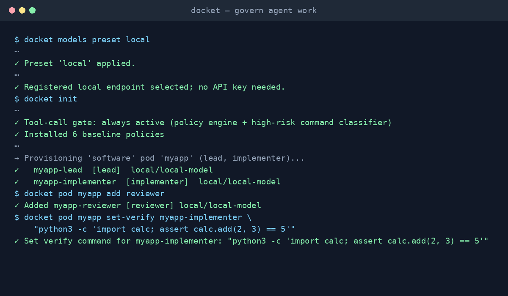
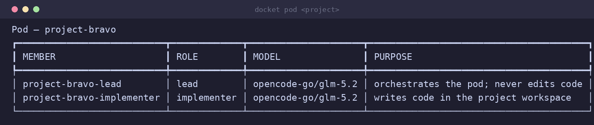
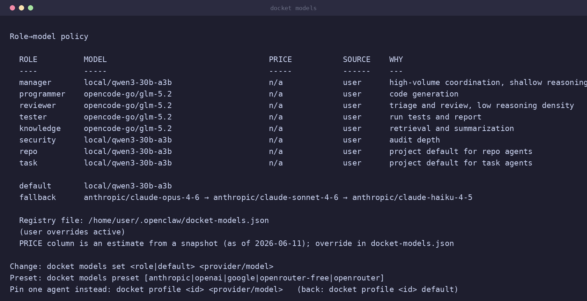

# docket — a governed runtime and control plane for agent fleets

[](https://github.com/yielab/docket/actions/workflows/ci.yml)
[](LICENSE)
[](https://www.python.org/)
[](specs/)

> **docket** runs teams of autonomous coding agents across multiple projects, and governs what
> they are allowed to do. It solves three problems the field has converged on as genuinely hard:
> **coordinated Lead-owned context** (the anti-fragility pattern vs solo-agent chaos),
> **per-project runtime-resource isolation** (disjoint workspaces, port ranges, and git worktrees
> per Implementer), and a **governance/HITL/audit spine** — where *every* tool call an agent makes
> passes through one policy chokepoint before it executes. One `docket` command keeps it all running.
>
> *Not an agent framework (vs CrewAI/LangGraph/AutoGen): docket owns the loop precisely so it can
> intercept it, and rents only open protocols — OpenAI-compatible HTTP, MCP, containers.*

> [!WARNING]
> **Early-stage / beta software — treat it as a prototype, not a hardened tool.** docket has
> **not** reached a stable release, and every release ships with a `-beta.N` version suffix for
> as long as that stays true. What exists today — agent-pod provisioning, per-project runtime
> isolation (session keys, port ranges, scratch dirs, git worktrees), docket's own gated agent
> turn loop, real pod dispatch with budget and verification gates, layered security (approval
> gates, an audit log, four approval channels), token accounting, and a read-only API — is
> implemented and covered by the automated suite (pytest + golden parity + `ruff`/`mypy --strict`).
> **Passing tests is not the same as production-ready:** none of it has been hardened against real
> fleets at scale or adversarial input. Expect rough edges and breaking changes between versions.
> **Verify anything important yourself before relying on it**, and treat every dollar figure as an
> estimate, not a bill (see [Cost reporting and its limits](#cost-reporting-and-its-limits)).

<p align="center">
  
</p>

<p align="center"><em>The whole loop in one terminal: <strong>provision → delegate → govern → keep healthy.</strong></em></p>

**Contents:** [Why](#why) · [The gated turn](#the-gated-turn) · [Telegram](#mobile-control-via-telegram)
· [Install](#install) · [Tour](#60-second-tour) · [Screenshots](#see-it-in-action) ·
[Cost](#cost-reporting-and-its-limits) · [Concepts](#concepts) · [Commands](#command-reference)
· [Security](#security) · [Embedding the runtime](#embedding-the-runtime) ·
[Compatibility](#compatibility) · [Roadmap](#whats-next) · [Contributing](#contributing)

---

## Why

Running one coding agent is easy. Running a fleet across several projects, unattended, surfaces
three problems the field treats as genuinely hard:

### 1 — Coordinated Lead-owned context

A **Lead** agent owns context, memory, and human communication for a project; **workers**
(Implementer, Reviewer, Tester) receive bounded tasks and report back. The Lead never edits
code. This is not multi-agent for its own sake — it is the separation of duties that turns
"an agent changed the code" into "a change was reviewed before it landed."

The separation is **structural, not advisory**. A Reviewer is not merely *told* not to edit code:
its tool registry is composed from its role archetype and does not contain `write`, `edit`, or
`bash` at all, so an attempt to call one comes back as a tool-not-found denial. Being unable to
do a thing is a strictly stronger guarantee than being instructed not to.

Every pod member is provisioned with a **startup contract** — the exact files re-read after each
context compaction (`WORKFLOW_AUTO.md` + a dated memory log), seeded so a fresh or just-compacted
agent reliably knows its codebase path, its read order, and what the project actually **is** (a
curated `MEMORY.md` summary), instead of losing that context and answering from its own
scaffolding. `docket doctor` re-seeds any agent whose contract is missing or stale.

See **[Agent Teams (Pods)](docs/AGENT-TEAMS.md)**, the core reference.

### 2 — Per-project runtime-resource isolation

Three isolation layers, each independent:

- **Context**: each agent gets a session key (`agent:<id>:<project>`) — no cross-project memory
  bleed, even when two pods run the same model.
- **Runtime resources**: each pod gets a **non-overlapping port range** and a **scratch
  directory** (allocated once, freed on delete) so two projects can run dev servers and test
  databases simultaneously without colliding — injected into the Implementer's real process
  environment (`DOCKET_PORT_BASE`/`DOCKET_PORT_COUNT`/`DOCKET_SCRATCH_DIR`), not just documented
  as prose it has to read and remember to follow.
- **Git worktrees**: for repo pods the Implementer works in a dedicated `git worktree` on its
  own branch (`docket/<project>/<member-id>`) — the convergent isolation pattern every major
  coding-agent tool has landed on (Cursor, Codex, etc.). Falls back to the flat workspace
  gracefully when git is unavailable or the codebase isn't a repo.

### 3 — Governance / HITL / audit spine

**Every tool call goes through one chokepoint.** `core/tools.py`'s dispatcher is the single place
a tool can execute, and three policy hooks run there: `pre_input`, `pre_tool_call`, and
`pre_output`. A call is allowed, denied, or routed to a human for approval *before* the handler
ever runs — and the decision is traced.

The classifier is **argument-aware**: it reads the whole command line, including every segment
behind a `;`, `&&`, `||`, or pipe. So `git status` is allowed and `git push origin production`
asks, which a binary-path allowlist structurally cannot do.

docket's approval store is answerable through **four channels** — a CLI channel
(`docket approve`/`docket deny`), a headless HTTP endpoint, MCP, and Telegram — and every grant,
deny, or timeout writes an entry to the hash-chained, tamper-evident audit log, tagged with the
channel it came from. The headless channels mean CI jobs and automation can vote without a chat
account. **Approvals fail closed on timeout.** Docker workspace isolation stays opt-in
(`docket gates isolate on`).

---

**Everything else** (provisioning, health, cost guardrails) is operational tooling that keeps
this three-layer stack running reliably:

- **One-command provisioning**: `docket add` provisions a pod (Lead + Implementer by default);
  `docket add --from agents.yaml` provisions a declarative, version-controlled fleet.
- **Real pod dispatch**: `docket pod <project> dispatch` runs one full Lead → Implementer →
  Reviewer → Tester pipeline turn, budget-gated and traced. `docket serve --dispatch` drives
  every pod's queue in the background.
- **Config drift detection**: `docket doctor` and `docket maintain check` catch runaway loops,
  stale sessions, and drifted or missing startup contracts.
- **Budget guardrails**: per-pod USD cap that auto-pauses the pod's Lead on breach. It fires on a
  **clearly labelled token-based estimate** — docket does not relabel an estimate as spend (see
  [Cost reporting and its limits](#cost-reporting-and-its-limits)). Dispatch refuses a paused
  pod's tasks outright; `docket profile <id> --resume` clears the pause. A role→cheapest-adequate-
  model policy and `docket cost` reporting round it out.
- **Read API for dashboards**: `docket serve` exposes a versioned read-only API
  (`/status.json`, `/metrics`, `/health`, `/runs`, `/approvals`) dashboards can consume.

## The gated turn

docket runs the agent turn itself, which is what makes the guardrails real rather than advisory:

```
        docket pod <p> dispatch
                 │
                 ▼
   ┌─────────────────────────────┐
   │ core/agent_loop.py          │  bounded: max iterations, max tool calls,
   │  the turn loop              │  wall-clock timeout, measured-token budget
   └──────────────┬──────────────┘
                  │ model asks for a tool
                  ▼
   ┌─────────────────────────────┐
   │ core/tools.py::dispatch_tool│  ◀── THE chokepoint. Nothing executes
   │  pre_tool_call policy hook  │      around it; an AST test enforces that.
   │  high-risk classifier       │
   └──────┬───────────┬──────────┘
          │           │
      allow│      ask │ ──▶ approval store ──▶ CLI · HTTP · MCP · Telegram
          │           │                              │
          ▼           ▼                              ▼
    tool handler   denied (fail-closed)        hash-chained audit log
```

**Built-in tools:** `read`, `write`, `edit`, `glob`, `grep`, `bash` (sandboxed exec), and `fetch`
(domain-allowlisted, size-capped, timeout-bounded).

> [!NOTE]
> **External MCP tools are configured and gated, but not yet reachable in a turn.**
> `docket mcp servers add` registers a server, and the client that loads its tools namespaces them
> `mcp__<server>__<tool>` (so a remote server cannot shadow `bash`) and routes them through the same
> gate as a built-in. What is missing is the last wire: the turn loop builds its registry from the
> built-ins alone, so a configured server's tools do not reach a running agent yet. Stated plainly
> because "browser support is just an MCP config" is only true once that wire exists.

The model endpoint is any **OpenAI-compatible** chat-completions API — OpenAI, Groq, Together,
OpenRouter, or a local llama.cpp / vLLM / LM Studio server. The adapter is stdlib `urllib`; no
vendor SDK is pulled in, and no per-vendor client is hand-rolled.

## Mobile control via Telegram

Wiring a pod's Lead to Telegram (`docket wire <id>`) turns your phone into a second control
surface, not just a notification feed:

- **Conversational dispatch** — message the Lead directly ("Fix the login bug," "what's the
  status?") and it runs through the same pipeline `docket pod <id> dispatch` runs from a shell.
  No laptop required to queue or check on work.
- **Approve from your phone** — a gated action pings the wired group and you reply to grant or
  deny it. This is docket's own approval store, so a Telegram decision lands in the same audit
  chain as a CLI or HTTP one, tagged `channel="telegram"`.
- **Status without a shell** — ask a Lead what's active, or check in on a fleet, from wherever you
  are.

```bash
docket keys add TELEGRAM_BOT_TOKEN   # stored 0600, redacted from traces
docket wire myproject-lead           # bind a pod's Lead to a Telegram group
docket serve                         # the process that long-polls for updates
docket unwire myproject-lead         # remove the binding
```

Setup is manual today (create a bot, add it to a group, run `wire`) — see
[docs/commands.md](docs/commands.md#wire) for the walkthrough.

## Install

```bash
# Homebrew (macOS/Linux) — recommended
brew tap yielab/docket-cli https://github.com/yielab/docket
brew install docket-cli

# Or the install script
curl -fsSL https://raw.githubusercontent.com/yielab/docket/main/install.sh | bash

# Or from source
git clone https://github.com/yielab/docket.git
cd docket && ./install.sh   # installs to ~/.local; DOCKET_PREFIX to override

# Then bootstrap docket's home + the org specialist team
docket install
```

```bash
uv pip install .   # or: pip install .  — then run `python -m docket --version`
```

> Installs to `~/.local` (no `sudo`); add `~/.local/bin` to `PATH` if it isn't already.

**Prerequisites:** Python 3.11+ · an **OpenAI-compatible chat-completions endpoint** (a hosted
provider's API key, or a local llama.cpp/vLLM/LM Studio server) · `git` · `bash` (launcher and
installer only). Optional: `fzf` (interactive picker), `docker` (workspace isolation),
`systemctl` (nothing requires it; docket degrades gracefully without it). The package pulls in
Typer, Rich, Pydantic, pydantic-settings, and filelock; MCP support is the optional `[mcp]` extra.

Point docket at a model with `docket keys add <PROVIDER>_API_KEY`, or set `DOCKET_LLM_BASE_URL` /
`DOCKET_LLM_API_KEY` to override every model at once. Everything docket owns lives under
`~/.docket/` (`DOCKET_HOME` to relocate).

## 60-second tour

```bash
docket add myproject ~/code/myproject    # provision a pod (Lead + Implementer)
docket pod myproject                     # inspect pod members, roles, isolation details
docket pod myproject delegate "Add auth" # queue a task for the pod
docket pod myproject dispatch            # run Lead → Implementer pipeline once
docket list                              # see every agent, scope, and pod at a glance
docket doctor                            # fleet health: drift, runaway, stale sessions
docket gates status                      # governance posture: approval gates, audit log
docket profile myproject --budget 5      # cap spend; auto-pauses the pod on breach
docket profile myproject --resume        # clear an auto-pause, unblock the pod's queue
docket cost myproject                    # measured token usage + a labelled estimate
```

That's the loop: **provision → delegate → dispatch → keep healthy → keep in budget.**

## See it in action

<table>
<tr>
<td width="50%">

**`docket pod <project>` — pod structure**



</td>
<td width="50%">

**`docket models` — role→model policy**



</td>
</tr>
</table>

> Screenshots are from a real run; project names are anonymized. They were captured before the
> Phase 19 runtime cutover, so panes showing a dollar figure or daemon state are stale — see
> [docs/assets/README.md](docs/assets/README.md) for the standing recapture list.

## What docket does that a bare agent CLI does not

| Need | Typical agent CLI | docket adds |
|------|-------------------|-------------|
| Run one agent turn with tools | ✅ | (owns its own loop, so it can gate it) |
| **Every tool call through one policy chokepoint** | — | ✅ `pre_input`/`pre_tool_call`/`pre_output`, AST-enforced single path |
| **Argument-aware command classification** | allowlist by binary, if any | ✅ reads the whole line and every `;`/`&&`/`\|` segment |
| **Role→toolset as data** | prompt-level instruction | ✅ a Reviewer's registry has no `write`/`edit`/`bash` to call |
| One-command per-project pod provisioning | — | ✅ `docket add` (stack auto-detect) |
| Project isolation: session keys (no context leak) | — | ✅ `agent:<id>:<project>` per pod member |
| Project isolation: runtime resources (ports + scratch) | — | ✅ disjoint port range + scratch dir, injected into the real env |
| Project isolation: git worktree per Implementer | partial | ✅ dedicated branch + worktree; flat-workspace fallback |
| Pod pipeline dispatch (Lead → Implementer → Reviewer → Tester) | — | ✅ `docket pod <p> dispatch` / `serve --dispatch` |
| Declarative fleet from version-controlled YAML | — | ✅ `docket add --from` |
| Drift / health / runaway detection | — | ✅ `docket doctor` |
| Role → cheapest-adequate-model policy | manual | ✅ one-command repolicy |
| Per-agent USD budget cap + auto-pause | — | ✅ `docket profile <id> --budget` |
| Approval gates + headless channels + audit log (HITL) | — | ✅ CLI / HTTP / MCP / Telegram, each audit-logged |
| Hash-chained tamper-evident audit log | — | ✅ `docket audit verify` |
| Pre-merge verification gate | — | ✅ `verifyCmd` per pod + a structural Tester PASS/FAIL gate |
| Scheduled + webhook-triggered pod dispatch | — | ✅ `@every N` / `HH:MM` UTC + `POST /dispatch/<project>` |
| Versioned read API for dashboards | — | ✅ `/status.json` v1, `/metrics`, `/health`, `/runs`, `/approvals` |
| External tools without writing code | varies | ⚠ MCP servers register and gate identically to built-ins, but are **not yet wired into a running turn** |

If a row isn't true for your setup, treat it as aspirational — honesty is the point of this table.

**vs agent frameworks (CrewAI/LangGraph/AutoGen):** those frameworks own the loop, which means they
own the interception points. docket owns the loop for the opposite reason — to put a policy gate
inside it. What docket does *not* implement is agent reasoning or prompt-engineering opinion; it
implements the governed execution substrate underneath.

## Cost reporting and its limits

> [!IMPORTANT]
> **docket reports measured tokens, not recorded dollar spend.** Agent turns run on docket's own
> loop, and token counts come back **measured** from the model endpoint's usage field — those
> numbers are real. Dollar figures do not: docket will not multiply tokens by a price table and
> call the result spend. `docket cost` therefore shows tokens plus a clearly labelled estimate
> (`~$X.XX (estimated)`), and **budget auto-pause fires on that labelled estimate.**

- **Token counts (measured, real).** Reported by the endpoint per call and accumulated per turn,
  per hop, and per agent. The turn loop's own token budget is enforced against these real counts.
- **Dollar estimates (best-effort).** Computed from a **hardcoded pricing table** (~13 models,
  snapshotted from a known catalog). Model prices change; treat these as estimates. Models not in
  the table show `n/a`. `docket cost` and `docket models` print the snapshot date so you can judge
  staleness. Override or extend in `~/.docket/docket-models.json`.
- **Context-size estimates are a third, weaker thing.** The static-context guards in
  `docket maintain check` use a stated characters-per-token approximation. docket never presents
  those as exact token counts, and never mixes them with the measured counts above.

> [!WARNING]
> **No figure docket prints is your provider's invoice.** Prompt caching, minimum charges,
> rounding, taxes, free-tier credits, and provider-side pricing changes all drift the real number.
> Use docket's cost figures for **relative** decisions (which agent is expensive, when a run
> spikes, whether to auto-pause) — and always **reconcile against your provider's own billing
> dashboard** before treating any number as money owed. Treat model-to-model savings comparisons
> as directional only.

## Concepts

**Agent teams are the heart of docket.** Everything else (isolation, cost guardrails, health
checks) exists to keep *teams of agents* running reliably. The separation of duties — **Lead
plans, Implementer writes, Reviewer/Tester gate** — turns "an agent changed the code" into "a
change was reviewed and validated before it landed." Full model in **[Agent Teams (Pods)](docs/AGENT-TEAMS.md)**.

- **Project pod** — each project is an isolated pod of project-scoped agents. `docket add`
  provisions a lean **Lead + Implementer** by default; add Reviewer/Tester/extra Implementers
  with `docket pod <project> add <role>` or `--pod full` / `--with`. The **Lead never edits
  code** — it plans, owns context/memory + human comms, and dispatches work. Every member has
  its own permission-locked workspace (`700`/`600`) with `SOUL.md`, `AGENTS.md`,
  `HEARTBEAT.md`, `.docket-meta.json`, and a `memory/` log.
- **Real dispatch** — `docket pod <id> dispatch` runs one complete pipeline turn (Lead →
  Implementer → Reviewer if present → Tester if present), budget-gated, traced, and
  **pod-local** — never crosses pod boundaries. `docket serve --dispatch` drives all pods
  continuously from the background.
- **Pre-merge verification** — set `verifyCmd` with `docket pod <project> add --verify "<cmd>"`
  (or `set-verify` on an existing member); the dispatch pipeline runs it in the Implementer's
  workspace after each Implementer hop and **fails** the task (with a `verification_failed`
  trace event) on non-zero exit. If a pod has a Tester, its hop is gated too: the Tester's first
  line must read `PASS`/`FAIL` — a `FAIL` or unparseable report ends the task the same way
  (a rework-eligible verdict is retried first, bounded by `maxReworkCycles`),
  instead of "the Tester agent said it was fine" being taken on faith.
- **Org specialists** — `security`, `knowledge`, and `manager` are created once by `docket install`
  and shared across the fleet (`scope: org`). An optional org **Portfolio Manager**
  (`docket install --portfolio`) adds cross-pod fleet visibility — advisory only, never a pod member.
- **Session key** (`agent:<id>:<project>`) — the isolation primitive; prevents cross-project
  contamination and enables parallel work. Change with `docket scope <id> set <key>`.
- **Role→model policy** — each role maps to the cheapest adequate model; change a role once and
  every policy-following agent re-resolves. Pin one agent with `docket profile`.

Configuration lives in two places docket owns: `.docket-meta.json` per workspace (per-agent
model, session key, persona, budget) and `~/.docket/fleet.json` (agent registration, channel
bindings, gate/isolation flags, provider endpoints, the org default model).

### Declarative orchestration

- **Pipelines** — `docket pipeline validate/plan/run`. One dialect, defined in `core/pipeline.py`
  and executed by `core/orchestrator.py` over the same pod-dispatch state machine, so `plan`
  renders from the real executor rather than a second pretty-printer that can drift from it.
- **Roles are data** — `docket roles list/show/add/validate`. Role archetypes are declarative
  definitions rather than hardcoded branches — including each role's **denied tools**, which is
  what makes a Reviewer structurally unable to write. **Pod blueprints** provision a named pod
  shape (software, research, content, ops, agentic-product) in one step. Pods are not limited to
  "build a web app".
- **Typed handoffs** — hops exchange a structured artifact (summary, changed files, diff ref,
  verdict) instead of concatenating raw text, and a **context compiler** fits each hop's message
  to a per-role budget, shedding artifact fields in a documented priority order.
- **Runs and cancellation** — `docket runs list/show` keeps one record per dispatch invocation;
  `docket runs cancel` kills the in-flight hop's process group. Scheduled (cron) and webhook
  triggers can drive pipelines, and `--follow` tails one live.

### Durable state docket owns

Nothing else keeps a durable transcript, so docket owns the state that has to survive a restart or
a context reset — all of it under `~/.docket/`:

- **Session history** — durable per-session turn history with compaction that never splits a
  tool-call/tool-result pair apart.
- **Task ledger** — dispatch mechanically maintains a delimited docket-owned region inside each
  Lead's `HEARTBEAT.md`, so the ledger is true whether or not the agent wrote its own entries.
  Only text between the delimiters is ever rewritten, so the agent's prose survives.
  `docket doctor` flags divergence from `TASK_LIST.json` and re-syncs under `--fix`.
- **Conversation registry** — `docket conversations list/show/resume/set`, seeded when you wire a
  channel and kept current by dispatch after every hop.
- **Memory distillation** — `docket maintain distill` summarizes memory logs into `MEMORY.md` and
  archives the originals. `clean` and `reset` distill **first** by default, so memory is never
  bare-deleted; if distillation fails, the delete is aborted rather than proceeding.
- **Audit log** — hash-chained and tamper-evident (`docket audit verify`), with rotation.

---

## Command reference

```bash
docket install [--portfolio] [--no-gates]  # Bootstrap docket's home + org specialists
docket add [id] [path]                     # Create a project pod (--from spec.yaml for a fleet)
docket pod <id> [add <role> | remove <m>]  # Inspect/resize a pod
docket pod <id> delegate/queue/dispatch    # Queue and run pod work
docket list / info <id> / delete <id>      # Fleet-wide view / one agent / teardown
docket models / profile <id>               # Role→model policy / pin or budget-cap one agent
docket cost [id] / doctor / maintain <id>  # Tokens / fleet health / per-agent upkeep
docket gates status                        # Approval-gate, routing, and audit posture
docket serve [--dispatch]                  # Read-only API, Telegram polling, pod queues
docket pipeline validate/plan/run <file>   # Declarative pipelines, run by the dispatch engine
docket roles list/show/add/validate        # Declarative role archetypes
docket runs list/show/cancel               # Dispatch run registry; cancel an in-flight hop
docket conversations list/show/resume      # The conversation registry docket owns
docket audit verify                        # Verify the audit log's tamper-evidence chain
docket trace [id] / metrics                # Execution traces / session success-rate and drift
docket mcp serve | servers add/list/remove # Expose the control plane, or add external tool servers
```

Every command, subcommand, and flag — including `context`, `keys`/`auth`, `gates
enable/isolate/classes`, `policies`, `persona`, `approve`/`deny`, `completions` — is documented in
**[docs/commands.md](docs/commands.md)**, the full reference.

## Engineering

docket practices spec-driven development (specs before implementation, RFC 2119 keywords, real
coverage — see [specs/README.md](specs/README.md)) and is checked by `ruff`, `mypy --strict`, a
pytest suite, and an 18-case golden-parity suite — see
[CONTRIBUTING.md](CONTRIBUTING.md) for how to run them and add a command.

By the numbers:

- **2,079 tests** in the pytest suite (`tests/python/`)
- **~26,253 lines** of Python in the shipped `docket` package
- **24 specifications** (RFC 2119), validated in CI
- **36 commands**, each documented in [docs/commands.md](docs/commands.md)

```bash
uv run pytest                                        # 2,079-test Python suite
bash tests/golden/run.sh verify-all                  # 18-case byte-parity suite
uv run ruff check . && uv run ruff format --check . && uv run mypy src
```

Every figure above is drift-guarded in CI by `uv run python scripts/metrics.py --check`, which
fails the build when this list and the tree disagree — and fails just as loudly if the prose stops
stating them, so the guard cannot quietly end up verifying nothing.

CI also runs the suite against the **lowest dependency versions `pyproject.toml` actually permits**
(`uv pip compile --resolution lowest-direct`), so the declared floors are a tested promise rather
than an assumption. That job exists because they were neither: two of the six advertised bounds
turned out to be unusable when first measured.

## Security

docket manages autonomous agents that can execute commands. Its safety model is **layered**, and
the enforcing layer is real: every tool call passes through one dispatcher where the policy engine
and the high-risk action classifier run before the handler does. Approval gates are **on by
default** for new installs (opt out with `docket install --no-gates`; reverse later with
`docket gates enable` / `disable`). Grants, denials and timeouts are audit-logged with the channel
they came from — CLI, HTTP, MCP, or Telegram. Docker workspace isolation
(`docket gates isolate on`) stays **opt-in**.

Being honest about the limits:

- **Network egress is not locked down.** `fetch` is domain-allowlisted and **refuses everything by
  default** until you opt a domain in (`FETCH_ALLOWED_DOMAINS`) — but `bash` can still reach the
  network through interpreters and package managers on the curated allowlist. `fetch` is the
  *inspectable* path, not yet the *only* path. Tracked as an open gap, not glossed over.
- **Enforcement covers the tool calls docket dispatches.** That is now every tool call in a docket
  agent turn, which is the change Phase 19 made. It is not a system-wide enforcement daemon: a
  process a user starts outside docket is outside its scope.

**Where you run docket matters.** A trusted homelab is a very different risk profile from a
public VPS — see [SECURITY.md](SECURITY.md) for the homelab-vs-VPS guidance, the privilege and
approval-gate model, what docket does and does **not** protect against, secret-storage backends
(keyring vs 0600 JSON), and the responsible-disclosure policy.

## Embedding the runtime

The governed runtime ships as a second, standalone package: **`docket-runtime`** (under
[`packages/docket-runtime/`](packages/docket-runtime/)). It is the turn loop, the gated tool
registry, the policy engine, the approval store and the audit chain — without the CLI, so a
product can embed the guardrails instead of reinventing them. Verified standalone: a clean
install pulls only `pydantic` and `filelock`.

This is **packaging and a public API contract, not a rewrite** — the control plane and the runtime
build from the same source tree, so they cannot drift apart. What it is deliberately *not* is a
hosted product runtime: multi-tenancy, authentication for external callers, queues, streaming and
per-customer quota are out of scope, and the embedding product owns its own serving layer.

## Compatibility

docket has no external daemon dependency. Its compatibility surface is the model endpoint.

| docket-cli | Model endpoint | MCP | Notes |
|------------|----------------|-----|-------|
| 0.2.x | OpenAI-compatible `/chat/completions` (tool calling) | stdio servers, optional `[mcp]` extra | Verified against hosted providers and local llama.cpp / vLLM / LM Studio |

An endpoint that does not implement tool calling will run text-only turns; anything requiring a
tool will fail cleanly rather than silently. See [COMPATIBILITY.md](COMPATIBILITY.md) for the
policy and how breaks are tracked.

## What's next

See [ROADMAP.md](ROADMAP.md) for the full phased plan. Near-term priorities:

1. Close the egress gap so `fetch` is the only network path, not merely the inspectable one
2. A trace/audit retention policy — both grow unbounded, and audit rotation currently costs the
   metrics counters their history

## Contributing

Python package with a three-layer architecture (`cli/` → `core/` → `edges/`), dependencies
pointing inward only: `cli/` renders, `core/` decides, `edges/` is the only layer that performs
I/O. Two invariants matter most — **every tool call goes through `core/tools.py`'s single
dispatcher** (an AST test enforces it), and **docket-owned JSON goes through `edges/store.py`**
(atomic, filelocked, 0600). See [CONTRIBUTING.md](CONTRIBUTING.md) for dev setup (`uv`), the
SSD/spec-first flow, code style (`ruff` + `mypy --strict`), and how to add a command. PRs welcome
for tool handlers, command implementations, test coverage, and docs.

## License

Apache 2.0 — see [LICENSE](LICENSE).
