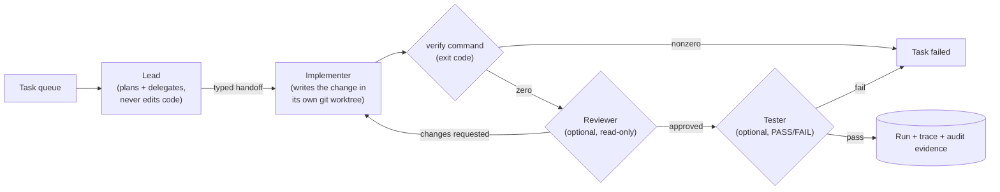
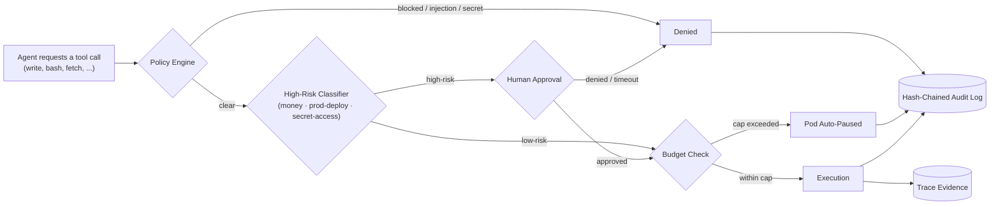

# docket — governed teams of coding agents

[](https://github.com/yielab/docket/actions/workflows/ci.yml)
[](LICENSE)
[](https://www.python.org/)
[](specs/)

**docket assembles a small team of role-scoped AI agents — a Lead, an Implementer, and optionally a
Reviewer and a Tester — and runs them against your codebase as one pipeline.** It owns both halves
of that job: which agent does what, in what order, and what every one of them is actually allowed
to do.

It exists because four things go wrong when you leave autonomous agents alone with a repository:

- **An agent told not to do something does it anyway.** A prompt is advice. docket removes the
  tool from the role's registry instead — a Reviewer *cannot* write, whatever the model decides —
  and routes every remaining call through one policy-and-approval gate with no second path
  around it.
- **A "safety setting" turns out to be wired to nothing.** Every docket setting has one writer,
  is validated when you write it, and has a consumer on the live path; a broken guardrail file
  blocks instead of silently allowing, and `docket config explain <agent>` shows exactly what a
  turn will use and what set each value.
- **An unattended run hangs, overspends, or leaves no trail.** Budgets pause the pod
  deterministically, an unattended pod can refuse approval-gated calls instead of waiting on
  nobody, and every verdict, approval and execution lands in a hash-chained audit log.
- **The team's output is only as good as the model's self-report.** Advancement is gated on exit
  codes and explicit verdicts — a verify command, a Reviewer's `APPROVE`, a Tester's `PASS` — not
  on how confident the prose sounds.

The gate half is the part most agentic tooling leaves unfinished. Whatever owns an agent's turn
loop is the only thing positioned to intercept a tool call before it executes — so frameworks
that own the loop without a dedicated policy layer leave enforcement to the agent's own judgment,
and wrappers that bolt a policy onto someone else's loop can be routed around. **docket owns the
turn loop for every role in the pipeline, specifically so that does not happen.** docket ships no
dashboard and is not a general-purpose orchestration framework: it feeds an external control
plane over a read API instead. It runs a supervised team, not a solo personal assistant, and
keeps every action inspectable after the fact.

> [!WARNING]
> docket is beta software (`v0.2.0-beta.3`). Core contracts are spec-first and test-backed, but the
> project has not been hardened against large fleets or adversarial public-host workloads. Expect
> breaking changes between beta releases and verify consequential outcomes yourself.

<p align="center">
  
</p>

## The pod: a governed team, not a lone agent

`docket init` provisions a **pod** — a project-scoped team — and `docket pod <id> dispatch` runs one
turn through it:


```mermaid
flowchart LR
    Q["Task queue"] --> L["Lead\n(plans + delegates,\nnever edits code)"]
    L -- "typed handoff" --> I["Implementer\n(writes the change in\nits own git worktree)"]
    I --> G{"verify command\n(exit code)"}
    G -- "nonzero" --> F["Task failed"]
    G -- "zero" --> R{"Reviewer\n(optional, read-only)"}
    R -- "changes requested" --> I
    R -- "approved" --> T{"Tester\n(optional, PASS/FAIL)"}
    T -- "fail" --> F
    T -- "pass" --> V[("Run + trace + audit evidence")]
```

Lead + Implementer is the minimum viable pod; Reviewer and Tester are optional, but when present
their verdict gates advancement instead of becoming advisory prose a model can talk its way past.
The same holds for the Implementer: `docket pod <id> set-verify <member> "<command>"` makes a
nonzero exit fail the task, whatever the model claims about its own work.
`docket init --blueprint <name>` provisions the same pipeline shaped for different work — software
(the default), research, content, ops, or agentic-product — not just one fixed team template.

Every pod is isolated from every other: its own workspace, session history, scratch directory, a
non-overlapping port range, and — for the Implementer — its own git worktree, so work on one
project can't bleed into another, and an agent's edit never lands on your checked-out branch.

<p align="center">
  
</p>

## How a tool call is gated

Every action an agent takes flows through one fixed pipeline. There is no configuration that
bypasses it — the former `docket gates enable/disable` toggles are retired precisely because the
flag they wrote was never read on the live path; every `ask` verdict is answered the same way by
the CLI, HTTP, MCP and Telegram channels.


```mermaid
flowchart LR
    A["Agent requests a tool call\n(write, bash, fetch, ...)"] --> B{"Policy Engine"}
    B -- "blocked / injection / secret" --> X["Denied"]
    B -- "clear" --> C{"High-Risk Classifier\n(money · prod-deploy · secret-access)"}
    C -- "high-risk" --> D{"Human Approval"}
    C -- "low-risk" --> E{"Budget Check"}
    D -- "approved" --> E
    D -- "denied / timeout" --> X
    E -- "cap exceeded" --> F["Pod Auto-Paused"]
    E -- "within cap" --> G["Execution"]
    X --> H[("Hash-Chained Audit Log")]
    F --> H
    G --> H
    G --> I[("Trace Evidence")]
```

The policy, classifier and approval steps are `core/tools.py`'s `dispatch_tool` chokepoint; the
budget check runs before each pod-dispatch hop. Every built-in tool and every MCP-registered
external tool passes through the chokepoint — there is no code path that reaches a handler another
way.

<p align="center">
  
</p>

## Core guarantees

The guarantees that matter before letting autonomous agents touch a production codebase:

- **Fail-closed, not fail-open.** An unrouted approval denies itself after 120 seconds; an async
  pod-dispatch approval denies after 15 minutes. A guardrail policy file that no longer parses —
  bad JSON, a regex that will not compile, an unknown action — **blocks the calls it governed**
  instead of silently dropping out, and `docket doctor` names it. If isolation is enabled but no
  sandbox backend is reachable, the turn is **refused outright** — it never falls back to running
  unsandboxed.
- **Structural role boundaries.** A Reviewer has no `write`/`edit`/`bash` tool in its registry at
  all — not a prompt telling it not to use them. Tools are removed from a role's registry *before*
  the model ever sees them, so a compromised diff has no tool call to make even if it convinced the
  model to try.
- **Argument-aware command classification.** The high-risk classifier reads the full command line,
  including every segment behind `;`, `&&`, `||`, or a pipe, so `git push origin production` is
  caught even though `git status` stays on the allowlist.
- **Tamper-evident audit trail.** Every policy verdict, approval decision and tool execution is
  written to a hash-chained JSONL log, tagged with the channel that decided (CLI, HTTP, MCP or
  Telegram). `docket audit verify` detects a broken chain.
- **Deterministic budget control.** A pod's USD cap (`docket profile <lead-id> --budget`) is checked
  before every dispatch hop and auto-pauses the pod once it is reached — new tasks are left
  `blocked`, never silently retried against a cheaper path. Token counts are measured; the dollar figure is a labelled estimate.
- **Explicit dispatch only.** A queued task never runs on its own. `docket pod <id> dispatch`, an
  authenticated `POST /dispatch/<project>`, the MCP `dispatch` tool, or an opt-in schedule or
  `docket serve --dispatch` sweep triggers a paid run; nothing else does.
- **Evidence that outlives the turn.** Task, run, approval and token counts stay queryable
  afterwards, and each pod's `HEARTBEAT.md` ledger is kept in sync at claim, hop and finalize, so
  the record survives a context reset even if the agent wrote nothing itself.
- **A read API to feed your own dashboard.** `/status.json` and `/metrics` expose pod and run
  health to an external control plane over loopback HTTP; the task, trace, run, approval and
  dispatch routes additionally require a Bearer token. docket feeds a dashboard; it does not ship
  one.

## Features

The guarantees above are the governance surface. Beside them docket ships:

- **Per-pod configuration that is checked, not hoped** (`docket pod <p> config`) — nine typed
  keys (`budgetUsd`, `maxReworkCycles`, `turnTimeoutS`, `verifyTimeoutS`, `approvalMode`,
  `allowCommands`, `pipeline`, `schedule`, `projectInstructions`), validated at write, audited,
  and refused loudly at dispatch if a stored value is invalid. `docket config explain <agent>`
  prints the whole effective configuration with the source of each value.
- **Pipelines you can bind, not just run** — `docket pod <p> config set pipeline <file>` makes a
  validated custom pipeline the pod's default for *every* trigger (dispatch, serve sweep,
  schedule, webhook, MCP); steps carry their own `instructions` with `${var}` interpolation from
  `docket pipeline run --var key=value`, and `pipeline plan` names which pipeline would run.
- **Shipped recipes** (`templates/recipes/`) — `secure-build`, `research-review` and
  `ops-approval` bundle a role, a pipeline and a policy pack with the exact commands to apply
  them; each is CI-validated and `secure-build` is proven by an end-to-end dispatch.
- **Unattended runs that fail fast instead of hanging** — `approvalMode refuse` turns a would-be
  120-second approval wait into an immediate, named failure, and `allowCommands` lets one pod run
  its own test binaries without a human in the loop (high-risk commands stay refused).
- **Three instruction layers with clear ownership** — generated role templates (re-rendered by
  `docket pod <p> sync` when they go stale), an operator-owned `INSTRUCTIONS.md` docket never
  writes, and opt-in `projectInstructions` that fold your repo's own `AGENTS.md` into the prompt,
  screened as untrusted input.
- **Prompts that scale with the model** — the context budget follows the resolved model's
  window (a 200k endpoint fits everything; a 16k local endpoint keeps the same floor as before),
  and a section that must be truncated or omitted is always visibly marked and traced, never
  silently dropped.
- **Role-based model routing** (`docket models`) — cheap models for planning and review roles,
  stronger ones only where code is written; `docket models preset <provider>` switches every role
  at once, and a pinned agent is never re-resolved behind your back.
- **Pod blueprints** — software (the default), research, content, ops and agentic-product, each the
  same gated pipeline shaped for different work.
- **Pipelines** (`docket pipeline validate|plan|run`) — one declarative dialect, planned from the
  real executor rather than a second pretty-printer.
- **Runs and cancellation** (`docket runs list|show|cancel`) — one record per dispatch; a cancel
  is durable immediately and kills a running `bash` command's process group.
- **Session compaction on the live turn path** — long histories are summarised without splitting a
  tool call from its result, so a small-context endpoint keeps working across hops.
- **MCP in both directions** — `docket mcp serve` exposes the control plane; `docket mcp servers`
  wires external tool servers whose tools reach a live turn through the same chokepoint.
- **Four approval channels** — CLI, authenticated HTTP, MCP and an inbound-only Telegram bot
  (`/approve`, `/deny`, `/status`, `/delegate`), each decision audit-logged with its channel.
- **Egress and sandboxing** — the `fetch` tool is domain-allowlisted and deny-by-default; opt-in
  Docker or bwrap isolation (`docket gates isolate on`) fails closed when the backend is missing.
- **Traces and registries with retention** — `docket trace` renders, tails or exports
  per-session JSONL and `docket trace expire` prunes terminated traces; the same window bounds
  finished runs, resolved approvals and closed conversations (`docket runs prune`,
  `docket conversations prune`), and live or pending records are never touched.
- **Crash recovery** — a corrupt docket-owned JSON file recovers from its validated backup without
  overwriting the good copy; `docket doctor --fix` repairs workspace drift.

Every command and flag is in the generated [command reference](docs/commands.md); reproducible
benchmark results are in [Adoption evidence](docs/ADOPTION-EVIDENCE.md).

## Three ways to use docket

**As a CLI**, provision and dispatch the pod above from your own terminal against your own
repository. That is the fastest path to a governed turn, and the quick start below walks it.

**As a non-interactive harness**, `docket harness run` executes one agent for one turn, to
completion, in a workspace and `DOCKET_HOME` the caller supplies, streaming newline-delimited
events on stdout and finishing with a single versioned result. It is built for an external
plan-of-record that spawns docket as a subprocess; the wire contract's schema is published under
[docs/contracts/harness-v1/](docs/contracts/harness-v1/) and pinned by the fixtures in
`tests/fixtures/harness-contract/v1/`. It runs one agent, not a pod, and
it never waits for a human: a call that would need approval ends the run as `blocked`, naming the
tool, the call and the reason, without executing it. The exit status is machine-readable — 0
completed, 1 ran and ended badly, 2 refused before any turn began — and `docket harness status`
reports on a run by its token. It refuses to start against the operator's own `DOCKET_HOME`, so a
spawned run never touches your approvals or audit log.

**As an embedded engine**, the standalone `docket-runtime` package lets an application register and
dispatch tools through docket's policy, approval, trace and audit chokepoint without shelling out
to the CLI. Its dependencies are deliberately minimal (`pydantic` and `filelock`, nothing else),
and it is **source-built, not published to any package index** — see
[Architecture](docs/DOCKET.md#embedding-docket-runtime).

Two adapter configurations have installed-artifact coverage: **OpenHands SDK**
(`openhands-sdk==1.44.1`, Python 3.12) and **PydanticAI** (`pydantic-ai==2.37.0`, Python 3.11),
each running a single, sequential Docket toolset with no other tools attached. The claim holds only
when the relevant tools are **exclusively Docket-backed** — ACP, native/provider tools, plugins/MCP
added beside an adapter, and arbitrary framework configurations are outside the proof.
This is not framework-neutral compatibility.
See [examples/runtime_adapters.py](examples/runtime_adapters.py) for the lazy constructors, and
[Compatibility](COMPATIBILITY.md) for the full boundary.

## Quick start

```bash
brew tap yielab/docket-cli https://github.com/yielab/docket
brew install docket-cli
```

Or a version-pinned installer that needs no `sudo`:

```bash
curl -fsSL https://raw.githubusercontent.com/yielab/docket/v0.2.0-beta.3/install.sh \
  | DOCKET_VERSION=0.2.0-beta.3 bash
export PATH="$HOME/.local/bin:$PATH"
```

Requires Python 3.11+, Git, Bash, and a non-streaming OpenAI-compatible chat-completions endpoint
with function-tool support — hosted (OpenRouter, Vercel AI Gateway) or local (llama.cpp, vLLM, LM
Studio). Every endpoint is registered explicitly; nothing is guessed.

```bash
docket models provider add local http://127.0.0.1:8081/v1 \
  --model local-model --ctx 32768 --max-tokens 4096
docket models preset local      # every role now resolves to the local endpoint

cd ~/code/myapp
docket init
docket pod myapp delegate "Create FIRST_TURN.md containing: governed first turn"
docket pod myapp dispatch

docket runs list                # what ran
docket trace tail myapp         # what it did, step by step (Ctrl-C to stop)
docket audit verify             # tamper-evident confirmation of the decision chain
```

`models preset local` matters: `set default` alone changes only the fallback, and the built-in role
policy would still route the Lead and Implementer to a hosted model you have no key for.

`docket init` provisions a minimum Lead + Implementer pod, and `--blueprint <name>` shapes the same
pipeline for research, content, ops or agentic-product work instead. For the full walkthrough and
hosted-provider variants, see the [ten-minute quick start](docs/QUICK-START-DOCKET.md).

## Configuration: roles and policies as data

Nothing that matters is hardcoded to a model's judgment. The rule: **a guarantee is a CLI-managed
JSON registry under `~/.docket/`, evaluated by code and audited when it fires.** A file the agent
merely reads for context is advisory, not a guarantee — both are real customization, only one is
governance. Company guardrails live in `~/.docket/policies/*.json`, checked with `docket
policies test` and `docket policies validate`; a role's callable tools live in
`docket-roles.json`, sandboxing in `fleet.json`, role-to-model routing in `docket-models.json`,
and each pod's own knobs behind `docket pod <p> config`. Workspace files (`SOUL.md`, `AGENTS.md`,
`TOOLS.md`) carry prose the agent reads once; the operator-owned `INSTRUCTIONS.md` and opt-in
`projectInstructions` are the durable way to put your own words in front of an agent. The
file-by-file map of everything an install creates — and how each file reaches (or never reaches)
the model — is [Configuration](docs/CONFIGURATION.md); the team-level reference is
[Agent teams](docs/AGENT-TEAMS.md).

## Best practices

Start with the minimum Lead + Implementer pod and add a Reviewer or Tester once a concrete quality
gate justifies the extra turns. Give the Implementer an objective check with `docket pod <id>
set-verify <member> "<command>"`, so advancement blocks on a nonzero exit code rather than on how confident
the model's prose sounds. Keep dispatch explicit before enabling schedules or `docket serve
--dispatch`, and confirm budgets and approval channels first. Inspect the run, trace, token usage
and audit chain before accepting a consequential change. Keep docket behind your own boundary:
`docket serve` binds loopback by default and does not terminate TLS.

## Known limits

Read these before trusting docket with anything consequential — they are the honest boundary of
what "governed" currently means. The mechanism above is real and automated-test-backed (see
[Adoption evidence](docs/ADOPTION-EVIDENCE.md) for reproducible results); it has not been hardened
the way the limits below describe.

- **Beta, single-operator software:** no tenant axis, hosted scheduler, quota system, or production
  fleet-scale claim.
- **Compatible HTTP, not provider SDK parity:** the model adapter uses non-streaming
  `/chat/completions` with function tools. A text-only endpoint can answer text turns but cannot
  complete tool-dependent work.
- **Network egress is not fully closed:** the `fetch` tool is allowlisted and inspectable, but an
  allowed shell/interpreter can still reach the network. Run untrusted work inside a stronger host
  or container boundary.
- **Cancellation is cooperative:** `cancel requested` is durable immediately, but active work stops
  only when the owned loop reaches a `safe checkpoint`. A running `bash` command is killed, but an
  HTTP call or any other tool handler already executing may finish before its result is discarded
  or retained atomically.
- **A read-only role gets no MCP tools at all:** nothing can prove a remote tool is read-only, so
  every MCP tool is treated as a write and a Reviewer receives none, not a narrowed subset. Each
  configured stdio server is also re-spawned per turn; there is no listing cache.
- **Telegram is inbound-only:** four verbs, no free-text chat, and docket never messages a chat
  first — no approval notifications, no completion reports.
- **Metrics counters are not monotonic:** they count what current storage holds, so audit
  rotation and trace retention can drop them. Do not alert on `rate()` over them.
- **Cost is an estimate:** token counts are measured; dollar values use a local pricing snapshot and
  are not a provider invoice.
- **Audit evidence is tamper-evident, not undeletable:** rotation preserves one predecessor link.
  An operator able to delete all docket state can erase both the log and its backup.
- **docket feeds a dashboard; it is not one:** use the authenticated API from an external
  plan-of-record such as Tack, or build your own consumer.
- **The standalone runtime is source-built:** **`docket-runtime`** exposes a narrow gated-tool
  facade and is **not published to any index**. It does not expose a second public turn loop.

Read [SECURITY.md](SECURITY.md) before exposing a service, and [COMPATIBILITY.md](COMPATIBILITY.md)
before relying on a model endpoint or MCP server.

## Documentation

| Need | Guide |
| --- | --- |
| Install and first governed turn | [Quick start](docs/QUICK-START-DOCKET.md) |
| Roles, pod shapes, handoffs, gates | [Agent teams](docs/AGENT-TEAMS.md) |
| Every installed file, every setting, recipes | [Configuration](docs/CONFIGURATION.md) |
| Every command and flag | [Command reference](docs/commands.md) |
| Provider endpoints and coding harnesses | [Models and gateways](docs/MODEL-GATEWAYS.md) |
| Security posture and deployment limits | [Security model](SECURITY.md) |
| Runtime and protocol compatibility | [Compatibility](COMPATIBILITY.md) |
| Deterministic adoption evidence and limits | [Adoption evidence](docs/ADOPTION-EVIDENCE.md) |
| Architecture, state ownership, and embedding `docket-runtime` | [Architecture](docs/DOCKET.md) |
| Pipeline examples | [Workflow guide](docs/WORKFLOW-GUIDE.md) |
| Troubleshooting | [Troubleshooting](docs/troubleshooting.md) |
| Current plans and measured triggers | [Roadmap](ROADMAP.md) |
| Current executable contracts | [Specifications](specs/README.md) |
| Contributing, tests, and CI gates | [Contributing](CONTRIBUTING.md) |

## Contributing

docket uses spec-first, test-first development and a three-layer architecture, `cli → core →
edges`. Two boundaries are non-negotiable: `core/tools.py::dispatch_tool` is the sole
tool-execution chokepoint, and `edges/store.py` is the sole writer of docket-owned JSON. Start with
[CONTRIBUTING.md](CONTRIBUTING.md). New features need a measured trigger, an executable acceptance
case, and documentation that states limits as clearly as capabilities.

## License

Apache-2.0. See [LICENSE](LICENSE).
