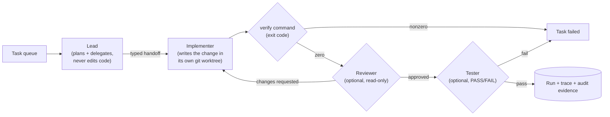
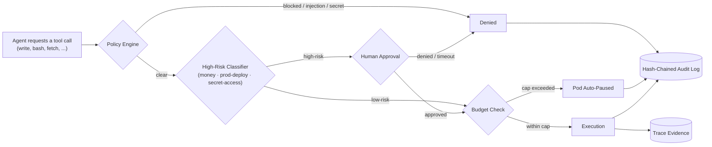

# docket — coding agents that work unattended, under rules they cannot argue with

[](https://github.com/yielab/docket/actions/workflows/ci.yml)
[](LICENSE)
[](https://www.python.org/)
[](specs/)

**docket runs a small team of coding agents — a Lead, an Implementer, and optionally a Reviewer
and a Tester — against your repository, through any OpenAI-compatible model, while you are not
watching.** A role that must not write has no write tool. A risky command waits for a human or is
refused. A step advances on an exit code or an explicit verdict, never on the model's own report.
Everything that happened, and everything that was in effect when it happened, is on the docket: a
hash-chained audit log, a trace per run, and configuration that names its source.

Self-hosted, one CLI, no dashboard of its own, no dollar figure it cannot measure. docket is not a
framework you program an agent loop with, and not an interactive pair-programming harness: it is
the thing that runs the team when nobody is at the keyboard.

> [!WARNING]
> docket is beta software (`v0.2.0-beta.3`). Core contracts are spec-first and test-backed, but the
> project has not been hardened against large deployments or adversarial public-host workloads.
> Expect breaking changes between beta releases and verify consequential outcomes yourself.

## The team

<p align="center">
  
</p>

`docket init` provisions a **pod**, a project-scoped team, and `docket pod <id> dispatch` runs one
turn through it:


```mermaid
flowchart LR
    Q["Task queue"] --> L["Lead\n(plans + delegates,\nnever edits code)"]
    L -- "typed handoff" --> I["Implementer\n(writes the change in\nits own git worktree)"]
    I --> G{"verify command\n(exit code)"}
    G -- "nonzero" --> F["Task failed"]
    G -- "zero" --> R{"Reviewer\n(optional, read-only)"}
    R -- "changes requested" --> I
    R -- "approved" --> T{"Tester\n(optional, PASS/FAIL)"}
    T -- "fail" --> F
    T -- "pass" --> V[("Run + trace + audit evidence")]
```

Lead + Implementer is the minimum. A Reviewer's `APPROVE` or a Tester's `PASS` gates the next
step, and `docket pod <id> set-verify <member> "<command>"` makes a nonzero exit fail the task,
whatever the model claims about its own work. Each pod has its own workspace, session history,
scratch directory and port range, and the Implementer edits in its own git worktree, so an agent's
change never lands on your checked-out branch. `docket init --blueprint research|content|ops|agentic-product`
shapes the same gated pipeline for other kinds of work.

*Limit:* the plan is only as good as the model behind the Lead, and a small local model still
varies run to run. A 16k-context endpoint is the honest integration test, and docket is built to
keep working there.

## The gate

<p align="center">
  
</p>

Every tool call, built-in or MCP, passes one chokepoint before it executes. No setting routes
around it.


```mermaid
flowchart LR
    A["Agent requests a tool call\n(write, bash, fetch, ...)"] --> B{"Policy Engine"}
    B -- "blocked / injection / secret" --> X["Denied"]
    B -- "clear" --> C{"High-Risk Classifier\n(money · prod-deploy · secret-access)"}
    C -- "high-risk" --> D{"Human Approval"}
    C -- "low-risk" --> E{"Budget Check"}
    D -- "approved" --> E
    D -- "denied / timeout" --> X
    E -- "cap exceeded" --> F["Pod Auto-Paused"]
    E -- "within cap" --> G["Execution"]
    X --> H[("Hash-Chained Audit Log")]
    F --> H
    G --> H
    G --> I[("Trace Evidence")]
```

- **A denied tool is absent, not discouraged.** A Reviewer has no `write`, `edit` or `bash` in its
  registry; the tool is removed before the model sees it (`docket roles`, `deniedTools`).
- **The classifier reads the whole command line**, every segment behind `;`, `&&`, `||` or a pipe:
  `git status` passes, `git push origin production` asks (`docket policies test`).
- **Fail-closed.** An approval nobody answers denies itself. A policy file that no longer parses
  blocks the calls it governed and `docket doctor` names it. Isolation with no sandbox backend
  refuses the turn. `docket pod <p> config set approvalMode refuse` turns an unattended pod's
  would-be wait into an immediate, named failure.
- **Nothing runs on its own.** Only `docket pod <p> dispatch`, an authenticated
  `POST /dispatch/<project>`, the MCP `dispatch` tool, or an opt-in schedule swept by
  `docket serve --dispatch` triggers a paid run. Approvals arrive over CLI, HTTP, MCP or an
  inbound-only Telegram bot, each decision logged with its channel.

*Limit:* `fetch` is domain-allowlisted and inspectable, but `bash` still reaches the network
through allowlisted interpreters and package managers. Run untrusted work inside a stronger host or
container boundary.

## The record

<p align="center">
  
</p>

- **`docket audit verify`** checks the hash chain over every policy verdict, approval and
  execution. Tamper-evident, not tamper-proof: rotation keeps one predecessor link, and an
  operator who can delete all docket state can erase the log and its backup together.
- **`docket trace tail <pod>`** shows a run step by step; **`docket runs list|show|cancel`** keeps
  one record per dispatch. `cancel requested` is durable immediately, and running work stops at
  the next safe checkpoint.
- **`docket config explain <agent>`** prints every effective value with the layer that set it,
  the provider and scope the model resolved to, and where its credential came from.
- **`docket cost`** reports measured token counts and a labelled dollar estimate from a local
  pricing snapshot, never a provider invoice; budget auto-pause fires on that estimate.
- **`/status.json` and `/metrics`** feed your own board or plan-of-record over loopback HTTP; the
  task, trace, run and approval routes take a Bearer token. docket feeds a dashboard; it does not
  ship one.

## Quick start

```bash
brew tap yielab/docket-cli https://github.com/yielab/docket
brew install docket-cli
```

Or a version-pinned installer that needs no `sudo`:

```bash
curl -fsSL https://raw.githubusercontent.com/yielab/docket/v0.2.0-beta.3/install.sh \
  | DOCKET_VERSION=0.2.0-beta.3 bash
export PATH="$HOME/.local/bin:$PATH"
```

Requires Python 3.11+, Git, Bash, and a non-streaming OpenAI-compatible chat-completions endpoint
with function-tool support — hosted (Anthropic, OpenAI, Google, OpenRouter, Vercel AI Gateway and
others) or local (llama.cpp, vLLM, LM Studio, Ollama). Fourteen providers ship as readable
`kind: provider` documents (`docket models provider list`); any other endpoint is registered
explicitly, and nothing is guessed.

```bash
docket models provider add local http://127.0.0.1:8081/v1 \
  --model local-model --ctx 32768 --max-tokens 4096
docket models preset local      # every role now resolves to the local endpoint

cd ~/code/myapp
docket init
docket pod myapp delegate "Create FIRST_TURN.md containing: governed first turn"
docket pod myapp dispatch

docket runs list                # what ran
docket trace tail myapp         # what it did, step by step (Ctrl-C to stop)
docket audit verify             # tamper-evident confirmation of the decision chain
```

`models preset local` matters: `set default` alone changes only the fallback, and the built-in role
policy would still route the Lead and Implementer to a hosted model you have no key for. For the
full walkthrough and hosted-provider variants, see the [ten-minute quick start](docs/QUICK-START-DOCKET.md).

## Use something else if

- **You want to pair with an agent interactively in your terminal.** A vendor coding harness is
  built for that; docket is built for the run you are not watching.
- **You want a board or a UI.** Use a worktree orchestrator, or point Tack (or your own consumer)
  at docket's read API.
- **You need hosted, multi-tenant execution.** docket is single-operator software with no tenant
  axis, hosted scheduler or quota system.

## Three ways to run it

- **As a CLI**, the quick start above: provision and dispatch a pod from your own terminal.
- **As a non-interactive harness**, `docket harness run` executes one agent for one turn in a
  workspace and `DOCKET_HOME` the caller supplies, streams newline-delimited events, ends with one
  versioned result, and exits 0 / 1 / 2 (completed / ended badly / refused before any turn). A call
  that would need approval ends the run as `blocked` instead of waiting on nobody. Contract:
  [docs/contracts/harness-v1/](docs/contracts/harness-v1/).
- **As an embedded engine**, the standalone **`docket-runtime`** package lets an application
  register and dispatch tools through the same policy, approval, trace and audit chokepoint. It
  depends on `pydantic` and `filelock` only, is source-built and **not published to any index**,
  and exposes a narrow gated-tool facade, not a second turn loop. The two adapter configurations
  it is verified with, and everything outside that proof, are in [Compatibility](COMPATIBILITY.md).

## Everything above is configuration

Every layer of the orchestration is a file you edit or a command you run, with working defaults,
so a custom setup is configuration, never a fork:

| You want to change… | Layer | How |
| --- | --- | --- |
| The team shape a new pod gets | Blueprint | `docket init --blueprint software\|research\|content\|ops\|agentic-product` |
| Who works a task, in what order, behind which gates, with how much rework | Pipeline | write a `kind: pipeline` YAML, `docket pipeline validate/plan` it, run it once with `--file` or bind it as the pod's default for every trigger with `docket pod <p> config set pipeline <file>` |
| What a kind of agent is, what it is told each hop, and which tools it is structurally denied | Role | `docket roles add` (`deniedTools`, `hopInstruction`, gate contract, token budget), globally or `--pod <p>` |
| Your own words in front of an agent | Instructions | edit the operator-owned `INSTRUCTIONS.md` (docket never touches it), or opt in your repo's own `AGENTS.md` with `pod config set projectInstructions` |
| What is forbidden or needs a human, everywhere | Policies | drop a `kind: policy` YAML (`when`/`then`) or a JSON file in `~/.docket/policies/`; live on the next call, `docket policies test`/`validate` to check it |
| What one pod may run unattended | Pod settings | `pod config set allowCommands pytest,uv` · `approvalMode refuse` · `budgetUsd` · timeouts · `schedule` |
| Which model each role uses | Model policy | `docket models set <role> <provider/model>`; pin one agent with `docket profile` |
| What a provider name means: URL, dialect, model limits, and which credential it uses by name | Provider catalog | `docket models provider add <file.yaml>` (a `kind: provider` document; `export <name>` prints a built-in as a starting point), the key itself via `docket keys add <NAME>` |
| A proven starting point instead of a blank page | Recipes | `docket pod <p> apply templates/recipes/secure-build` (or `research-review`, `ops-approval`); `docket pod <p> export <dir>` writes a pod back into that shape |

One rule keeps the map honest: a guarantee is a docket-managed registry under `~/.docket/`,
evaluated by code and audited when it fires; a file the agent merely reads is advice. Every setting
has one writer, is validated when written, and is refused loudly when broken. `docket validate
<dir>` checks any of these documents against editor-usable schemas. The file-by-file map of
everything an install creates is [Configuration](docs/CONFIGURATION.md); the team-level reference
is [Agent teams](docs/AGENT-TEAMS.md).

## Also shipped

- **Pipelines as bounded data**: `on:` routing with capped loops, `when` skips, `run:` command
  steps, `${var}` instructions; planned from the real executor, never a second pretty-printer.
- **MCP in both directions**: `docket mcp serve` exposes the control surface; `docket mcp servers`
  wires external tool servers into the same chokepoint, `--kind read` for read-only roles.
- **Typed handoffs and context budgets** that follow the resolved model's window, with any
  truncation marked and traced rather than silent.
- **Session compaction on the live path**, never splitting a tool call from its result.
- **Opt-in sandboxing** (`docket gates isolate on`, Docker or bwrap) and a deny-by-default `fetch`.
- **Retention and recovery**: `docket trace expire`, `runs prune`, `conversations prune`; a corrupt
  docket-owned JSON file recovers from its validated backup, `docket doctor --fix` repairs drift.
- **Recipes** validated in CI; `secure-build` is proven by an end-to-end dispatch.

## Known limits

Read these before trusting docket with anything consequential; they are the honest boundary of
what "governed" currently means. The mechanism above is automated-test-backed (see
[Adoption evidence](docs/ADOPTION-EVIDENCE.md) for reproducible results); it has not been hardened
the way the limits below describe.

- **Beta, single-operator software:** no tenant axis, hosted scheduler, quota system, or
  large-deployment claim.
- **Compatible HTTP, not provider SDK parity:** non-streaming `/chat/completions` with function
  tools. A text-only endpoint can answer text turns but cannot complete tool-dependent work.
  Anthropic documents its OpenAI-compatibility layer as intended for evaluation (no prompt caching)
  and Google documents its Gemini layer as beta; the built-in documents say so in their preset notes.
- **MCP tools are writes unless the operator says otherwise:** nothing can prove a remote tool is
  read-only, so a server left at the default reaches no read-only role. `--kind read` is an
  operator assertion, not a verified fact. Each configured stdio server is re-spawned per turn.
- **Telegram is inbound-only:** four verbs, no free-text chat, and docket never messages a chat
  first; no approval notifications, no completion reports.
- **Metrics counters are not monotonic:** they count what current storage holds, so audit
  rotation and trace retention can drop them. Do not alert on `rate()` over them.
- **Cancellation is cooperative:** a running `bash` command is killed, but an HTTP call or another
  tool handler already executing may finish before its result is discarded.

Read [SECURITY.md](SECURITY.md) before exposing a service, and [COMPATIBILITY.md](COMPATIBILITY.md)
before relying on a model endpoint or MCP server.

## Documentation

| Need | Guide |
| --- | --- |
| Install and first governed turn | [Quick start](docs/QUICK-START-DOCKET.md) |
| Roles, pod shapes, handoffs, gates | [Agent teams](docs/AGENT-TEAMS.md) |
| Every installed file, every setting, recipes | [Configuration](docs/CONFIGURATION.md) |
| Every command and flag | [Command reference](docs/commands.md) |
| Provider endpoints and coding harnesses | [Models and gateways](docs/MODEL-GATEWAYS.md) |
| Security posture and deployment limits | [Security model](SECURITY.md) |
| Runtime and protocol compatibility | [Compatibility](COMPATIBILITY.md) |
| Deterministic adoption evidence and limits | [Adoption evidence](docs/ADOPTION-EVIDENCE.md) |
| Architecture, state ownership, and embedding `docket-runtime` | [Architecture](docs/DOCKET.md) |
| Pipeline examples | [Workflow guide](docs/WORKFLOW-GUIDE.md) |
| Troubleshooting | [Troubleshooting](docs/troubleshooting.md) |
| Current plans and measured triggers | [Roadmap](ROADMAP.md) |
| Current executable contracts | [Specifications](specs/README.md) |
| Contributing, tests, and CI gates | [Contributing](CONTRIBUTING.md) |

## Contributing

docket uses spec-first, test-first development and a three-layer architecture, `cli → core →
edges`. Two boundaries are non-negotiable: `core/tools.py::dispatch_tool` is the sole
tool-execution chokepoint, and `edges/store.py` is the sole writer of docket-owned JSON. Start with
[CONTRIBUTING.md](CONTRIBUTING.md). New features need a measured trigger, an executable acceptance
case, and documentation that states limits as clearly as capabilities.

## License

Apache-2.0. See [LICENSE](LICENSE).
