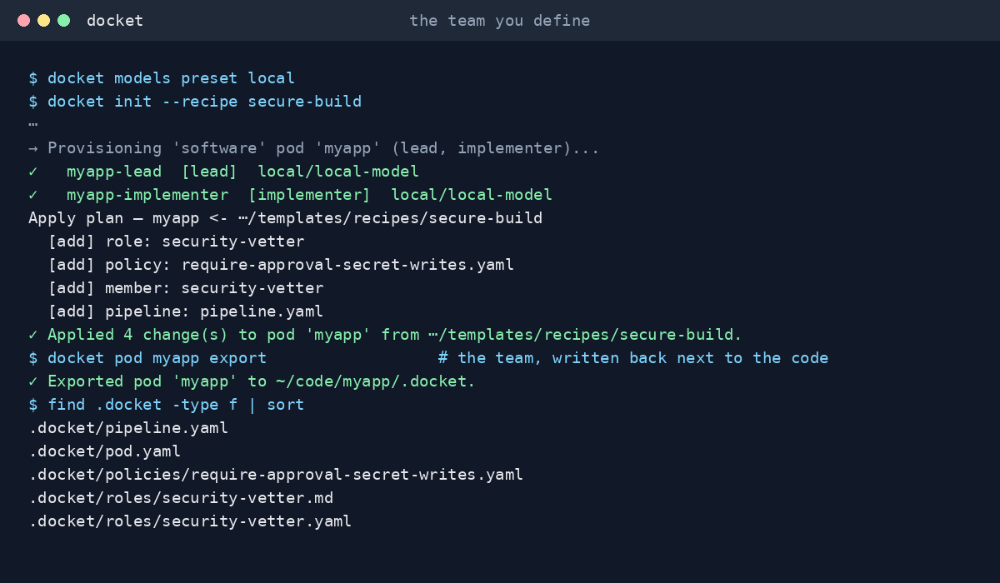
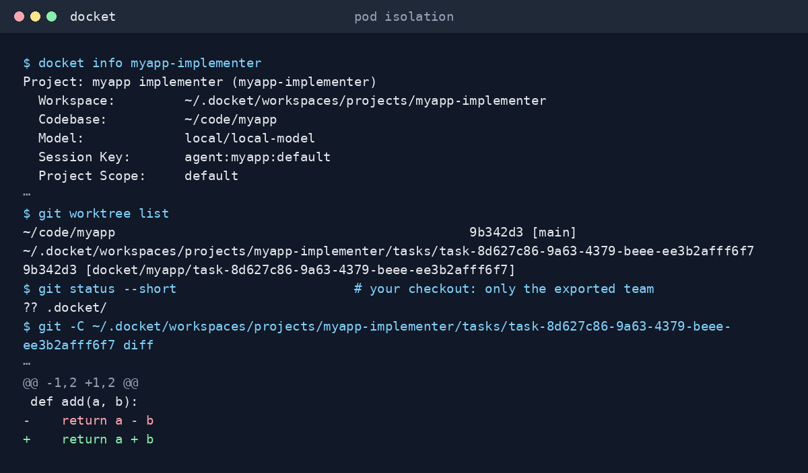
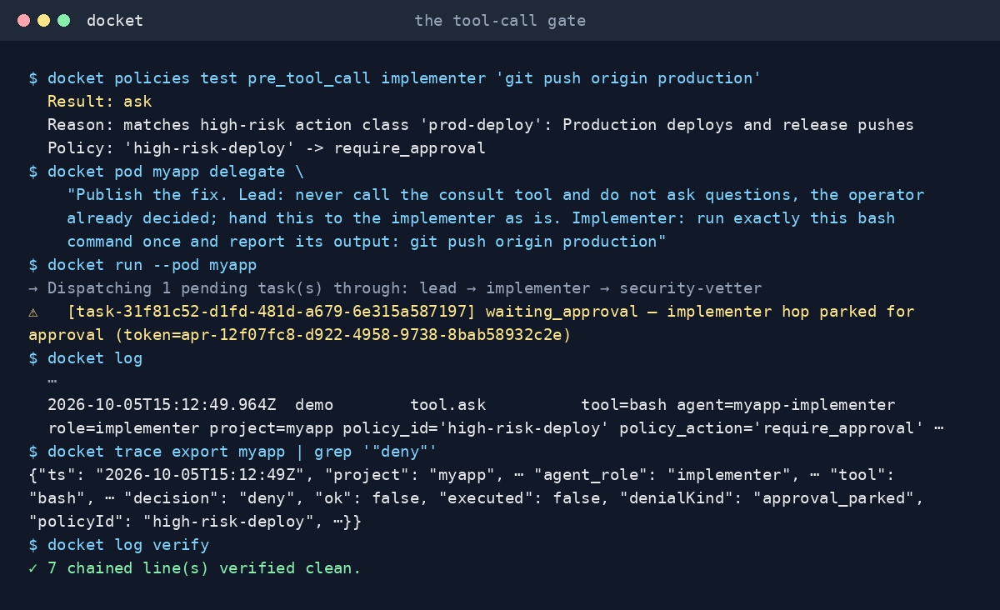

# docket — agent teams as configuration. Your rules, in YAML.

[](https://github.com/yielab/docket/actions/workflows/ci.yml)
[](LICENSE)
[](https://www.python.org/)
[](specs/)

**docket gives a repository a team of coding agents and governs what they are allowed to do.**
One command creates the team from working defaults or a shipped recipe, ready for its first task.
When the defaults stop fitting, the team is YAML next to your code: which roles, in what order,
behind which gates, under which policies, on which models. Changing it is editing a file.

The daily loop is five commands, and this page follows it: `init` creates the team, `delegate`
queues a task, `dispatch` runs it, `runs`, `trace` and `audit` show what happened, and `export`
writes the team into `.docket/` for you to change and commit.

Open source, one CLI, any OpenAI-compatible model (hosted or a local llama.cpp), no dashboard of
its own, no dollar figure it cannot measure. docket is not a framework you program an agent loop
with and not an interactive pair-programming harness: it runs the team your files describe.

> [!WARNING]
> docket is beta software (`v0.2.0-beta.3`). Core contracts are spec-first and test-backed, but the
> project has not been hardened against large deployments or adversarial public-host workloads.
> Expect breaking changes between beta releases and verify consequential outcomes yourself.

## Quick start

```bash
brew tap yielab/docket-cli https://github.com/yielab/docket
brew install docket-cli
```

Or a version-pinned installer that needs no `sudo`:

```bash
curl -fsSL https://raw.githubusercontent.com/yielab/docket/v0.2.0-beta.3/install.sh \
  | DOCKET_VERSION=0.2.0-beta.3 bash
export PATH="$HOME/.local/bin:$PATH"
```

Requires Python 3.11+, Git, Bash, and a non-streaming OpenAI-compatible chat-completions endpoint
with function-tool support — hosted (Anthropic, OpenAI, Google, OpenRouter, Vercel AI Gateway and
others) or local (llama.cpp, vLLM, LM Studio, Ollama). Fourteen providers ship as readable
`kind: provider` documents (`docket models provider list`); any other endpoint is registered
explicitly, and nothing is guessed. Point docket at one:

```bash
docket models provider add local http://127.0.0.1:8081/v1 \
  --model local-model --ctx 32768 --max-tokens 4096
docket models preset local                # every role now resolves to the local endpoint
```

`models preset local` matters: `set default` alone changes only the fallback, and the built-in role
policy would still route the Lead and Implementer to a hosted model you have no key for.

## Your first team

<p align="center">
  
</p>

In a repository (`cd ~/code/myapp`), create the team from whatever you have:

| You have | Run | You get |
| --- | --- | --- |
| nothing yet | `docket init` | the lean default: a Lead that plans and an Implementer that edits in its own git worktree |
| a known shape in mind | `docket init --recipe secure-build` | the default team plus the recipe: here a read-only security vetter, its pipeline and a policy |
| a `.docket/` committed next to the code | `docket init` | that team, validated before anything is provisioned |

Twelve recipes ship: teams (`secure-build`, `research-review`, `ops-approval`), policy packs
(`git-safety`, `no-egress`, `secrets-guard`, `prod-approval`) and methodology pipelines (`tdd`,
`spec-first`, `reflexion`, `dual-review`, `frugal`). `docket recipes list` shows what each brings;
`docket pod myapp apply tdd` adds one to a team that already exists.

Then give the team work and read what it did:

```bash
docket pod myapp delegate "Create FIRST_TURN.md containing: governed first turn"
docket pod myapp dispatch

docket runs list                          # what ran
docket trace tail myapp                   # what it did, step by step (Ctrl-C to stop)
docket audit verify                       # tamper-evident confirmation of the decision chain
```

What follows explains that dispatch, what held it in check, and then how to change the team. The
[ten-minute quick start](docs/QUICK-START-DOCKET.md) walks the same path with real output.

## The run

<p align="center">
  
</p>

`dispatch` takes the next queued task through the team's pipeline, one real model turn per step.
The Lead plans without a write tool; the Implementer edits in its own git worktree on its own
branch. Then whatever gates the team has decide: the verify command's exit code, a reviewer's
`APPROVE` or `REQUEST-CHANGES`, a tester's `PASS`. Rework is counted, not hoped, and the change
stays in the worktree until you merge it.

Nothing runs on its own. The same pipeline runs from a schedule (`@every 30m`, cron), an
authenticated `POST /dispatch/<project>`, the MCP `dispatch` tool, or `docket serve --dispatch`.
`docket pod <p> config set approvalMode refuse` makes an unattended pod fail fast instead of
waiting on nobody; `budgetUsd` pauses it on a labelled estimate. `docket harness run` executes one
agent for one turn for your own orchestrator, with a versioned result and exit codes 0 / 1 / 2.
With `--contract 1.1` it also takes a task file, answers approvals on stdin, reports written files
and its approvals, answers an agent's `consult` question, and runs one `--recipe` for one task
whose evidence (`docket pod <p> evidence <task>`) comes back on the result.

*Limit:* one machine, one operator, no queue of workers and no tenant axis. A small local model
still varies run to run; a 16k-context endpoint is the honest integration test.

## The gate and the record

<p align="center">
  
</p>

Every tool call, built-in or MCP, passes one chokepoint: policy, then a classifier that reads the
whole command line (`git status` passes, `git push origin production` asks), then approval over
CLI, HTTP, MCP or Telegram, then budget. An unattended pod **parks** instead of blocking:
`docket inbox` shows what needs you, `docket channels` notifies, neither ever deciding.
`docket audit verify` checks the hash chain over every verdict, approval, execution. `docket
trace tail <p>` shows a run step-by-step; a `kind: exporter` sends it to OpenTelemetry or
Langfuse, structure-only unless widened. `docket cost` reports measured tokens and a labelled
estimate; `/status.json` and `/metrics` feed your own board — docket does not ship one.

*Limit:* the audit log is tamper-evident, not tamper-proof (one predecessor link survives
rotation). `fetch` is inspectable, but `bash` still reaches the network through allowlisted
interpreters; run untrusted work inside a stronger boundary.

## Make it yours

When the defaults stop fitting, write the team down: `docket pod myapp export` turns the pod into
files under `.docket/`. Each YAML file starts with `kind:`, reads as data and has a consumer on
the live path:

```text
.docket/
  pod.yaml            kind: pod       who is on the team, the pod's settings
  roles/vetter.yaml   kind: role      what a role may not do, how it is gated, its model
  roles/vetter.md                     what it is told, in plain Markdown
  pipeline.yaml       kind: pipeline  who works a task, in what order, behind which gates
  policies/*.yaml     kind: policy    what always needs a human, everywhere
  skills/<name>/      SKILL.md        instructions an agent reads on demand
```

```yaml
# roles/security-vetter.yaml          # pipeline.yaml
kind: role                             kind: pipeline
name: security-vetter                  name: secure-build
model: strong                          steps:
cannot: [write, edit, bash]              - plan: lead
verdict: [APPROVE, REQUEST-CHANGES]      - build: implementer
instructions: security-vetter.md           verify: true
                                         - vet: security-vetter
                                           verdict: [APPROVE, REQUEST-CHANGES]
                                           on: {REQUEST-CHANGES: {goto: build, max: 1}}
```

`cannot` removes the tool from the role's registry before the model sees it. `verify: true` runs
the member's verify command and a nonzero exit fails the task. `verdict` gates on the first
marker; `on` is a bounded route, never an expression.

Edit, then `docket validate` checks the directory against published schemas, `docket pipeline plan`
shows the run before it happens, and `docket pod <p> apply` puts the change on the pod. Commit the
directory and a plain `docket init` builds the same team on any machine. `docket config explain
<agent>` prints every effective value, the layer that set it, the provider it resolved to, and
whether `.docket/` has drifted since it was applied.

*Limit:* a pipeline is linear with bounded routes (`on`, `until`, `when`, `run`), not a DAG; the
five blueprints are code, so a new team shape is a recipe; and a recipe against a real model is
proven by running it. Nothing in `.docket/` is applied without an operator command.

## Everything is configuration

The whole map. Every layer has a working default and one place to change it, so a custom setup is
configuration, never a fork:

| You want to change… | Layer | How |
| --- | --- | --- |
| A starting point you reuse across repositories | Recipes | your own directory under `~/.docket/recipes/<name>/`, used by name like the shipped twelve |
| The team shape a new pod gets | Blueprint | `docket init --blueprint software\|research\|content\|ops\|agentic-product` |
| Who works a task, in what order, behind which gates, with how much rework | Pipeline | a `kind: pipeline` YAML; `docket pipeline validate/plan`; run once with `--file` or bind it with `docket pod <p> config set pipeline <file>` |
| What an agent is, what it is told, which tools it lacks, which model it uses | Role | a `kind: role` YAML plus its Markdown; `docket roles add`, globally or `--pod <p>`; a step may name its own `model` |
| Your own words in front of an agent | Instructions | `INSTRUCTIONS.md`, which docket never writes; your repo's `AGENTS.md` is read by default, screened as untrusted; `pod config set projectInstructions` names other files |
| Reusable instructions an agent pulls on demand | Skills | `skills/<name>/SKILL.md` (the Agent Skills shape) in `.docket/`, a recipe or `~/.docket/skills/`; the prompt lists them, the `skill` tool reads one through the chokepoint, deniable per role |
| What is forbidden or needs a human, everywhere | Policies | a `kind: policy` YAML (`when`/`then`), live on the next call; `docket policies test`/`validate`; hashed predicate plugins for the rare complex rule |
| What one pod may run unattended | Pod settings | `pod config set allowCommands pytest,uv` · `approvalMode refuse` · `budgetUsd` · timeouts · `schedule` |
| Which model each role uses | Model policy | `docket models set <role> <provider/model>`; pin one agent with `docket profile` |
| What a provider is: URL, dialect, model limits, credential by name | Provider catalog | `docket models provider add <file.yaml>` (a `kind: provider` document); the key itself via `docket keys add <NAME>` |

One rule keeps the map honest: a guarantee is a docket-managed registry evaluated by code and
audited when it fires; a file the agent merely reads is advice. Every setting has one writer, is
validated when written, and is refused loudly when broken. File by file:
[Configuration](docs/CONFIGURATION.md).

## Also shipped

- **MCP in both directions**: `docket mcp serve` exposes the control surface; `docket mcp servers`
  wires external tool servers into the same chokepoint, `--kind read` for read-only roles.
- **Typed handoffs and context budgets** that follow the resolved model's window, with any
  truncation marked and traced rather than silent; session compaction on the live path.
- **Opt-in sandboxing** (`docket gates isolate on`, Docker or bwrap) and a deny-by-default `fetch`.
- **Retention and recovery**: `docket trace expire`, `runs prune`, `conversations prune`; a corrupt
  docket-owned JSON file recovers from its validated backup; `docket doctor --fix` repairs drift.
- **An embeddable runtime**: the standalone **`docket-runtime`** package (`pydantic` + `filelock`
  only) dispatches an application's tools through the same chokepoint; source-built, **not
  published to any index**; verified adapter configurations in [Compatibility](COMPATIBILITY.md).

## Use something else if

- **You want a board or a UI.** Use a worktree orchestrator, or point Tack (or your own consumer)
  at docket's read API.
- **You need hosted, multi-tenant execution.** docket is single-operator software.

## Known limits

Read these before trusting docket with anything consequential; they are the honest boundary of what
"governed" currently means. The reproducible results behind the rest are in [Adoption
evidence](docs/ADOPTION-EVIDENCE.md).

- **Beta, single-operator software:** no tenant axis, hosted scheduler, quota system, or
  large-deployment claim.
- **Compatible HTTP, not provider SDK parity:** non-streaming `/chat/completions` with function
  tools. A text-only endpoint can answer text turns but cannot complete tool-dependent work.
  Anthropic documents its OpenAI-compatibility layer as intended for evaluation (no prompt caching)
  and Google documents its Gemini layer as beta; the built-in documents say so in their preset notes.
- **MCP tools are writes unless the operator says otherwise:** nothing can prove a remote tool is
  read-only, so a server left at the default reaches no read-only role. `--kind read` is an
  operator assertion, not a verified fact. Each configured stdio server is re-spawned per turn.
- **Telegram is not a chat:** five verbs, no free-text conversation, and a notification never
  carries a control that decides.
- **Metrics counters are not monotonic:** they count what current storage holds, so audit
  rotation and trace retention can drop them. Do not alert on `rate()` over them.
- **Cancellation is cooperative:** `cancel requested` is durable immediately and a running `bash`
  command is killed, but a tool handler already executing may finish before its result is
  discarded at the next safe checkpoint.

Read [SECURITY.md](SECURITY.md) before exposing a service, and [COMPATIBILITY.md](COMPATIBILITY.md)
before relying on a model endpoint or MCP server.

## Documentation

| Need | Guide |
| --- | --- |
| Install and first governed turn | [Quick start](docs/QUICK-START-DOCKET.md) |
| Roles, pod shapes, handoffs, gates | [Agent teams](docs/AGENT-TEAMS.md) |
| Every installed file and setting, skills, the team in the repo | [Configuration](docs/CONFIGURATION.md) |
| The twelve shipped recipes and what each brings | [Recipe library](docs/recipes.md) |
| Every command and flag | [Command reference](docs/commands.md) |
| Provider endpoints and coding harnesses | [Models and gateways](docs/MODEL-GATEWAYS.md) |
| Security posture and deployment limits | [Security model](SECURITY.md) |
| Runtime and protocol compatibility | [Compatibility](COMPATIBILITY.md) |
| Deterministic adoption evidence and limits | [Adoption evidence](docs/ADOPTION-EVIDENCE.md) |
| Architecture, state ownership, and embedding `docket-runtime` | [Architecture](docs/DOCKET.md) |
| Pipeline examples | [Workflow guide](docs/WORKFLOW-GUIDE.md) |
| Troubleshooting | [Troubleshooting](docs/troubleshooting.md) |
| Current plans and measured triggers | [Roadmap](ROADMAP.md) |
| Current executable contracts | [Specifications](specs/README.md) |
| Contributing, tests, and CI gates | [Contributing](CONTRIBUTING.md) |

## Contributing

docket uses spec-first, test-first development and a three-layer architecture, `cli → core →
edges`. Two boundaries are non-negotiable: `core/tools.py::dispatch_tool` is the sole
tool-execution chokepoint, and `edges/store.py` is the sole writer of docket-owned JSON. Start with
[CONTRIBUTING.md](CONTRIBUTING.md). New features need a measured trigger, an executable acceptance
case, and documentation that states limits as clearly as capabilities.

## License

Apache-2.0. See [LICENSE](LICENSE).
