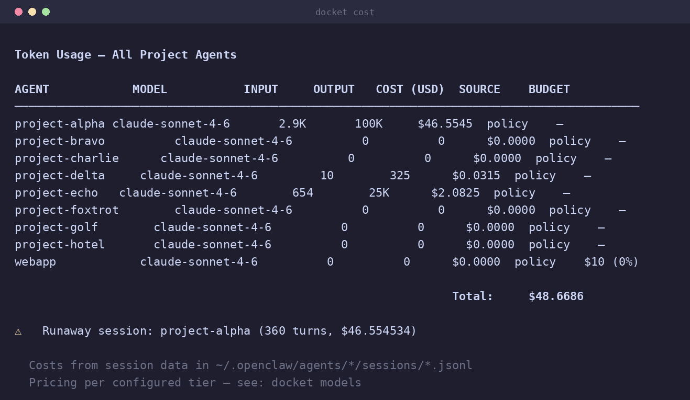

# Command Reference

Complete reference for all docket commands with detailed examples and options.

## Table of Contents

- [Setup Commands](#setup-commands)
- [Lifecycle Commands](#lifecycle-commands)
- [Session & Context Management](#session--context-management)
- [Pod Coordination](#pod-coordination)
- [Workflow Management](#workflow-management)
- [Telegram Integration](#telegram-integration)
- [Keys & Authentication](#keys--authentication)
- [Utility Commands](#utility-commands)
- [Security & Audit](#security--audit)
- [Observability Commands](#observability-commands)
- [Global Options](#global-options)
- [Command Aliases](#command-aliases)
- [Removed Commands](#removed-commands)
- [Exit Codes](#exit-codes)
- [Environment Variables](#environment-variables)

## Setup Commands

### install

Bootstrap a complete OpenClaw setup from scratch, including the shared **org specialists**.

**Syntax:**
```bash
docket install                  # manager, knowledge, security — exec-approval gates ON by default
docket install --portfolio      # + the optional org Portfolio Manager
docket install --no-gates       # opt out of exec-approval gates at install time
docket install --yes            # skip confirmation prompts (non-interactive/CI)
```

**What it does:**
1. Checks for required dependencies (python3 3.11+, openclaw, systemctl; bash for the launcher)
2. Initializes OpenClaw configuration at `~/.openclaw/openclaw.json`
3. Creates the org specialists (`scope: org`): **manager**, **knowledge**, **security**
4. Sets up specialist agents and best-practice defaults
5. Sets up workspace directories with proper permissions (700)
6. Starts the openclaw-gateway.service systemd unit

**Flags:**
- **`--portfolio`**: also provision the optional org **Portfolio Manager** — one
  `portfolio-manager` agent (`scope: org`) that is an advisory cross-pod planner over fleet
  *metadata* (which pods exist, their queues, budgets, health). It never edits code, never
  dispatches into a pod, and is never a pod member. Opt-in.
- **`--gates`/`--no-gates`** (default `--gates`, i.e. **on**): the enforced tool-approval gates
  for dangerous operations are applied automatically; pass `--no-gates` to explicitly opt out.
  Re-apply or reverse anytime with `docket gates enable`/`docket gates disable` — see
  `specs/functional/security-gates.spec.md`.
- **`--yes`/`-y`**: skip interactive confirmation prompts — for scripted/CI installs.

**Example:**
```bash
# First-time setup (gates on by default)
docket install

# With the org Portfolio Manager, opting out of gates
docket install --portfolio --no-gates

# Non-interactive (CI)
docket install --yes

# Output:
# → Checking dependencies...
# ✓ python3 3.11+ found
# ✓ openclaw 0.4.2 found
# → Creating OpenClaw config...
# → Creating org specialists...
# ✓ manager agent created
# ✓ knowledge agent created
# ✓ security agent created
# ...
# ✓ Installation complete!
```

**Aliases:** `setup`

**Notes:**
- Safe to run multiple times (idempotent)
- Preserves existing agents
- Recommended on clean systems
- Project pods are created separately with [`docket add`](#add); see
  [Agent Teams (Pods)](AGENT-TEAMS.md)

---

## Lifecycle Commands

### list

Display all project agents with status, model, and Telegram binding info.

**Syntax:**
```bash
docket list
```

**Output format:**
```
┌──────────────────────────────────────────────────────────────┐
│ ID              Type   Model        Telegram      Session    │
├──────────────────────────────────────────────────────────────┤
│ myproject       repo   sonnet (policy) ✓ Wired    default     │
│ taskagent       task   haiku (policy)  ✗ Not wired alpha      │
└──────────────────────────────────────────────────────────────┘
```

**Example:**
```bash
docket list

# With DEBUG mode
DEBUG=1 docket list
```

**Aliases:** None

**Notes:**
- Shows all registered agents: org specialists (manager, knowledge, security) and all pod members
- Telegram status checks openclaw.json bindings
- Session shows current project key

---

### add

Create a new project **pod** — an isolated team of project-scoped agents that owns one codebase.
The default pod is **lean: a Lead + an Implementer**. See [Agent Teams (Pods)](AGENT-TEAMS.md).

**Syntax:**
```bash
docket add                               # interactive
docket add <project> [path]              # lean pod: <project>-lead + <project>-implementer
docket add <project> [path] --pod full   # full pod: + reviewer + tester
docket add <project> [path] --with reviewer,tester   # lean pod + named roles
```

**Flags:**
- **`--pod full`**: provision the full pod — Lead, Implementer, Reviewer, and Tester.
- **`--with <roles>`**: start from the lean pod and add the named roles (comma-separated:
  `reviewer`, `tester`, `implementer`). E.g. `--with reviewer` adds a review gate only.

Member ids are predictable: `myapp-lead`, `myapp-implementer`, `myapp-reviewer`, `myapp-tester`
(duplicated roles get `-2`, `-3` suffixes). A pod has **exactly one Lead**. Resize the pod later
with [`docket pod`](#pod), and tear the whole pod down with [`docket delete`](#delete).

**Interactive prompts:**
1. **Agent type:** `repo` (codebase-based) or `task` (general work)
2. **Project name:** Display name for the agent
3. **Codebase path:** (repo type only) Absolute path to codebase
4. **Description:** Optional description
5. **Tech stack:** Auto-detected or manual entry
6. **Model selection:** Choose from available models or profiles
7. **Telegram group:** Optional group ID for wiring

**Example:**
```bash
# Lean pod (Lead + Implementer) for a codebase
docket add myapp ~/code/myapp

# Full pod with a review + test gate
docket add myapp ~/code/myapp --pod full

# Lean pod plus a reviewer
docket add myapp ~/code/myapp --with reviewer

# Interactive session:
# → Select agent type:
#   1) repo (codebase-based project)
#   2) task (general work)
# Choice: 1
#
# → Enter project name: My Awesome Project
# → Detecting stack...
# ✓ Detected: Node.js, React, TypeScript
# → Model [policy: anthropic/claude-sonnet-4-6]:
#   (Enter = follow the role policy; type a provider/model ID to pin)
#
# ✓ Pod 'myapp' created (myapp-lead, myapp-implementer)
```

**Aliases:** `create`, `new`

**Notes:**
- Member ids auto-generated via slugification (`<project>-<role>[-N]`)
- Each member gets its own workspace at `~/.openclaw/workspaces/projects/<member-id>/`
- Generates SOUL.md, AGENTS.md, TOOLS.md, HEARTBEAT.md per member
- Sets permissions to 700 (dirs) and 600 (files)
- Restarts gateway after creation
- Pod members are ordinary registered agents, so `docket list`/`info`/`cost`/`doctor` see them

---

### info

Display detailed information about a specific project agent.


**Syntax:**
```bash
docket info <agent-id>
docket info             # Interactive picker if ID omitted
```

**Output:**
```
Agent: myproject-implementer
─────────────────────────────────────────────────
Type:              repo
Name:              My Awesome Project
Codebase:          /home/user/Sites/myproject
Stack:             Node.js, React, TypeScript
Model:             anthropic/claude-sonnet-4-6
Description:       My project description
Session Key:       agent:myproject:default
Project Key:       default
Created:           2026-02-25T10:00:00Z
Workspace:         ~/.openclaw/workspaces/projects/myproject-implementer/
Telegram:          ✓ Wired to group -1001234567890
```

**Example:**
```bash
# With agent ID
docket info myproject

# Interactive picker
docket info
# → Select project:
#   1) myproject - My Awesome Project
#   2) taskagent - Task Agent
# Choice: 1
```

**Aliases:** `show`

**Notes:**
- Uses fzf for interactive selection if available
- Falls back to numbered list otherwise
- Displays metadata from .docket-meta.json

---

### delete

Remove an agent and optionally its workspace.

**Syntax:**
```bash
docket delete <agent-id>
docket delete           # Interactive picker
```

**Interactive prompts:**
1. Confirm deletion (yes/no)
2. Delete workspace files (yes/no)

**Example:**
```bash
docket delete myproject

# Prompts:
# ⚠ Delete agent 'myproject'? (yes/no): yes
# ⚠ Also delete workspace directory? (yes/no): yes
# ✓ Agent deleted
# ✓ Workspace removed
```

**Aliases:** `remove`, `rm`

**Notes:**
- Removes agent from openclaw.json
- Optionally deletes `~/.openclaw/workspaces/projects/<id>/`
- Restarts gateway after deletion
- Cannot be undone (backup first if unsure)
- Given a pod id (not a single member id), removes the whole pod — see [`docket pod`](#pod) to
  remove one member instead

---

### maintain

Clear memory, repair, or rebuild an agent. Consolidates the retired `reset`, `repair`, and
`cleanup` commands into one.


**Syntax:**
```bash
docket maintain [agent-id] [mode]
```

**Modes:**
- **`check`** (default): Health check and auto-fix — permissions (700/600), missing workspace
  files, session-key sync between `.docket-meta.json` and `openclaw.json`, Telegram bindings
- **`clean`**: Clear memory logs only (`memory/*.md`)
- **`reset`**: Clear memory + MEMORY.md + HEARTBEAT.md
- **`rebuild`**: Deep rebuild — regenerate SOUL.md, AGENTS.md, TOOLS.md from metadata
- **`sessions`**: Archive large/old session data

**Example:**
```bash
# Health check and auto-fix (was: docket repair)
docket maintain myproject
docket maintain myproject check

# Clear memory logs (was: docket reset 1)
docket maintain myproject clean

# Clear memory + heartbeat (was: docket reset 2)
docket maintain myproject reset

# Deep rebuild (was: docket reset 3)
docket maintain myproject rebuild

# Archive old sessions (was: docket cleanup safe)
docket maintain myproject sessions
```

**Migration (deprecated → current):**

| Old | New |
|-----|-----|
| `docket repair [id]` | `docket maintain [id] check` |
| `docket reset [id]` / `reset [id] 1` | `docket maintain [id] clean` |
| `docket reset [id] 2` | `docket maintain [id] reset` |
| `docket reset [id] 3` | `docket maintain [id] rebuild` |
| `docket cleanup [id]` | `docket maintain [id] sessions` |

**Notes:**
- Preserves identity (`.docket-meta.json`, `openclaw.json`)
- `reset`/`rebuild` are destructive and prompt for confirmation
- Restarts the gateway after structural changes

---

## Session & Context Management

### scope

Manage session keys for multi-project isolation.

**Syntax:**
```bash
docket scope <agent-id> show                    # Display current scope
docket scope <agent-id> set <project-key>       # Set new project scope
docket scope <agent-id> reset                   # Reset to default
```

**Session key format:** `agent:<id>:<project>`

**Example:**
```bash
# Show current scope
docket scope myproject show
# Output: agent:myproject:default

# Set scope to "alpha"
docket scope myproject set alpha
# ✓ Session key updated: agent:myproject:alpha

# Reset to default
docket scope myproject reset
# ✓ Session key reset: agent:myproject:default
```

**Aliases:** None

**Notes:**
- Prevents cross-project contamination
- Updates .docket-meta.json, openclaw.json, and SOUL.md
- Restarts gateway to apply changes
- Use different keys for parallel project work

---

### context

Inspect and manage an agent's memory and working context — a dashboard, a keyword search over
its memory logs, and per-agent memory maintenance.

**Syntax:**
```bash
docket context <agent-id>                 # show: dashboard (default)
docket context <agent-id> show            # same as above
docket context <agent-id> search <query>  # keyword search over indexed memory
docket context <agent-id> index           # (re)build the search index
docket context <agent-id> snapshot        # write SNAPSHOT.md into the agent's own workspace
docket context <agent-id> compress        # archive (gzip) memory logs older than 30 days
docket context <agent-id> project         # project/stack-focused view (codebase, stack, tasks)
```

**Subcommands:**

#### show (default)
Dashboard: the last 3 memory-log files (last 5 lines each), active tasks parsed from
`HEARTBEAT.md`, today's gateway log lines mentioning the agent, and quick stats (memory-log
count, session size, last-active timestamp).

```bash
docket context myproject
```

#### search
Keyword search over memory logs and `MEMORY.md` decision headers. Requires `docket context <id>
index` to have been run at least once (if the index is missing, it tells you so and exits 0
rather than erroring). Any words after `search` (or after the agent id, with no subcommand at
all) are treated as the query.

```bash
docket context myproject search "auth middleware"
docket context myproject auth middleware   # same — bare text also means "search"
```

#### index
(Re)builds `.memory-index.json` from `memory/*.md` (bolded/code-span tokens as keywords) and
`MEMORY.md`'s `## ` headers (as decisions). Run this after new memory logs accumulate and before
`search`.

```bash
docket context myproject index
```

#### snapshot
Writes a **markdown** snapshot (`SNAPSHOT.md`, chmod 600) into *that agent's own workspace* —
metadata, recent memory activity, and the full `HEARTBEAT.md`/`MEMORY.md` contents. This is a
**different command from the top-level [`docket snapshot`](#snapshot-1)**, which exports the
whole fleet as JSON to stdout or a file. Same word, different scope and format — don't confuse
the two.

```bash
docket context myproject snapshot
# ✓ Snapshot written: ~/.openclaw/workspaces/projects/myproject/SNAPSHOT.md
```

#### compress
Gzips memory-log files older than 30 days into `memory/archive/*.md.gz` and deletes the
originals. No-op (with an info message) if nothing qualifies.

```bash
docket context myproject compress
```

#### project
A project-metadata-focused view: codebase path, stack, model, session key, active tasks, and
memory decision headers — a quicker "what is this agent working on" glance than the full `show`
dashboard.

```bash
docket context myproject project
```

**Aliases:** None. (`memory`/`mem` are **removed**, not aliases — see
[Removed Commands](#removed-commands).)

**Notes:**
- All context data lives inside the agent's own workspace; nothing here touches other agents
- `search` needs `index` to have been run first
- `docket context <id> snapshot` (markdown, one agent) ≠ `docket snapshot` (JSON, whole fleet)

---

## Pod Coordination

> `docket team` was **retired** — see [Removed Commands](#removed-commands). Delegation and
> execution now live entirely on the per-project pod:
>
> - [`docket pod <project> delegate`/`dispatch`](#pod) — the **per-project pipeline**. Queues
>   and runs work for one project's pod (Lead → Implementer → Reviewer → Tester), pod-local and
>   budget-gated.
> - Org-wide fleet visibility (no queue, no dispatch): `docket install --portfolio` (the advisory
>   Portfolio Manager).
>
> See [Agent Teams (Pods)](AGENT-TEAMS.md) for the full pod model.

### pod

Manage a project's **pod** (its members) and run its **dispatch pipeline**. A pod is the isolated
team of project-scoped agents created by [`docket add`](#add); every member has its own
permission-locked workspace, so no role is ever shared between projects.
See [Agent Teams (Pods)](AGENT-TEAMS.md).

**Syntax:**
```bash
docket pod <project>                                   # list the pod's members (default)
docket pod <project> list                              # same as above
docket pod <project> add <role> [--count N] [--verify "<cmd>"]  # add member(s): implementer|reviewer|tester
docket pod <project> remove <member-id>                # remove one member
docket pod <project> set-verify <member-id> "<cmd>"    # set an implementer's verify command
docket pod <project> delegate [--priority high|normal|low] "<task>"   # queue a task
docket pod <project> queue                             # show the pod's task queue
docket pod <project> dispatch                          # run the pending tasks through the pipeline
```

**Subcommands:**

#### list (default)
Show the pod's members and their roles. Runs when no subcommand is given.

```bash
docket pod myapp

# Output:
# Pod: myapp
# ────────────────────────────────────────
# myapp-lead          lead          (orchestrator)
# myapp-implementer   implementer
# myapp-reviewer      reviewer
```

#### add
Add a member to the pod. Role is one of `implementer`, `reviewer`, `tester` (the Lead is unique —
a pod always has exactly one). Duplicated roles get `-2`, `-3` ids. `--count N` adds several at
once. `--verify "<cmd>"` (Implementer only) sets the mechanical verification gate `docket pod
… dispatch` runs after that member's hop (CD-2) — it's written into the new member's
`.docket-meta.json` (`verifyCmd`) and documented in its `TOOLS.md`.

```bash
docket pod myapp add implementer          # adds myapp-implementer-2
docket pod myapp add reviewer             # add a review gate later
docket pod myapp add implementer --count 2 # two more parallel implementers
docket pod myapp add implementer --verify "npm test"  # gate this implementer's hops on `npm test`
```

#### remove
Remove one member by id.

```bash
docket pod myapp remove myapp-tester
# ✓ Removed myapp-tester from pod 'myapp'
```

#### set-verify
Set (or change) the verify command on an **existing** Implementer — the only public way to do
this short of the internal `meta-set` debug command. Rewrites the member's `TOOLS.md` so the
Implementer sees the updated gate.

```bash
docket pod myapp set-verify myapp-implementer "npm test"
# ✓ Set verify command for myapp-implementer: 'npm test'
```

#### delegate
Queue a task on the **pod's** task queue (which lives in the Lead's workspace). Optional
`--priority high|normal|low` (default `normal`). This queues only; run it with `dispatch`.

```bash
docket pod myapp delegate "Fix the null-token login crash"
docket pod myapp delegate --priority high "Patch the auth bypass"
# ✓ Queued task for pod 'myapp' (priority: high)
```

#### queue
Show the pod's task queue with per-task status and recorded cost.

```bash
docket pod myapp queue

# Output:
# Queue: myapp
# ────────────────────────────────────────
# t-002  pending   high    Patch the auth bypass            $0.00
# t-001  done      normal  Fix the null-token login crash   $0.42
```

#### dispatch
Run the pod's **pending** tasks through its pipeline — **one real agent turn per hop**:
`Lead → Implementer → Reviewer (if present) → Tester (if present)`. Only the roles the pod
actually has take part (a lean pod runs two hops). docket invokes each hop via the OpenClaw
daemon, captures the result, and threads it to the next role.

```bash
docket pod myapp dispatch
# → Dispatching pod 'myapp' (1 pending task)...
#   Lead → Implementer → Reviewer
# ✓ t-002 complete
```

Three guarantees hold on every dispatch:

- **Budget-gated.** Before *each* hop, docket checks the pod's recorded spend against the Lead's
  budget cap (`docket profile <project>-lead --budget N`). Over budget → the task is left
  **pending**, not run.
- **Traced.** Every hop emits a trace event (`docket trace`) on a per-task session
  `agent:<project>:<task_id>`, so a run is fully auditable.
- **Pod-local.** Dispatch only ever targets the project's own pod members. There is **no cross-pod
  dispatch path** — one pod can never run another pod's agents.

> Each hop is a real, costed LLM turn, so dispatch is explicit (`docket pod … dispatch`) or
> opt-in (`docket serve --dispatch`) — never silent. Plain `docket serve` does not dispatch.

**Aliases:** None

**Notes:**
- The pod's queue lives in the Lead's workspace
- Resize a pod with `add`/`remove`; provision one with [`docket add`](#add); tear it down with
  [`docket delete`](#delete)
- Run every pod's queue continuously in the background with [`docket serve --dispatch`](#serve)

---

## Workflow Management

### workflow

Manage Lobster deterministic workflows.

**Syntax:**
```bash
docket workflow <agent-id> list                 # List all workflows
docket workflow <agent-id> create <name>        # Create from template
docket workflow <agent-id> show <name>          # Display workflow
docket workflow <agent-id> validate <name>      # Structural lint (no execution)
docket workflow <agent-id> plan <name>          # Dry-run: render the plan, no side effects
docket workflow <agent-id> delete <name>        # Remove workflow
```

**Subcommands:**

#### list
Show all workflows for an agent.

```bash
docket workflow myproject list

# Output:
# Workflows for 'myproject':
#   - ci-pipeline.lobster.yml
#   - code-review.lobster.yml
#   - deploy.lobster.yml
```

#### create
Generate a new workflow from template. Refuses to overwrite an existing file of the same name.

```bash
docket workflow myproject create ci-pipeline

# Output:
# → Creating workflow 'ci-pipeline'...
# ✓ Template created: workflows/ci-pipeline.lobster.yml
# → Edit with: docket edit myproject
```

#### show
Display workflow contents.

```bash
docket workflow myproject show ci-pipeline

# Output: (displays YAML contents)
```

#### validate
Structural lint of a workflow's Lobster YAML — checks step types and required fields without
running anything. Prints each problem and exits 1 if any are found, exits 0 and confirms
otherwise.

```bash
docket workflow myproject validate deploy

# ✗ Workflow 'deploy' is invalid:
#   ✗ step 'apply-changes': unknown type 'shell2'
```

#### plan
Dry-run: renders a human-readable description of what the workflow *would* execute (steps, order,
approval points) without running any of it — no side effects, no LLM turns. Accepts `dry-run` as
an alias for the subcommand word itself (`docket workflow <id> dry-run <name>`).

```bash
docket workflow myproject plan deploy

# 1. check-status   (shell, no tokens)
# 2. run-tests      (shell, no tokens)
# 3. llm-analysis   (LLM step — requires approval)
# 4. apply-changes  (shell, no tokens)
# 5. verify         (shell, no tokens)
```

#### delete
Remove a workflow.

```bash
docket workflow myproject delete ci-pipeline

# Prompt:
# ⚠ Delete workflow 'ci-pipeline'? (yes/no): yes
# ✓ Workflow deleted
```

**Aliases:** `wf`

**Notes:**
- Workflows stored in `<workspace>/workflows/*.lobster.yml`
- Templates include ci-pipeline and code-review
- Saves ~90% tokens vs. ad-hoc planning
- Supports shell steps (zero tokens) and LLM steps
- `validate`/`plan` never execute a workflow — use `docket pod <project> dispatch` (or run the
  workflow's own steps directly) to actually run one

---

## Telegram Integration

### wire

Bind an agent to a channel group (Telegram by default) for notifications and approvals.

**Syntax:**
```bash
docket wire <agent-id>
docket wire <agent-id> --channel telegram   # explicit (also the default)
docket wire             # Interactive picker
```

**Flags:**
- **`--channel <name>`** (default `telegram`): which channel to wire the binding for. Telegram is
  the only channel shipped today; the flag exists so additional channels can be added without a
  breaking change to `wire`'s syntax.

**Interactive prompts:**
1. Enter Telegram group ID (get from logs)

**Example:**
```bash
# Step 1: Create Telegram group and add bot
# Step 2: Send test message
# Step 3: Get group ID from logs
tail -f /tmp/openclaw/openclaw-$(date +%Y-%m-%d).log
# Look for: "New group: -1001234567890"

# Step 4: Wire agent
docket wire myproject
# → Enter Telegram group ID: -1001234567890
# ✓ Agent wired to group -1001234567890
```

**Aliases:** `telegram`

**Notes:**
- Updates openclaw.json bindings
- Enables mobile approvals for dangerous operations
- Sends notifications for workflow steps
- Restarts gateway after wiring

---

### unwire

Remove Telegram binding from an agent.

**Syntax:**
```bash
docket unwire <agent-id>
docket unwire           # Interactive picker
```

**Example:**
```bash
docket unwire myproject
# ✓ Telegram binding removed
```

**Aliases:** None

**Notes:**
- Removes entry from openclaw.json bindings
- Agent can still function without Telegram
- Approvals will require CLI interaction
- Restarts gateway after unwiring

---

## Keys & Authentication

### keys

Manage API keys for model providers, stored centrally and synced to every agent workspace.

**Syntax:**
```bash
docket keys                        # list (default)
docket keys list                   # show stored keys, masked
docket keys add <KEY_NAME>         # add a new key (hidden prompt)
docket keys remove <KEY_NAME>      # remove a key (confirms if interactive)
docket keys rotate <KEY_NAME>      # replace an existing key's value
docket keys validate [KEY_NAME]    # check format (all keys if name omitted)
docket keys export                 # print `export NAME='value'` lines
docket keys setup                  # interactive wizard (Anthropic/OpenAI/Google/OpenRouter)
```

**Subcommands:**

#### list (default)
Masked table of stored keys with a green ✓ / yellow ⚠ format badge and the date added.

```bash
docket keys list
#   ✓ ANTHROPIC_API_KEY               sk-a****3f2c  added 2026-06-01
```

#### add
Key name must be `UPPERCASE_WITH_UNDERSCORES` (e.g. `ANTHROPIC_API_KEY`). Prompts for the hidden
value via `getpass`; errors (exit 1) if the name already exists — use `rotate` instead. On
success: stores it, re-syncs `.env` files into every agent workspace, and restarts the gateway.

```bash
docket keys add ANTHROPIC_API_KEY
# Enter value for ANTHROPIC_API_KEY (hidden):
# ✓ Key 'ANTHROPIC_API_KEY' stored.
```

#### remove
Deletes a stored key. Confirms interactively (`y/N`) if stdin is a TTY.

```bash
docket keys remove OPENROUTER_API_KEY
```

#### rotate
Replaces the value of an existing key (errors, exit 1, if it doesn't already exist).

```bash
docket keys rotate ANTHROPIC_API_KEY
```

#### validate
Checks stored key(s) against known provider prefix/length rules (e.g. `ANTHROPIC_API_KEY` must
start `sk-ant-` and be ≥ 40 chars). No name = validates everything. Exit 1 if any check fails.

```bash
docket keys validate
docket keys validate ANTHROPIC_API_KEY
```

#### export
Prints `export NAME='value'` lines (unmasked, shell-quoted) for every stored key — intended for
`eval $(docket keys export)`.

```bash
eval "$(docket keys export)"
```

#### setup
Interactive wizard (requires a TTY) that walks through Anthropic / OpenAI / Google AI /
OpenRouter keys one at a time.

```bash
docket keys setup
```

**Aliases:** `key`, `secret`

**Notes:**
- Stored in `~/.openclaw/secrets.json` (values, 0600) and `secrets.meta.json` (added/rotated
  timestamps) — docket-owned JSON, written through `edges/store.py`, never `openclaw.json`
- Recognized provider keys: `ANTHROPIC_API_KEY`, `OPENAI_API_KEY`, `GOOGLE_AI_API_KEY`,
  `OPENROUTER_API_KEY`, `GROQ_API_KEY`, `MISTRAL_API_KEY`, `XAI_API_KEY`, `CEREBRAS_API_KEY`,
  `HUGGINGFACE_TOKEN`
- `add`/`remove`/`rotate` all re-sync `.env` files to agent workspaces and restart the gateway

---

### auth

Manage Claude model authentication profiles (separate from `docket keys` — this drives
OpenClaw's own auth-profile store via the `openclaw` CLI, not the `secrets.json` file).

**Syntax:**
```bash
docket auth                 # status (default)
docket auth status          # list configured auth profiles
docket auth login           # OAuth-style refreshable setup-token flow
docket auth key              # paste a static API key as an auth profile
docket auth setup            # interactive menu (login vs key vs cancel)
```

**Subcommands:**

#### status (default)
Lists auth profiles (`● id (provider, type) [disabled: reason]`); green ● if usable, yellow ●
if disabled.

```bash
docket auth status
# No auth profiles configured.
#   Run: docket auth login
```

#### login
Requires the `openclaw` binary on PATH. Runs the refreshable OAuth-style setup-token flow;
restarts the gateway on success.

```bash
docket auth login
```

#### key
Requires `openclaw` on PATH. Pastes a static (non-refreshing) API key as an auth profile.

```bash
docket auth key
```

#### setup
Requires `openclaw` on PATH **and** an interactive TTY. Presents a menu: setup-token / paste-key
/ cancel (default: setup-token). `choose` is accepted as an alias for this subcommand word.

```bash
docket auth setup
```

**Aliases:** None

**Notes:**
- Delegated entirely to `openclaw`'s own auth-profile store via the ACL
  (`edges/adapters/openclaw.py`) — this command never reads/writes an auth file directly
- Separate concept from `docket keys` (raw provider API keys in `secrets.json`)

---

## Utility Commands

### logs

View memory logs and gateway entries for an agent.

**Syntax:**
```bash
docket logs <agent-id>
docket logs             # Interactive picker
```

**What it shows:**
1. Recent memory logs from `memory/YYYY-MM-DD.md`
2. Gateway log entries for the agent
3. Active tasks from HEARTBEAT.md

**Example:**
```bash
docket logs myproject

# Output:
# Memory Logs (2026-02-25)
# ────────────────────────────────────────
# 10:00 - Started work on authentication
# 10:15 - Implemented JWT middleware
# 10:30 - Added tests for auth flow
#
# Gateway Logs
# ────────────────────────────────────────
# [10:00:12] Message received from myproject
# [10:05:34] Tool approval requested: git push
# [10:06:01] Approval granted
#
# Active Tasks (HEARTBEAT.md)
# ────────────────────────────────────────
# - Refactor authentication module
# - Add integration tests
```

**Aliases:** `log`

**Notes:**
- Tails last 50 lines by default
- Use `tail -f` on log files for live monitoring
- Memory logs rotate daily

---

### edit

Open agent workspace files in $EDITOR.

**Syntax:**
```bash
docket edit <agent-id>
docket edit             # Interactive picker
```

**What it opens:**
- SOUL.md (identity and session key)
- AGENTS.md (delegation rules)
- TOOLS.md (project commands)
- HEARTBEAT.md (active tasks)
- .docket-meta.json (metadata)

**Example:**
```bash
# Uses default editor
docket edit myproject

# Set custom editor
EDITOR=vim docket edit myproject
EDITOR=code docket edit myproject
```

**Aliases:** None

**Notes:**
- Respects $EDITOR environment variable
- Falls back to `vi` if $EDITOR not set
- Opens workspace directory in most editors
- Be careful editing .docket-meta.json (use `docket maintain <id> check` to fix)

---

### profile

Pin an agent's model, or re-attach it to the role→model policy. Also sets per-agent budget caps.

Every agent follows its role's policy model by default (`modelSource: policy`). Pinning
(`modelSource: pinned`) detaches it: policy and preset changes will no longer touch it.

**Syntax:**
```bash
docket profile <agent-id>                    # Show current model, role, source, budget
docket profile <agent-id> <provider/model>   # Pin this agent to a model
docket profile <agent-id> default            # Follow the role policy again
docket profile <agent-id> --budget <USD>     # Set a per-agent spend cap (0 = none)
```

**Example:**
```bash
# Show current model and intent
docket profile myproject
# Current model:  anthropic/claude-sonnet-4-6
# Role:           repo (project default for repo agents)
# Source:         policy — follows the role's model (docket models)

# Pin a stronger model for a hard problem
docket profile myproject anthropic/claude-opus-4-6
# ✓ Model pinned: anthropic/claude-sonnet-4-6 → anthropic/claude-opus-4-6

# Back to the policy when done
docket profile myproject default
```

**Aliases:** None. (`tier` is a **removed** top-level command, not an alias of `profile` — see
[Removed Commands](#removed-commands).)

**Notes:**
- Tier names (`economy`/`standard`/`premium`) are **hard-rejected** as a model argument —
  `docket profile <id> premium` fails with "Invalid model" and exits 1. They are not "deprecated
  but accepted"; there is no shim. Use a full `provider/model` ID, or `docket models` to see/set
  the role policy's model classes.
- Updates .docket-meta.json and openclaw.json
- Restarts gateway after change

---

### models

View and change the role→model policy — the single place that decides which model each
kind of agent runs on. Built-in defaults put high-volume/low-reasoning roles (manager,
reviewer, tester, knowledge, task) on the cheap model class and reasoning-dense roles
(programmer, security, repo) on the strong class.


**Syntax:**
```bash
docket models                            # Show the role→model policy with pricing and WHY
docket models set <role> <provider/model> # Change one role's model
docket models set default <provider/model> # Change the fallback default model
docket models preset [name]              # List or apply a provider preset
docket models reset                      # Restore built-in defaults
```

**Presets:** `anthropic` (default), `openai`, `google`, `openrouter-free` (zero per-token cost), `openrouter`

**Example:**
```bash
docket models set programmer openai/gpt-4.1
# ✓ programmer → openai/gpt-4.1
# → Re-resolving policy-following agents...
#   (every agent with role 'programmer' that follows the policy is updated)
```

**Notes:**
- Policy changes are **live**: every policy-following agent is re-resolved and the gateway restarts once. Pinned agents (`docket profile <id> <model>`) are never touched
- Overrides persist in `~/.openclaw/docket-models.json` (`roles:` map); delete it or run `docket models reset` to restore built-ins
- Unknown models are accepted if well-formed (`provider/model`) — the daemon validates the actual model; pricing shows `n/a`
- Tier names (`economy`/`standard`/`premium`) are rejected everywhere a model/role value is
  expected — including here — per D-2 (0.2.0)

---

### cost

Display token usage and cost breakdown, with per-agent budget caps and runaway-session detection.



**Syntax:**
```bash
docket cost                        # All agents (aggregate)
docket cost <agent-id>             # Single agent
docket cost <agent-id> --json      # Machine-readable output
docket cost <agent-id> --history   # Show per-day cost history
docket cost <agent-id> --days N    # Limit history to the last N days (with --history)
```

**Flags:**
- **`--json`**: emit machine-readable JSON instead of the Rich table (for both the aggregate and
  single-agent forms).
- **`--history`**: show a per-day cost breakdown instead of (or alongside) the current totals.
- **`--days N`** (default `0` = no limit): restrict `--history` to the last N days.

**Output format:**
```
Token Usage: myproject
────────────────────────────────────────
Model:            anthropic/claude-sonnet-4-6
Source:           builtin
Turns:            42

Input:            125,000 tokens
Output:            45,000 tokens
Cache read:        50,000 tokens
Cache write:       10,000 tokens

Total cost:       $1.11 (recorded)
```

The dollar total is the **recorded** spend reported by the OpenClaw daemon — not an estimate.
docket does not print a projected "savings if you switched models" figure: that would depend on
its hand-maintained pricing table, which has no live feed. For model choice, see `docket models`.

**Example:**
```bash
# Single agent
docket cost myproject

# All agents
docket cost

# JSON for scripting
docket cost myproject --json

# Last 7 days of history
docket cost myproject --history --days 7

# Output:
# Token Usage (All Agents)
# ────────────────────────────────────────
# myproject:     $1.11
# taskagent:     $0.45
# Total:         $1.56
```

**Aliases:** `usage`

**Notes:**
- Dollar total is the **recorded** spend reported by the OpenClaw daemon — not an estimate
- Pricing from the bundled MODEL_PRICING snapshot (manual; not a live feed)
- docket does not print projected savings — exact spend depends on your models and pricing
- Useful for budget management and detecting runaway sessions

---

### doctor

System-wide health check and diagnostics, with an optional auto-fix pass.

**Syntax:**
```bash
docket doctor              # Human-readable health check
docket doctor --json       # Machine-readable health probe (for scripting/monitoring)
docket doctor --fix        # Apply auto-fixes for detected drift (mutates state)
```

**Flags:**
- **`--json`**: emit a machine-readable health probe instead of the Rich report.
- **`--fix`**: apply auto-fixes for detected drift (e.g. permission repairs, missing workspace
  files, session-key resync). **This mutates state** — see the warning below.

**What it checks:**
1. Required dependencies (openclaw, python3; fzf optional)
2. OpenClaw config file exists and is valid JSON
3. Gateway service status
4. Workspace permissions (700/600)
5. Specialist agents present
6. Telegram bindings
7. Session key consistency
8. Missing or corrupted files
9. Leftover pre-Phase-10 global `programmer`/`reviewer`/`tester` workspaces (flagged for
   migration to per-pod roles)

**Example:**
```bash
docket doctor

# Output:
# System Health Check
# ════════════════════════════════════════
# Dependencies
# ✓ openclaw: /usr/local/bin/openclaw
# ✓ python3: /usr/bin/python3
# ✓ fzf: /usr/bin/fzf
#
# OpenClaw
# ✓ Config file exists
# ✓ Valid JSON
# ✓ Gateway service running
#
# Specialists
# ✓ knowledge OK
# ⚠ security - Missing HEARTBEAT.md (run: docket maintain security check)
#
# Projects
# ✓ myproject - OK
# ⚠ taskagent - Permission issue (run: docket maintain taskagent check)
#
# Summary
# ────────────────────────────────────────
# Status: Healthy (2 warnings)
# Recommendations:
#   - Fix security agent HEARTBEAT.md
#   - Repair taskagent permissions

# Apply the fixes it found
docket doctor --fix

# Scripted/CI health probe
docket doctor --json
```

**Aliases:** `check`

**Notes:**
- Run after installation to verify setup
- **`doctor` is diagnostic-only by default; `--fix` is not read-only — it mutates workspace
  files, permissions, and session-key sync to correct detected drift.** Review its findings
  before running with `--fix` on a workspace you haven't backed up.
- Useful for troubleshooting

---

### serve

Run docket's background loop, refreshing fleet status, metrics, and health on an interval.
By default it is **read-only**: it observes and reports, it does not run any agents.

**Syntax:**
```bash
docket serve                # read-only monitor (status / metrics / health only)
docket serve --dispatch     # also drive every pod's queue through its pipeline each refresh
```

**Flags:**
- **`--dispatch`**: on each refresh, also run every pod's **pending** tasks through its pipeline
  (the same `Lead → Implementer → Reviewer → Tester` hops as [`docket pod <project> dispatch`](#pod)).
  These are **real, costed LLM turns** and are **budget-gated** per hop (against each pod's Lead
  budget cap) and traced. Each pod's dispatch is **pod-local** — there is no cross-pod path.

Plain `docket serve` never dispatches; driving agents is opt-in via `--dispatch`. See
[Agent Teams (Pods)](AGENT-TEAMS.md) for the dispatch model.

**Example:**
```bash
# Just watch the fleet (no agent turns)
docket serve

# Autonomous operation: drive every pod's queue continuously
docket serve --dispatch
```

**Aliases:** None

**Notes:**
- Read-only by default — safe to leave running for monitoring
- `--dispatch` spends real budget; over-budget tasks are left pending (not run)
- Per-task dispatch is traced (`docket trace`) for auditability
- Also exposes local HTTP endpoints (`/status.json`, `/metrics`, `/health`) while running

---

### completions

Print a shell-completion script for `bash` or `zsh`.

**Syntax:**
```bash
docket completions           # usage/install instructions
docket completions bash      # print the bash completion function
docket completions zsh       # print the zsh completion function
```

**Example:**
```bash
# Enable for the current shell session
eval "$(docket completions bash)"

# Enable permanently
echo 'eval "$(docket completions bash)"' >> ~/.bashrc
echo 'eval "$(docket completions zsh)"'  >> ~/.zshrc
```

**Aliases:** `completion`

**Notes:**
- Only `bash` and `zsh` are supported (no fish) — an unknown shell name errors with exit 1
- The top-level command-name list is generated live from the real Typer command registry, so it
  can never drift from `docket --help`
- Second-level subcommand words (e.g. `gates status enable disable isolate classes`) are hand-maintained
  in the completion templates, since those subcommands are parsed manually rather than being
  Click subgroups; a regression test guards them against drift

---

### snapshot

Export the whole fleet's state as a single JSON document — every project agent and specialist,
its model, registration/binding status, last activity, and recorded cost, plus gateway status and
channel list.

**Syntax:**
```bash
docket snapshot                    # Print JSON to stdout
docket snapshot -o state.json      # Write JSON to a file instead
docket snapshot --output state.json
```

**Flags:**
- **`-o`/`--output <path>`**: write the JSON to this file instead of stdout.

**Example:**
```bash
docket snapshot -o /tmp/fleet-state.json
# ✓ Snapshot written to /tmp/fleet-state.json
```

**Output shape (abbreviated):**
```json
{
  "timestamp": "2026-07-02T12:00:00Z",
  "gateway": "active",
  "channels": ["telegram"],
  "agents": [
    {"id": "myproject-lead", "kind": "project", "model": "...", "registered": true,
     "bindings": [], "lastActivity": "...", "costUsd": 1.11}
  ],
  "totalCostUsd": 1.56
}
```

**Aliases:** `export`

**Notes:**
- A whole-fleet **JSON** export — not the same command as `docket context <id> snapshot`, which
  writes one agent's **markdown** memory snapshot into its own workspace; see [context](#context)
- Useful for backups, dashboards, or feeding fleet state into another tool

---

## Security & Audit

### gates

Manage the enforced tool-approval gates for dangerous operations (`rm`, `git push`,
`docker stop`, …) and Docker workspace isolation. Exec-approval gates are **on by default**
for new installs (`docket install`, unless `--no-gates`); this command re-applies, tunes, or
reverses that configuration on an existing fleet. Docker workspace isolation
(`gates isolate`) stays opt-in. See `specs/functional/security-gates.spec.md`.

**Syntax:**
```bash
docket gates                       # status (default)
docket gates status                # report current gate/approval/isolation state
docket gates enable [--force]      # turn on conservative exec-approval defaults + a seeded allowlist
docket gates disable               # turn exec-approval gates back off
docket gates isolate on            # turn on Docker workspace isolation (default if no on/off given)
docket gates isolate off           # turn Docker workspace isolation back off
docket gates classes               # list the documented high-risk action classes
```

**Subcommands:**

#### status (default)
Reports the exec-approval policy state (`OK`/`OPEN`/`UNSET`/error), approval-routing on/off/unset,
and workspace-isolation mode.

```bash
docket gates status

# Exec-approval gates
#
# Status unavailable: approvals snapshot unavailable
# Approval routing: not configured
# Workspace isolation: not configured — docket gates isolate on
```

#### enable
Applies conservative exec-approval defaults (`security=allowlist, ask=on-miss,
askFallback=deny`) plus a curated per-agent allowlist, and turns on approval routing. Existing
non-default settings are left alone unless `--force` is passed. Restarts the gateway.

```bash
docket gates enable
docket gates enable --force   # overwrite existing gate config, not just fill in defaults
```

#### disable
Resets exec-approval gate defaults and turns approval routing back off (any seeded allowlist
entries are left in place). Restarts the gateway.

```bash
docket gates disable
```

#### isolate
Turns Docker-based workspace isolation on or off (`on` is the default target if you omit it).
`isolate on` requires `docker` on PATH — errors, exit 1, if it's missing.

```bash
docket gates isolate on
docket gates isolate off
```

#### classes
Lists the built-in high-risk action classes (`HIGH_RISK_PATTERNS` in `core/security.py`) —
money-movement, prod-deploy, and secret-access. The daemon's exec-allowlist only gates by binary
path, not argument text, so today this is fully enforced (always asks, regardless of allowlist
status) only for classes with no overlap in the curated allowlist (money-movement, secret-access).
For `prod-deploy`, whose pattern matches specific `git`/`npm` invocations, those bins remain
allowlisted — excluding them wholesale would also block every benign use (`git status`, `npm
test`, ...). Per-argument enforcement for allowlisted bins needs a daemon capability that doesn't
exist yet (deferred; see `specs/functional/security-gates.spec.md`). Read-only; the pattern list
is not yet user-configurable.

```bash
docket gates classes
```

**Aliases:** `security`

**Notes:**
- `docket install` applies this configuration by default; pass `--no-gates` to opt out
- Every state change is written to the audit log (`gates.enable`/`gates.disable`/`gates.isolate`)
- Approvals are answerable headlessly via `docket approve`/`docket deny` or `POST /approvals/<token>`
  (`docket serve`), in addition to Telegram — see [`approve` / `deny`](#approve--deny)

---

### audit

Show the audit log — a durable, append-only record of docket-initiated mutations (key changes,
gate toggles, profile pins, scope changes, add/delete, etc.).

**Syntax:**
```bash
docket audit                # last 20 entries (default), human-readable
docket audit 5              # last N entries
docket audit --json         # raw JSONL passthrough
```

**Flags:**
- **`--json`**: dump the raw `audit.log` JSONL file verbatim to stdout instead of the formatted
  table.
- `[N]` positional: show the last N entries (default 20 if omitted).

**Example:**
```bash
docket audit 5

# Audit log — last 5 change(s)
#
#   2026-07-01T14:02:11Z  alice   keys.add        ANTHROPIC_API_KEY
#   2026-07-01T14:05:44Z  alice   gates.enable    security=allowlist seeded=git,npm,pytest
```

Empty-state example:
```bash
docket audit
# → No audit log yet.
#   Mutations (keys, gates, profile, scope, add/delete) are recorded to
#   ~/.openclaw/audit.log once you make a change.
```

**Aliases:** None

**Notes:**
- Stored at `~/.openclaw/audit.log` — one JSON object per line (`ts`, `user`, `pid`, `action`,
  `detail`), never containing secret values
- Best-effort and never raises; disable entirely with `DOCKET_NO_AUDIT=1`
- Always exits 0, even on an empty or malformed log (malformed lines are skipped, not fatal)

---

### policies

Manage declarative guardrail policies evaluated on each agent turn.

**Syntax:**
```bash
docket policies list                     # List installed policies
docket policies show <name>              # Print one policy's JSON
docket policies init                     # Copy baseline policies (block-destructive, prompt-injection, secret-pii-redact)
docket policies test <hook> <role> <text> # Dry-run the evaluator (no traces emitted)
```

**Aliases:** `policy`

---

### approve / deny

Grant or deny a pending HITL approval token (from `approval_create` or a Telegram notification).

**Syntax:**
```bash
docket approve <token>   # Grant the pending approval
docket deny <token>      # Deny the pending approval
```

**Notes:**
- Token format: `apr-*`
- Returns exit 2 if the token is not found or already resolved
- Telegram approval buttons call these automatically; use CLI when Telegram is unavailable

---

## Observability Commands

### trace

View, follow, and export agent action traces. Every dispatch hop emits a JSONL trace event; use `trace` to inspect them.

**Syntax:**
```bash
docket trace <session-id>                     # Render one session human-readable
docket trace tail <project>                   # Follow the latest open session live
docket trace export <project> [--since DATE]  # Raw JSONL passthrough
docket trace ingest <project>                 # Pull daemon logs into trace store
```

**Example:**
```bash
# See the most recent dispatch run for "myapp"
docket trace tail myapp

# Export all traces since a date
docket trace export myapp --since 2026-06-01
```

**Notes:**
- Traces stored at `~/.openclaw/traces/<project>/<session-id>.jsonl`
- Each dispatch hop writes events: `tool_call`, `cost_charged`, `approval_requested`, etc.

---

### metrics

Compute success rate, latency, cost, and guardrail trip counts from trace data.

**Syntax:**
```bash
docket metrics [--role <role>] [--project <project>] [--window <N>]
```

**Options:**
- **`--role`**: Filter to a specific agent role
- **`--project`**: Filter to a specific project
- **`--window N`**: Rolling window size in sessions (default from config)

---

### eval

Run non-blocking specialist-role evals — structural checks by default, or live golden-task
grading with `--live`. Never blocks CI (see `tests/evals/run-evals.sh`).

**Syntax:**
```bash
docket eval                          # structural checks, all roles
docket eval --role reviewer          # restrict to one role's eval script
docket eval --live                   # run live golden-task evals (calls a real model)
docket eval --live --role reviewer --tier economy   # live, one role, at a given model tier
docket eval --recommend              # print tier right-sizing recommendations from stored results
```

**Flags:**
- **`--live`** (default off): run live golden-task evals instead of structural-only checks.
- **`--tier <economy|standard|premium>`** (default `standard`): the model-class label recorded
  with the eval results, for right-sizing analysis. **This is not the same vocabulary as the
  retired `docket profile`/`docket tier` shim** — it never sets or validates any agent's actual
  model, and is unaffected by the tier-name rejection described under [profile](#profile).
- **`--role <name>`**: restrict to one role's eval script (`tests/evals/<role>.eval.sh`).
- **`--recommend`**: run no evals; print tier recommendations derived from the most recent stored
  results instead.

**Example:**
```bash
docket eval
#   SKIP  knowledge
#   SKIP  manager
#   ...
#   Pass: 0   Skip: 6   Fail: 0

docket eval --live --role reviewer --tier economy
# ✓ PASS — reviewer
```

**Aliases:** `evals`

**Notes:**
- Exit codes: `0` = PASS (or all-SKIP aggregate run), `2` = SKIP (single-role form: agent not
  installed, or live mode off), anything else = FAIL
- Live-run results append to `tests/evals/results/YYYY-MM-DD.jsonl` (`role`, `tier`, `passed`,
  `costUsd`)

---

## Global Options

### --debug

Enable verbose debug output.

**Syntax:**
```bash
docket --debug <command>
DEBUG=1 docket <command>
```

**Example:**
```bash
docket --debug list
DEBUG=1 docket add
```

**Output:**
```
[dbg] Loading config from /home/user/.openclaw/openclaw.json
[dbg] Found 3 project agents
[dbg] Reading metadata for myproject
...
```

### --help / -h

Show Typer's auto-generated help for `docket` or any subcommand.

**Syntax:**
```bash
docket --help
docket -h
docket <command> --help
```

### help

A dedicated top-level command that prints docket's full hand-written help text (agent types,
common commands, and the current role→model policy) — richer than `docket --help`'s
auto-generated command list, and always exits 0.

**Syntax:**
```bash
docket help
```

**Aliases:** None

### --version / -V

Show the installed docket version.

**Syntax:**
```bash
docket --version
docket -V
```

---

## Command Aliases

Every alias below is drawn directly from `src/docket/__main__.py`'s `_ALIASES` map — the single
source of truth. `docket <alias>` rewrites to `docket <command>` before argument parsing.

| Alias | Command |
|-------|---------|
| `setup` | `install` |
| `create`, `new` | `add` |
| `show` | `info` |
| `remove`, `rm` | `delete` |
| `telegram` | `wire` |
| `key`, `secret` | `keys` |
| `wf` | `workflow` |
| `log` | `logs` |
| `usage` | `cost` |
| `check` | `doctor` |
| `security` | `gates` |
| `evals` | `eval` |
| `export` | `snapshot` |
| `completion` | `completions` |
| `policy` | `policies` |

`context`, `auth`, `pod`, `edit`, `models`, `profile`, `audit`, `trace`, `metrics`, `serve`,
`approve`, `deny`, `list`, `help` have no alias.

---

## Removed Commands

These command names are **not aliases** — typing them prints a migration notice and exits 1
(`src/docket/__main__.py`'s `_REMOVED` map). They do not run anything.

| Removed name | Use instead |
|---|---|
| `reset` | `docket maintain [id] <clean\|reset\|rebuild>` |
| `repair` | `docket maintain [id] check` |
| `fix` | `docket maintain [id] check` |
| `cleanup`, `clean` | `docket maintain [id] sessions` |
| `model` | `docket profile [id] <provider/model\|default>`, or `docket models` |
| `tier` | tier names (economy/standard/premium) are no longer accepted anywhere (D-2, 0.2.0) — use `docket profile [id] <provider/model>` or `docket models` |
| `billing`, `credits`, `monitor`, `mon` | `docket cost [id]` |
| `memory`, `mem` | `docket context [id] <search\|snapshot\|index\|compress>` |
| `smart`, `ai` | `docket models` (role policy) or `docket profile [id] <provider/model>` |
| `mode`, `terminal`, `term` | `docket models` (role policy) or `docket profile [id] <provider/model>` |
| `team` | `docket pod <project> delegate "<task>"` / `queue` / `dispatch`; org-wide view: `docket install --portfolio` |

---

## Exit Codes

| Code | Meaning |
|------|---------|
| 0 | Success |
| 1 | Error (generic; also used by all `_REMOVED` command notices) |
| 2 | Missing dependency (also: `approve`/`deny` on an unknown/resolved token) |
| 3 | Invalid argument |
| 4 | Permission denied |
| 5 | Service failure |

---

## Environment Variables

| Variable | Description | Default |
|----------|-------------|---------|
| `DEBUG` | Enable debug output | `0` |
| `EDITOR` | Text editor for `docket edit` | `vi` |
| `OPENCLAW_DIR` | OpenClaw directory | `~/.openclaw` |
| `DOCKET_NO_AUDIT` | Disable audit-log writes entirely | unset (audit on) |

---

## Tips & Tricks

### Interactive Pickers

If you have fzf installed, omit the agent-id for fuzzy search:

```bash
docket info      # Opens fzf picker
docket delete    # Opens fzf picker
docket logs      # Opens fzf picker
```

### Batch Operations

Use bash loops for batch operations:

```bash
# Reset all agents
for id in $(docket list | awk '{print $1}' | tail -n +2); do
  docket maintain "$id" clean
done

# Cheaper models fleet-wide: change the policy once — every
# policy-following agent updates automatically (pins are untouched)
docket models preset openrouter-free
```

### Cost Monitoring

Track daily costs:

```bash
# Add to crontab
0 23 * * * docket cost >> ~/docket-costs-$(date +%Y-%m).log
```

### Backup Strategy

Regular backups:

```bash
# Backup script
#!/bin/bash
tar -czf ~/backups/openclaw-$(date +%s).tar.gz \
  ~/.openclaw/openclaw.json \
  ~/.openclaw/workspaces/

# Or a single-file fleet snapshot
docket snapshot -o ~/backups/fleet-$(date +%s).json
```

---

## Next Steps

- [Agent Teams (Pods)](AGENT-TEAMS.md)
- [Workflow Guide](WORKFLOW-GUIDE.md)
- [Main README](../README.md)
