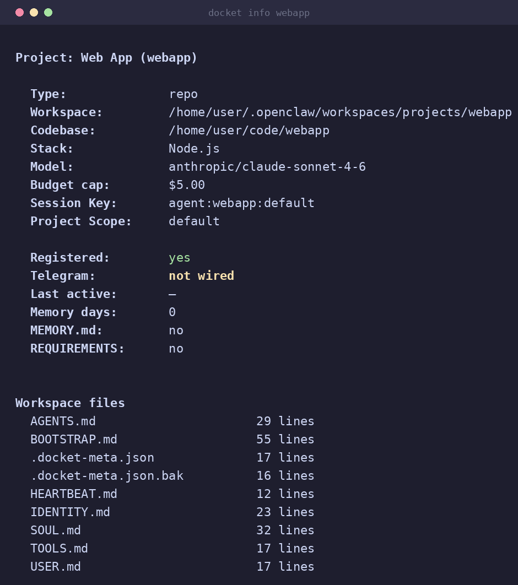
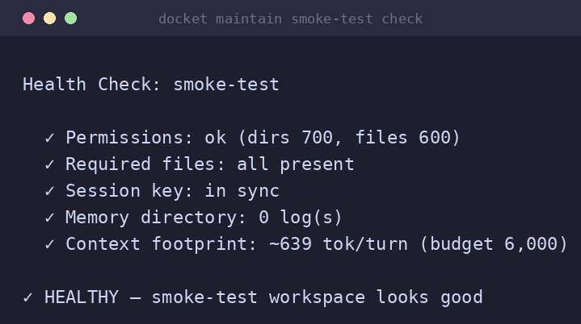
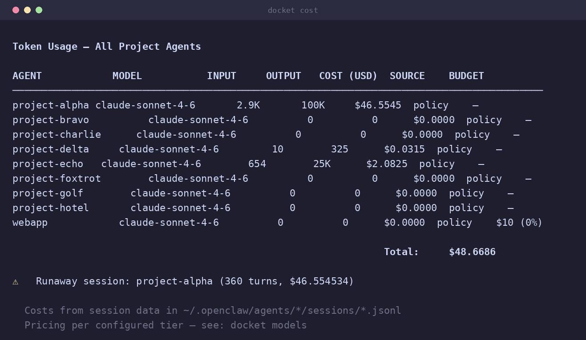

# Command Reference

Complete reference for all docket commands with detailed examples and options.

## Table of Contents

- [Lifecycle Commands](#lifecycle-commands)
- [Session & Context Management](#session--context-management)
- [Pod Coordination](#pod-coordination)
- [Telegram Integration](#telegram-integration)
- [Keys & Authentication](#keys--authentication)
- [Utility Commands](#utility-commands)
- [Security & Audit](#security--audit)
- [Observability Commands](#observability-commands)
- [Global Options](#global-options)
- [Command Aliases](#command-aliases)
- [Removed Commands](#removed-commands)
- [Exit Codes](#exit-codes)
- [Environment Variables](#environment-variables)

## Lifecycle Commands

### list

Display all project agents with status, model, and Telegram binding info.

**Syntax:**
```bash
docket list
docket list --json     # machine-readable listing
```

**Flags:**
- **`--json`**: emit the full agent listing as JSON instead of the Rich table.

**Output format:**
```
┌──────────────────────────────────────────────────────────────┐
│ ID              Type   Model        Telegram      Session    │
├──────────────────────────────────────────────────────────────┤
│ myproject       repo   sonnet (policy) ✓ Wired    default     │
│ taskagent       task   haiku (policy)  ✗ Not wired alpha      │
└──────────────────────────────────────────────────────────────┘
```

**Example:**
```bash
docket list

# With DEBUG mode
DEBUG=1 docket list
```

**Aliases:** None

**Notes:**
- Shows all registered agents: org specialists (manager, knowledge, security) and all pod members
- Telegram status checks docket's own channel bindings (`~/.docket/fleet.json`)
- Session shows current project key

---

### init

Create a new project **pod** — an isolated team of project-scoped agents that owns one codebase.
The default pod is **lean: a Lead + an Implementer**. See [Agent Teams (Pods)](AGENT-TEAMS.md).
The first invocation also creates Docket's shared workstation foundation (fleet registry, org
specialists, policies, and default gates). There is no separate setup step.

**Syntax:**
```bash
docket init                              # derive project id/path/stack from the current directory
docket init <project> [path]              # lean pod: <project>-lead + <project>-implementer
docket init <project> [path] --pod full   # full pod: + reviewer + tester
docket init <project> [path] --with reviewer,tester   # lean pod + named roles
docket init --blueprint <name> [path]     # a named pod shape other than the default (software)
docket init --from <spec-file>            # non-interactive: provision one or many pods from JSON/YAML
```

**Flags:**
- **`--pod full`**: provision the full pod — Lead, Implementer, Reviewer, and Tester. Only
  applies to the default `software` blueprint; ignored (with a warning) for any other blueprint,
  which provisions its own fixed roster.
- **`--with <roles>`**: start from the lean pod and add the named roles (comma-separated:
  `reviewer`, `tester`, `implementer`). E.g. `--with reviewer` adds a review gate only. Same
  `software`-only restriction as `--pod full`.
- **`--blueprint <name>`** (default `software`): provision a named **pod blueprint** instead of
  the plain lean/full pod — see [Pod Blueprints](#pod-blueprints) below. Unknown name errors with
  `unknown blueprint 'X'; valid blueprints: software, research, content, ops` and exits 1 before
  any prompt is shown.
- **`--codebase <path>`** / **`--path <path>`** (aliases): the codebase path (or, for a
  `workdir`-kind blueprint, the pod's shared working directory) — same value as the `path`
  positional; supplying it up front skips its interactive prompt.
- **`--name <name>`**: display name — same value as the 1st positional; skips its prompt.
- **`--from <spec-file>`**: non-interactive, declarative mode — provision one or many
  agents/pods from a JSON or YAML file (`.yaml`/`.yml` needs PyYAML installed). Mutually
  exclusive with every other flag/prompt. See [Declarative provisioning](#declarative-provisioning)
  below.

The default path is deterministic and non-interactive: location = cwd, id = slugified directory
name, stack = detected markers, roster = Lead + Implementer.

Member ids are predictable: `myapp-lead`, `myapp-implementer`, `myapp-reviewer`, `myapp-tester`
(duplicated roles get `-2`, `-3` suffixes). A pod has **exactly one Lead**. Resize the pod later
with [`docket pod`](#pod), and tear the whole pod down with [`docket delete`](#delete).

Every project is a **repo** — a pod tied to a codebase. The codebase defaults to the directory
you run `docket init` in (or the `path` argument / `--codebase <path>`, in which case you are not
re-prompted), and the project name is suggested from that directory's name.

**Example:**
```bash
# Lean pod (Lead + Implementer) for a codebase
docket init myapp ~/code/myapp

# From inside the repo — codebase + name are detected from the cwd
cd ~/code/myapp && docket init

# Full pod with a review + test gate
docket init myapp ~/code/myapp --pod full

# Lean pod plus a reviewer
docket init myapp ~/code/myapp --with reviewer
```

**Aliases:** None

**Notes:**
- Member ids auto-generated via slugification (`<project>-<role>[-N]`)
- Each member gets its own workspace at `~/.docket/workspaces/projects/<member-id>/`
- Generates SOUL.md, AGENTS.md, TOOLS.md, HEARTBEAT.md per member
- Sets permissions to 700 (dirs) and 600 (files)
- Pod members are ordinary registered agents, so `docket list`/`info`/`cost`/`doctor` see them

#### Pod Blueprints

A **blueprint** is a named, fixed pod shape — an alternative to the plain lean/full `software`
pod for work that isn't "implement against a codebase." Four ship built-in:

| Blueprint | Kind | Roles | Default budget | Shape |
|---|---|---|---|---|
| `software` (default) | codebase | lead, implementer | none | Default lean project pod |
| `research` | workdir | lead, researcher, analyst, writer, critic | $20 | Critic gates the final step (`APPROVE`\|`REJECT`), one rework cycle back to writer |
| `content` | workdir | lead, writer, critic | $15 | Same Critic-gate pattern, no researcher/analyst step |
| `ops` | workdir | lead, operator, monitor | $30 | Operator is gated on its own `verifyCmd`; Monitor is a human-approval gate |
| `agentic-product` | codebase | lead, implementer, reviewer, tester | none | Full software pipeline for products that ship agents |

A **codebase** blueprint (`software`) treats the location argument as an existing codebase path
(never auto-created) and auto-detects its stack. A **workdir** blueprint (`research`/`content`/
`ops`) treats the location as the pod's one shared working directory instead — no codebase is
assumed and no stack is auto-detected; if you don't pass one, docket provisions
`~/.docket/workspaces/pods/<project>/` for you. `--blueprint` also changes the interactive
prompt label ("Working directory" instead of "Codebase path").

```bash
# A research pod against its own working directory
docket init briefing --blueprint research

# An ops pod with an explicit shared working directory
docket init rollout --blueprint ops --codebase ~/ops/rollout
```

`--pod full`/`--with` only extend the `software` roster; passing either alongside a different
blueprint is ignored with a warning, since every other blueprint's roster is fixed.

Only the five built-ins exist today — there is no `docket blueprints add <file>` to register a
custom one yet (that overlay mechanism is unbuilt, unlike `docket roles add` for archetypes).
See [pod-blueprints.spec.md](../specs/functional/pod-blueprints.spec.md).

#### Declarative provisioning

`docket init --from <spec-file>` provisions one or many agents/pods from a single JSON or YAML
file, without any prompts — the same mechanism a CI job or a fleet-bootstrap script would use.
The file is either a bare list of entries, `{"agents": [...]}`, or a single entry object.

Each entry needs an `id`. An entry with a `blueprint` field provisions a pod via that blueprint
(fields: `codebase` or `workDir` depending on the blueprint's kind, `stack`, `description`,
`projectKey`, `budgetUsd`, `telegram`); an entry with no `blueprint` field provisions a single
flat agent the same shape `docket add` always has (fields: `name`, `codebase`, `stack`, `model`,
`description`, `telegram`, `budgetUsd`, `projectKey`).

```json
{
  "agents": [
    {
      "id": "acme-api",
      "name": "Acme API",
      "codebase": "/home/user/projects/acme-api",
      "stack": "Node/Express",
      "model": "anthropic/claude-sonnet-4-6",
      "description": "Customer-facing REST API",
      "telegram": "-1001234567890",
      "budgetUsd": "25"
    },
    {
      "id": "launch-brief",
      "blueprint": "content",
      "workDir": "/home/user/work/launch-brief",
      "description": "Product launch one-pager",
      "budgetUsd": "10"
    }
  ]
}
```

```bash
docket init --from spec.json
docket init --from spec.yaml   # requires PyYAML: pip install pyyaml
```

An entry whose id already exists is skipped with a warning, not an error; an unknown blueprint
name is likewise skipped, not fatal to the rest of the file. The command always exits 0 and
prints a summary of what was created vs. skipped — check the output, not just the exit code, in
a script.

---

### add

Add role agents to an existing pod. This command never creates a project.

```bash
docket add reviewer                       # pod inferred from the current directory
docket add tester --project myapp         # explicit pod
docket add implementer --count 2          # indexed additional Implementers
docket add implementer --verify "uv run pytest"
```

Use `--project <pod>` when running outside the project's configured `codebase`/`workDir`.
Otherwise Docket chooses the most-specific registered pod containing the cwd and fails clearly
when there is no match or the result is ambiguous.

---

### status

Show project-level state without mixing it with the global agent inventory or workstation health.

```bash
docket status          # project containing the current directory
docket status --all    # every project, one row per pod
docket status --json   # machine-readable current-project result
docket status --all --json
```

The current-project view includes the configured path, readiness, pod roles, and task counts.
`docket list` remains the detailed global agent inventory; `docket doctor` remains the global
technical health check.

---

### info

Display detailed information about a specific project agent.



**Syntax:**
```bash
docket info <agent-id>
docket info             # Interactive picker if ID omitted
```

**Output:**
```
Agent: myproject-implementer
─────────────────────────────────────────────────
Type:              repo
Name:              My Awesome Project
Codebase:          /home/user/Sites/myproject
Stack:             Node.js, React, TypeScript
Model:             anthropic/claude-sonnet-4-6
Description:       My project description
Session Key:       agent:myproject:default
Project Key:       default
Created:           2026-02-25T10:00:00Z
Workspace:         ~/.docket/workspaces/projects/myproject-implementer/
Telegram:          ✓ Wired to group -1001234567890
```

**Example:**
```bash
# With agent ID
docket info myproject

# Interactive picker
docket info
# → Select project:
#   1) myproject - My Awesome Project
#   2) taskagent - Task Agent
# Choice: 1
```

**Aliases:** `show`

**Notes:**
- Uses fzf for interactive selection if available
- Falls back to numbered list otherwise
- Displays metadata from .docket-meta.json

---

### delete

Remove a project pod, or a legacy flat agent.

**Syntax:**
```bash
docket delete <agent-id>
docket delete           # Interactive picker
```

For a pod id, Docket lists every member and requires typing the pod id in an interactive terminal.
It then removes every member registration, binding, conversation entry, workspace/worktree,
pod runtime directory, durable session, and trace. The global audit record is preserved.

For a legacy flat agent id, Docket separately asks whether to remove its workspace before requiring
the exact agent id.

**Example:**
```bash
docket delete myproject
# Type the pod id to confirm deletion [myproject]: myproject
# ✓ Pod 'myproject' deleted.
```

**Aliases:** `remove`, `rm`

**Notes:**
- Removes agent registration from docket's fleet registry (`~/.docket/fleet.json`)
- Pod deletion removes all Docket-owned operational state for that pod; a legacy flat agent can
  keep its workspace when explicitly requested
- Cannot be undone (backup first if unsure)
- Given a pod id (not a single member id), removes the whole pod — see [`docket pod`](#pod) to
  remove one member instead
- Org specialists (manager, knowledge, security) cannot be removed with `docket delete` — it
  errors outright rather than deleting a shared, fleet-wide agent
- A Git worktree is removed, but its dedicated branch remains in the source repository so committed
  code is not silently destroyed; remove that branch separately after reviewing it

---

### maintain

Clear memory, repair, or rebuild an agent. Consolidates the retired `reset`, `repair`, and
`cleanup` commands into one.



**Syntax:**
```bash
docket maintain [agent-id] [mode] [--no-distill-first]
```

**Modes:**
- **`check`** (default): Health check and auto-fix — permissions (700/600), missing workspace
  files, fleet registration, memory directory, and a per-turn context-footprint estimate (warns
  if SOUL/AGENTS/TOOLS/HEARTBEAT/MEMORY together exceed the configured token budget)
- **`clean`**: Clear memory logs only (`memory/*.md`) — **distills first by default** (see below)
- **`reset`**: Clear memory + MEMORY.md + HEARTBEAT.md — **distills first by default**
- **`rebuild`**: Deep rebuild — regenerate SOUL.md, AGENTS.md, TOOLS.md from metadata
- **`sessions`**: Archive large/old session data
- **`distill`**: Summarize `memory/*.md` into MEMORY.md via one driver-backed turn, then archive
  the originals under `memory/<archive-dir>/`

**Flags:**
- **`--no-distill-first`** (`clean`/`reset` only): skip the automatic pre-delete distillation and
  delete/clear memory undistilled. `--distill-first` is also accepted, as a no-op affirmation of
  the default.

**Example:**
```bash
# Health check and auto-fix (was: docket repair)
docket maintain myproject
docket maintain myproject check

# Clear memory logs, distilling into MEMORY.md first (was: docket reset 1)
docket maintain myproject clean

# Clear memory + heartbeat, distilling first (was: docket reset 2)
docket maintain myproject reset

# Skip distillation and delete logs undistilled
docket maintain myproject clean --no-distill-first

# Deep rebuild (was: docket reset 3)
docket maintain myproject rebuild

# Archive old sessions (was: docket cleanup safe)
docket maintain myproject sessions

# Summarize memory without clearing anything
docket maintain myproject distill
```

**Migration (deprecated → current):**

| Old | New |
|-----|-----|
| `docket repair [id]` | `docket maintain [id] check` |
| `docket reset [id]` / `reset [id] 1` | `docket maintain [id] clean` |
| `docket reset [id] 2` | `docket maintain [id] reset` |
| `docket reset [id] 3` | `docket maintain [id] rebuild` |
| `docket cleanup [id]` | `docket maintain [id] sessions` |

**Distillation and the fail-closed contract (`clean`/`reset`):**

Memory is never bare-deleted. Before `clean` deletes `memory/*.md`, or `reset` clears memory +
HEARTBEAT.md, docket runs one driver-backed turn that summarizes pending logs into MEMORY.md and
archives the originals — the same work `docket maintain <id> distill` does standalone. **A
failed distillation aborts the delete outright — nothing is touched:**
```bash
docket maintain myproject clean
# → Distilling memory before proceeding (one driver-backed turn)...
# ✗ Distillation failed (timeout): the turn did not complete -- nothing deleted.
```
`failure_kind` (`timeout`, `daemon_error`, `invalid_output`) tells you whether to just retry or
whether the model's output needs a closer look (`daemon_error` is the failure-kind name's literal
value — a name that predates Phase 19's removal of the daemon and now just means "the turn didn't
complete cleanly," not a live external process). Pass `--no-distill-first` to skip this and
delete/clear undistilled — you'll be warned that it's happening. When a `reset` runs a real
distillation, MEMORY.md is left as freshly distilled rather than immediately cleared again in
the same breath.

**Notes:**
- Preserves identity (`.docket-meta.json`, fleet registration)
- `clean`/`reset`/`rebuild` prompt for confirmation and require a TTY (non-interactive calls are
  cancelled, not silently applied)

---

## Session & Context Management

### scope

Manage session keys for multi-project isolation.

**Syntax:**
```bash
docket scope <agent-id> show                    # Display current scope
docket scope <agent-id> set <project-key>       # Set new project scope
docket scope <agent-id> reset                   # Reset to default
```

**Session key format:** `agent:<id>:<project>`

**Example:**
```bash
# Show current scope
docket scope myproject show
# Output: agent:myproject:default

# Set scope to "alpha"
docket scope myproject set alpha
# ✓ Session key updated: agent:myproject:alpha

# Reset to default
docket scope myproject reset
# ✓ Session key reset: agent:myproject:default
```

**Aliases:** None

**Notes:**
- Prevents cross-project contamination
- Updates `.docket-meta.json` and `SOUL.md`
- Use different keys for parallel project work

---

### context

Read-only views over an agent's memory and working context. There is no separate semantic memory
index — docket's own turn loop has no `memory_search` tool of its own, so an agent (and this
command) searches memory files the same way it reads any other file — so `context` is just two
dashboards.

**Syntax:**
```bash
docket context <agent-id>                 # show: dashboard (default)
docket context <agent-id> show            # same as above
docket context <agent-id> project         # project/stack-focused view (codebase, stack, tasks)
```

**Subcommands:**

#### show (default)
Dashboard: the last 3 memory-log files (last 5 lines each), active tasks parsed from
`HEARTBEAT.md`, and quick stats (memory-log count, session size read from docket's own durable
per-session storage, last-active timestamp).

```bash
docket context myproject
```

#### project
A project-metadata-focused view: codebase path, stack, model, session key, active tasks, and
`MEMORY.md` section headers — a quicker "what is this agent working on" glance than the full
`show` dashboard.

```bash
docket context myproject project
```

**Aliases:** None. (`memory`/`mem` are **removed**, not aliases — see
[Removed Commands](#removed-commands).)

**Notes:**
- Both subcommands are read-only and touch only the named agent's own workspace.
- The `search`/`index`/`snapshot`/`compress` subcommands were **removed**: the per-agent index/
  snapshot/gzip-archive artifacts they wrote were read by nothing else in docket (the archive
  even hid old logs from an agent's own `read`/`grep`-based recall). There is no separate semantic
  memory index to replace them with — an agent searches its own memory files directly. Use
  `docket snapshot` for a whole-fleet JSON export.

---

### persona

Set or clear an agent's optional **display persona** (a name/emoji). Identity of record is the
agent's *role*; the persona is a docket-owned skin rendered into `SOUL.md` — never a
self-authored `IDENTITY.md`.

**Syntax:**
```bash
docket persona <agent-id>                 # (show) current persona + role
docket persona <agent-id> set "Orion 🔭"  # assign a display name
docket persona <agent-id> clear           # remove it (back to role/name)
```

**Notes:**
- Stored in `.docket-meta.json` (`persona`) and rendered into `SOUL.md`; survives `maintain rebuild`.
- `docket doctor` quarantines the base-assistant self-authoring scaffolding a model may leave
  behind (`IDENTITY.md`/`BOOTSTRAP.md`) from managed workspaces — use this command instead to
  give an agent a friendly name.

---

## Pod Coordination

> `docket team` was **retired** — see [Removed Commands](#removed-commands). Delegation and
> execution now live entirely on the per-project pod:
>
> - [`docket pod <project> delegate`/`dispatch`](#pod) — the **per-project pipeline**. Queues
>   and runs work for one project's pod (Lead → Implementer → Reviewer → Tester), pod-local and
>   budget-gated.
> - Org-wide fleet visibility (no queue, no dispatch): `docket init --portfolio` (the advisory
>   Portfolio Manager).
>
> See [Agent Teams (Pods)](AGENT-TEAMS.md) for the full pod model.

### pod

Manage a project's **pod** (its members) and run its **dispatch pipeline**. A pod is the isolated
team of project-scoped agents created by [`docket add`](#add); every member has its own
permission-locked workspace, so no role is ever shared between projects.
See [Agent Teams (Pods)](AGENT-TEAMS.md).

**Syntax:**
```bash
docket pod <project>                                   # list the pod's members (default)
docket pod <project> list                              # same as above
docket pod <project> add <role> [--count N|-n N] [--verify "<cmd>"]  # add member(s)
docket pod <project> remove <member-id>                # remove one member
docket pod <project> set-verify <member-id> "<cmd>"    # set an implementer's verify command
docket pod <project> delegate [--priority high|normal|low] <task>   # queue a task
docket pod <project> queue [--retry <task-id>]         # show the queue, or un-block one task
docket pod <project> dispatch [--resume] [--timeout <seconds>]   # run pending tasks through the pipeline
```

**Subcommands:**

#### list (default)
Show the pod's members and their roles. Runs when no subcommand is given.

```bash
docket pod myapp

# Output:
# Pod: myapp
# ────────────────────────────────────────
# myapp-lead          lead          (orchestrator)
# myapp-implementer   implementer
# myapp-reviewer      reviewer
```

#### add
Add a member to the pod. Role is validated against the open role-archetype registry (see
[`docket roles`](#roles)) — not a hardcoded `implementer|reviewer|tester` list, so a blueprint
role (`researcher`, `analyst`, `writer`, `critic`, `operator`, `monitor`) or any user-defined
archetype works too; `programmer` is accepted as an alias for `implementer`. The Lead is unique —
a pod always has exactly one and it cannot be added this way. Duplicated roles get `-2`, `-3`
ids. `--count N` (short alias `-n N`) adds several at once. `--verify "<cmd>"` (also accepted as
`--verify="<cmd>"`) sets the mechanical verification gate `docket pod … dispatch` runs after that
member's hop (CD-2) — it's written into the new member's `.docket-meta.json` (`verifyCmd`) and
documented in its `TOOLS.md`. Passing `--verify` for a non-implementer role doesn't error — it's
silently ignored with a warning, since only an Implementer hop is verify-gated. A new member
inherits the pod's `workspaceKind`/`workDir`/`blueprint` from its existing members, so adding to
a `workdir`-kind pod (see [Pod Blueprints](#pod-blueprints)) doesn't wrongly treat it as a
codebase agent.

```bash
docket pod myapp add implementer          # adds myapp-implementer-2
docket pod myapp add reviewer             # add a review gate later
docket pod myapp add implementer --count 2 # two more parallel implementers
docket pod myapp add implementer -n 2      # same, short form
docket pod myapp add implementer --verify "npm test"  # gate this implementer's hops on `npm test`
```

#### remove
Remove one member by id.

```bash
docket pod myapp remove myapp-tester
# ✓ Removed myapp-tester from pod 'myapp'
```

#### set-verify
Set (or change) the verify command on an **existing** Implementer — the only public way to do
this short of the internal `meta-set` debug command. Rewrites the member's `TOOLS.md` so the
Implementer sees the updated gate. The command is validated (no NUL/newline, length-capped) and
the change is audit-logged (`pod.set-verify`); it runs, at dispatch time, in the Implementer's
git **worktree** when one exists, falling back to the pod's shared codebase root, then the
member's own workspace dir.

```bash
docket pod myapp set-verify myapp-implementer "npm test"
# ✓ Set verify command for myapp-implementer: 'npm test'
```

#### delegate
Queue a task on the **pod's** task queue (which lives in the Lead's workspace). Optional
`--priority`/`-p` `high|normal|low` (default `normal`). The task description is capped at 500
characters and is preserved whether passed as one quoted argument or as ordinary positional words.
Quote it when it contains shell metacharacters. This queues only; run it with `dispatch`.

```bash
docket pod myapp delegate "Fix the null-token login crash"
docket pod myapp delegate --priority high "Patch the auth bypass"
# ✓ Queued task for pod 'myapp' (priority: high)
```

#### queue
Show the pod's task queue with per-task status (`pending`/`running`/`done`/`failed`/`blocked`)
and estimated cost. `--retry <task-id>` moves one `blocked` task back to `pending` — the explicit,
single-task way around a reached budget cap (a pod-wide budget change, `docket profile
<lead-id> --budget`/`--resume`, un-blocks every task in the pod at once instead).

```bash
docket pod myapp queue

# Output:
# Queue: myapp
# ────────────────────────────────────────
# t-002  pending   high    Patch the auth bypass            $0.00
# t-001  done      normal  Fix the null-token login crash   $0.42

docket pod myapp queue --retry t-003
# ✓ Requeued 't-003' for pod 'myapp' — status set to pending.
```

#### dispatch
Run the pod's **pending** (and, with `--resume`, crash-recoverable) tasks through its pipeline —
**one real agent turn per hop**: `Lead → Implementer → Reviewer (if present) → Tester (if
present)`. Only the roles the pod actually has take part (a lean pod runs two hops). docket
invokes each hop through its own turn loop (`core/agent_loop.py`), captures the result, and
threads it to the next role. Each task is claimed under a filelock before its first hop runs, so two dispatchers (e.g. a
manual run and the `docket serve --dispatch` sweep) can never double-run the same task, and each
hop is persisted to the queue as it completes so a crash loses at most the in-flight hop.

```bash
docket pod myapp dispatch
# → Dispatching 1 pending task(s) through: lead → implementer → reviewer
#   [t-002] done — 3 hop(s), $0.0412
```

**Flags:**
- **`--resume`**: also reclaim any task a prior dispatcher left `failed` with a stale claim (it
  crashed mid-task) and continue each one from its last persisted hop instead of hop 0.
- **`--timeout <seconds>`**: override both the agent-turn timeout and the `verifyCmd` timeout
  for this run only (otherwise each falls back to the pod's own configured timeouts, then a
  300s default).

Guarantees that hold on every dispatch:

- **Budget-gated, with real auto-pause.** Before *each* hop, docket checks the pod's token-based
  dollar estimate against the Lead's budget cap (`docket profile <project>-lead --budget N`) —
  docket's own turn loop reports no billed spend, so the gate always runs off this labelled
  estimate, never a claimed "recorded" figure. Over budget → the task is left **blocked** (not silently retried)
  and the pod's Lead is marked paused — every further claim against this pod is refused outright
  until `docket profile <project>-lead --resume` clears it.
- **Retried on a transient hiccup.** A timed-out or daemon-error hop retries in place (linear
  backoff, a small per-role budget) before failing; a real non-zero exit or a bad verdict is
  never retried.
- **Reviewed, with bounded rework.** When the pod has a Reviewer, a `REQUEST-CHANGES` verdict
  sends the task back to the Implementer for one rework cycle (default) before a second
  rejection fails it; `APPROVE` advances normally.
- **Verified in the right tree.** A set `verifyCmd` runs in the Implementer's git worktree when
  one exists, not the shared codebase root.
- **Traced.** Every hop, retry, gate outcome, and claim/sweep event emits a trace event (`docket
  trace`) on a per-task session `agent:<project>:<task_id>`, so a run is fully auditable.
- **Recorded.** Every invocation — this CLI call, the serve webhook, a due schedule, or the sweep
  loop — creates a queryable record in `docket runs`; an exception during dispatch is captured
  there, never silently discarded.
- **Pod-local.** Dispatch only ever targets the project's own pod members. There is **no cross-pod
  dispatch path** — one pod can never run another pod's agents.

> Each hop is a real, costed LLM turn, so dispatch is explicit (`docket pod … dispatch`) or
> opt-in (`docket serve --dispatch`) — never silent. Plain `docket serve` does not dispatch.

See [pod-dispatch.spec.md](../specs/functional/pod-dispatch.spec.md) for the complete state
machine, retry/timeout/rework semantics, and trace-event vocabulary.

**Aliases:** None

**Notes:**
- The pod's queue lives in the Lead's workspace
- Resize a pod with `add`/`remove`; provision one with [`docket add`](#add); tear it down with
  [`docket delete`](#delete)
- Run every pod's queue continuously in the background with [`docket serve --dispatch`](#serve)
- Inspect what a dispatch run actually did with [`docket runs`](#runs)

---

### pipeline

Validate, plan, and run a **docket-native pipeline** — the one dialect docket actually executes
(the retired Lobster/`docket workflow` YAML was a separate, non-executed thing; see
[Removed Commands](#removed-commands)). A pipeline file declares a pod's hop order, gates, and
rework edges instead of relying on the built-in default order.

**Syntax:**
```bash
docket pipeline validate <file>                                   # structural check only
docket pipeline plan <project> [--file <path>]                    # render the resolved plan
docket pipeline run <project> [--file <path>] [--resume] [--timeout <seconds>] [--follow]
```

**Subcommands:**

#### validate
Pure structural validation of a pipeline file — no project involved, nothing dispatched. Checks
step ids are unique, each step has exactly one of `role`/`agent`, gate shapes are well-formed,
and rework edges point at an earlier step id.

```bash
docket pipeline validate ./ship-feature.yaml
```

#### plan
Resolves the pipeline against a **project's actual pod roster** and prints the plan — the exact
function `run`/`docket pod <p> dispatch` use internally to decide what to execute, not a second
pretty-printer. Never executes anything or spends tokens. Without `--file`, resolves the pod's
zero-migration default order (`lead → implementer → reviewer → tester`, whichever roles the pod
actually has).

```bash
docket pipeline plan myapp --file ./ship-feature.yaml
# Pipeline: ship-feature
#   [plan] role=lead -> myapp-lead [gate: none]
#   [build] role=implementer -> myapp-implementer [gate: mechanical(pytest -q)]
```

#### run
Dispatches a project's pod through the given (or default) pipeline — this delegates to the exact
same executor as `docket pod <project> dispatch`, so it is equally budget-gated, verify/Reviewer/
Tester-gated, traced, and recorded in `docket runs`. `--resume`/`--timeout` behave identically to
[`docket pod dispatch`](#pod). `--follow` tails the run's trace events live in the foreground
(Ctrl-C stops watching, not the dispatch itself, which keeps running).

```bash
docket pipeline run myapp --file ./ship-feature.yaml --follow
```

**Pipeline file schema** (YAML or JSON; unknown keys are rejected):
- `name` (required), `description`, `variables` (a name→`{default, description, required}` map —
  declared but not yet interpolated into any hop's prompt/environment).
- `steps`: each has `id` (unique), exactly one of `role` (a role-archetype slug) or `agent` (a
  specific member id), optional `retries`, `timeout` (seconds), optional `gate`, or a `parallel`
  list of child steps (one nesting level).
- `gate.type`: `mechanical` (a `command`, or `null` to defer to the target's own `verifyCmd`),
  `verdict` (a `pattern` regex, `passValues`, optional `rework: {to, when, maxCycles}` edge back
  to an earlier step), or `approval` (a human sign-off message).

```yaml
name: ship-feature
description: Build and verify a change.
steps:
  - id: plan
    role: lead
  - id: build
    role: implementer
    gate:
      type: mechanical
      command: "pytest -q"
```

**Aliases:** None

**Notes:**
- A pod with no pipeline file runs the built-in default order — declaring a pipeline is opt-in
- `archetype` references inside a step are shape-validated only, never checked against the live
  role registry
- See [pipeline-format.spec.md](../specs/functional/pipeline-format.spec.md)

---

### roles

Manage declarative **role archetypes** — the data-driven definitions behind every pod role
(`lead`, `implementer`, `reviewer`, `tester`, and the blueprint-only roles `researcher`,
`analyst`, `writer`, `critic`, `operator`, `monitor`). A role is data (SOUL/AGENTS templates,
model class, gate contract, token budget), not a hardcoded branch, so `docket pod <p> add <role>`
accepts any name in this registry.

**Syntax:**
```bash
docket roles list                    # all archetypes (built-in + user-defined)
docket roles show <name>             # one archetype's full definition
docket roles add <file.yaml>         # register a new user-defined archetype
docket roles validate [file.yaml]    # validate the live registry, or dry-run one candidate file
```

**Subcommands:**

#### list (default)
```bash
docket roles list
#   NAME           SOURCE     SCOPE CLASS   GATE        EDIT       DESCRIPTION
#   lead           built-in   pod   cheap   none        none       orchestrates the pod; never edits code
#   implementer    built-in   pod   strong  mechanical  write      writes code in the project workspace
#   reviewer       built-in   pod   cheap   verdict     read-only  read-only veto on diffs
#   tester         built-in   pod   cheap   verdict     read-only  behaviour-only PASS/FAIL
#   researcher     starter    pod   strong  none        write      gathers and synthesizes source material
```

#### show
Prints the full wire-format definition (YAML, falling back to JSON if PyYAML is missing):
`name`, `version`, `scope` (`org`|`pod`), `modelClass` (`cheap`|`strong`), `soulTemplate`,
`agentsTemplate`, `gateContract` (`none`|`verdict`|`mechanical`|`approval`), `editRights`
(`none`|`read-only`|`write`, descriptive only — not enforced), `toolProfile`, `tokenBudget`.

```bash
docket roles show reviewer
```

#### add
Registers a new archetype from a standalone YAML file into the user overlay
(`~/.docket/docket-roles.json`) — built-ins are never edited, only shadowed by name.

```bash
docket roles add ./producer.yaml
# ✓ Added archetype 'producer' (scope=pod, modelClass=cheap).
```

#### validate
Structural field validation (closed enums, name regex, non-blank templates) plus a dry-run
render of both templates against a representative variable set — catches a template referencing
an unknown `${var}` before `add` persists it. With no file argument, validates every entry
currently in the merged live registry instead.

```bash
docket roles validate
docket roles validate ./producer.yaml   # dry-run without persisting
```

**Aliases:** None

**Notes:**
- Built-ins (`lead`/`implementer`/`reviewer`/`tester`) and the 6-role starter library are Python
  literals, never loaded from files; a user archetype in `~/.docket/docket-roles.json` overlays
  by name, and a malformed overlay entry is skipped rather than crashing a live fleet
- See [role-archetypes.spec.md](../specs/functional/role-archetypes.spec.md)

---

## Telegram Integration

### wire

Bind an agent to a channel group (Telegram by default) so that chat can send it commands.

> **Inbound only.** The binding authorizes a chat to send `/approve`, `/deny`, `/status` and
> `/delegate`; docket never messages the group on its own. There is no notification on a pending
> approval and no report when a task finishes — you poll with `/status`.

**Syntax:**
```bash
docket wire <agent-id>
docket wire <agent-id> --channel telegram   # explicit (also the default)
docket wire             # Interactive picker
```

**Flags:**
- **`--channel <name>`** (default `telegram`): which channel to wire the binding for. Telegram is
  the only channel shipped today; the flag exists so additional channels can be added without a
  breaking change to `wire`'s syntax.

**Interactive prompts:**
1. With `TELEGRAM_BOT_TOKEN` configured, Docket shows a one-time command such as
   `/wire A1B2C3`. Send it in the Telegram group, return to the terminal, and press Enter.
   Docket discovers and binds that group automatically.
2. You can paste a numeric group ID instead. Manual entry is also the fallback when the bot token
   is missing, Telegram cannot be reached, or no matching message is found.

**Example:**
```bash
# Store the bot token once, create a bot, and add it to the group
docket keys add TELEGRAM_BOT_TOKEN

# Start the guided setup
docket wire myproject
# → In the group, send: /wire A1B2C3
# → Return here and press Enter
# ✓ Found Telegram group "My Project Team"
# ✓ Binding: myproject ← telegram group -1001234567890
# ✓ Done. 'myproject' is now wired to telegram peer -1001234567890
```

**Aliases:** `telegram`

**Notes:**
- Updates docket's own fleet registry (`~/.docket/fleet.json`) bindings, and seeds an entry in
  the conversation registry (`docket conversations`)
- Enables mobile approvals via docket's own Telegram bot (`docket serve --telegram`, once
  `TELEGRAM_BOT_TOKEN` is stored) — the binding is the **entire authorization boundary**: anyone
  who can post in that chat can `/approve`, `/deny`, `/status`, or `/delegate` as this agent the
  moment the bot is running
- Guided discovery reads the matching one-time `/wire` message without advancing the Telegram
  poller's durable offset or processing unrelated messages. If `docket serve --telegram` is
  already polling, stop it during setup so it does not receive the one-time command first.

---

### unwire

Remove a channel binding from an agent.

**Syntax:**
```bash
docket unwire <agent-id>
docket unwire <agent-id> --channel telegram   # explicit (also the default)
docket unwire           # Interactive picker
```

**Flags:**
- **`--channel <name>`** (default `telegram`): which channel binding to remove — same purpose
  as `wire`'s flag.

**Example:**
```bash
docket unwire myproject
# ✓ Telegram binding removed
```

**Aliases:** None

**Notes:**
- Removes the entry from docket's own fleet registry (`~/.docket/fleet.json`)
- Agent can still function without Telegram
- Approvals will require CLI, HTTP, or MCP interaction

---

### conversations

Inspect and resume the **conversation registry** — docket's durable index of channel
threads. docket's own turn loop keeps no durable transcript of its own, so docket tracks which
agent handles each thread, its topic, status, and a resume pointer.

**Syntax:**
```bash
docket conversations                       # (list) all tracked conversations
docket conversations show <id|agent-id>    # full detail for one
docket conversations resume <id|agent-id>  # mark in_progress + print a resume brief
docket conversations set <agent-id> <peer-id> [--topic ..] [--status ..] [--last ..] [--task ..]
```

**Notes:**
- Auto-seeded when you `docket wire` an agent to a channel; cleaned up on `docket delete`.
- `status` ∈ `active | in_progress | waiting | done`.
- Durable conversation *content* lives in the agent's `HEARTBEAT.md` + `memory/` (which the
  agent resumes on its next turn via the durability contract); this registry tracks *state*.

---

## Keys & Authentication

### keys

Manage API keys for model providers. Docket's model client reads them centrally; matching provider
credentials are also synced to the agent workspaces that need them.

**Syntax:**
```bash
docket keys                        # list (default)
docket keys list                   # show stored keys, masked
docket keys add <KEY_NAME>         # add a new key (hidden prompt)
docket keys remove <KEY_NAME>      # remove a key (confirms if interactive)
docket keys rotate <KEY_NAME>      # replace an existing key's value
docket keys validate [KEY_NAME]    # check format (all keys if name omitted)
docket keys export                 # print `export NAME='value'` lines
docket keys setup                  # interactive wizard (Anthropic/OpenAI/Google/OpenRouter/Vercel)
```

**Subcommands:**

#### list (default)
Masked table of stored keys with a green ✓ / yellow ⚠ format badge and the date added.

```bash
docket keys list
#   ✓ ANTHROPIC_API_KEY               sk-a****3f2c  added 2026-06-01
```

#### add
Key name must be `UPPERCASE_WITH_UNDERSCORES` (e.g. `ANTHROPIC_API_KEY`). Prompts for the hidden
value via `getpass`; errors (exit 1) if the name already exists — use `rotate` instead. On
success: stores it, makes it available to Docket's model client, and re-syncs matching provider
credentials into agent workspaces.

```bash
docket keys add ANTHROPIC_API_KEY
# Enter value for ANTHROPIC_API_KEY (hidden):
# ✓ Key 'ANTHROPIC_API_KEY' stored.
```

#### remove
Deletes a stored key. Confirms interactively (`y/N`) if stdin is a TTY.

```bash
docket keys remove OPENROUTER_API_KEY
```

#### rotate
Replaces the value of an existing key (errors, exit 1, if it doesn't already exist).

```bash
docket keys rotate ANTHROPIC_API_KEY
```

#### validate
Checks stored key(s) against known provider prefix/length rules (e.g. `ANTHROPIC_API_KEY` must
start `sk-ant-` and be ≥ 40 chars). No name = validates everything. Exit 1 if any check fails.

```bash
docket keys validate
docket keys validate ANTHROPIC_API_KEY
```

#### export
Prints `export NAME='value'` lines (unmasked, shell-quoted) for every stored key — intended for
`eval $(docket keys export)`.

```bash
eval "$(docket keys export)"
```

#### setup
Interactive wizard (requires a TTY) that walks through Anthropic / OpenAI / Google AI /
OpenRouter / Vercel AI Gateway keys one at a time.

```bash
docket keys setup
```

**Aliases:** `key`, `secret`

**Notes:**
- Stored in `~/.docket/secrets.json` (values, 0600) and `secrets.meta.json` (added/rotated
  timestamps) — docket-owned JSON, written through `edges/store.py`
- Recognized provider keys: `ANTHROPIC_API_KEY`, `OPENAI_API_KEY`, `GOOGLE_AI_API_KEY`,
  `OPENROUTER_API_KEY`, `AI_GATEWAY_API_KEY`, `VERCEL_OIDC_TOKEN`, `GROQ_API_KEY`,
  `MISTRAL_API_KEY`, `XAI_API_KEY`, `CEREBRAS_API_KEY`, `HUGGINGFACE_TOKEN`
- The runtime reads a selected provider's stored credential directly; exporting is optional.
- `add`/`remove`/`rotate` re-sync only matching provider credentials (plus allowed custom keys)
  to agent workspaces.

---

### auth

Model-provider credential **status** — separate from `docket keys` only in name today. Before
Phase 19, `auth login`/`key`/`setup` shelled out to the (now-deleted) daemon for an OAuth-like
setup-token exchange. **That flow no longer exists, and there is no docket-native replacement.**
`docket keys add <PROVIDER>_API_KEY` is the real, working credential path —
`edges/adapters/llm.py`'s `resolve_endpoint` reads it directly; the matching environment variable
is an optional process-only override.

**Syntax:**
```bash
docket auth                              # status (default)
docket auth status                       # which provider keys are stored
docket auth login | key | setup | choose # print the "no docket-native flow" message and exit 1
```

**Subcommands:**

#### status (default)
Lists which recognized provider env-var-named keys (`ANTHROPIC_API_KEY`, `OPENAI_API_KEY`, ...)
are stored via `docket keys`.

```bash
docket auth status
#   ● ANTHROPIC_API_KEY  (stored via 'docket keys')
#
# At least one provider credential is stored.
```

#### login / key / setup / choose
All four print the same message and exit 1 — they are kept as named subcommands only so a
pre-Phase-19 script gets an explicit, actionable error instead of "unknown command":

```bash
docket auth login
# ✗ No docket-native provider-auth flow exists yet (Phase 19 P19-7b deleted the daemon
#   this used to shell out to for an OAuth-like token exchange).
#   What works today: store a credential directly and docket's own chat client reads it —
#     docket keys add ANTHROPIC_API_KEY
```

**Aliases:** None

**Notes:**
- `docket auth status` never writes anything — read-only
- `login`/`key`/`setup`/`choose` accept `--provider <name>` (default `anthropic`) purely to name
  the right env var in their error message; none of them perform an auth exchange
- Use [`docket keys`](#keys) for the credential path that actually works

---

## Utility Commands

### logs

View an agent's latest memory log.

**Syntax:**
```bash
docket logs <agent-id>
docket logs             # Interactive picker
```

**What it shows:**
The most recent `memory/YYYY-MM-DD.md` file's first 40 lines (with a note if there are more).
There is no gateway or daemon log to tail any more — docket has no external process producing
one; memory logs are the durable, docket-owned activity record. For active tasks, read
`HEARTBEAT.md` directly (`docket edit <id>`) or use `docket context <id> show`.

**Example:**
```bash
docket logs myproject

# Output:
# Logs: My Awesome Project (myproject)
#
# Latest memory log: 2026-02-25.md
#   10:00 - Started work on authentication
#   10:15 - Implemented JWT middleware
#   10:30 - Added tests for auth flow
```

**Aliases:** `log`

**Notes:**
- Shows the single latest memory log file only, not a rolling tail across days
- Use `tail -f` on the file directly (under the agent's workspace `memory/` directory) for live
  monitoring while an agent is working
- Memory logs rotate daily

---

### edit

Open agent workspace files in $EDITOR.

**Syntax:**
```bash
docket edit <agent-id>
docket edit             # Interactive picker
```

**What it opens:**
- SOUL.md (identity and session key)
- AGENTS.md (delegation rules)
- TOOLS.md (project commands)
- HEARTBEAT.md (active tasks)
- .docket-meta.json (metadata)

**Example:**
```bash
# Uses default editor
docket edit myproject

# Set custom editor
EDITOR=vim docket edit myproject
EDITOR=code docket edit myproject
```

**Aliases:** None

**Notes:**
- Respects $EDITOR environment variable
- Falls back to `vi` if $EDITOR not set
- Opens workspace directory in most editors
- Be careful editing .docket-meta.json (use `docket maintain <id> check` to fix)

---

### profile

Pin an agent's model, or re-attach it to the role→model policy. Also sets per-agent budget caps
and clears an auto-pause.

Every agent follows its role's policy model by default (`modelSource: policy`). Pinning
(`modelSource: pinned`) detaches it: policy and preset changes will no longer touch it.

**Syntax:**
```bash
docket profile <agent-id>                    # Show current model, role, source, budget
docket profile <agent-id> <provider/model>   # Pin this agent to a model
docket profile <agent-id> default            # Follow the role policy again
docket profile <agent-id> --budget <USD>     # Set a per-agent spend cap (0 = none)
docket profile <agent-id> --resume           # Clear an auto-pause (e.g. a reached budget cap)
```

**Example:**
```bash
# Show current model and intent
docket profile myproject
# Current model:  anthropic/claude-sonnet-4-6
# Role:           repo (project default for repo agents)
# Source:         policy — follows the role's model (docket models)

# Pin a stronger model for a hard problem
docket profile myproject anthropic/claude-opus-4-6
# ✓ Model pinned: anthropic/claude-sonnet-4-6 → anthropic/claude-opus-4-6

# Back to the policy when done
docket profile myproject default

# An agent auto-paused after reaching its budget cap (e.g. a pod's Lead)
docket profile myproject-lead --resume
# → Unblocked 2 budget-blocked task(s) in pod 'myproject'.
# ✓ Resumed 'myproject-lead' — auto-pause cleared.
```

**Aliases:** None. (`tier` is a **removed** top-level command, not an alias of `profile` — see
[Removed Commands](#removed-commands).)

**Notes:**
- Tier names (`economy`/`standard`/`premium`) are **hard-rejected** as a model argument —
  `docket profile <id> premium` fails with "Invalid model" and exits 1. They are not "deprecated
  but accepted"; there is no shim. Use a full `provider/model` ID, or `docket models` to see/set
  the role policy's model classes.
- Updates `.docket-meta.json`
- `--resume` clears `paused`/`pausedReason` (set by the pod-dispatch budget gate when a pod's
  Lead reaches its cap) and writes a `profile.resume` audit entry; when the target is a pod's
  Lead it also un-blocks that pod's `blocked` tasks so dispatch can claim them again

---

### models

View and change the role→model policy — the single place that decides which model each
kind of agent runs on. Built-in defaults put high-volume/low-reasoning roles (manager,
reviewer, tester, knowledge) on the cheap model class and reasoning-dense roles
(programmer, security, repo) on the strong class.


**Syntax:**
```bash
docket models                            # Show the role→model policy with pricing and WHY
docket models set <role> <provider/model> # Change one role's model
docket models set default <provider/model> # Change the fallback default model
docket models preset [name]              # List or apply a provider preset
docket models reset                      # Restore built-in defaults (asks for confirmation)
docket models provider add <name> <base-url> [--model ID] [--name NAME] [--ctx N] [--max-tokens N]
```

**Presets:** `anthropic` (default), `openai`, `google`, `openrouter-free` (experimental
zero-cost router), `openrouter`, `ai-gateway` (Vercel), `local` (no API key — run your own
OpenAI-compatible endpoint, priced at `$0 (local)`). See
[Models, gateways, and coding harnesses](MODEL-GATEWAYS.md).

**Example:**
```bash
docket models set programmer openai/gpt-4.1
# ✓ programmer → openai/gpt-4.1
# → Re-resolving policy-following agents...
#   (every agent with role 'programmer' that follows the policy is updated)
```

#### provider add
Registers an OpenAI-compatible endpoint (e.g. another hosted service or self-hosted vLLM/Ollama) so its
models can be referenced from `docket models set`/`preset`. `--model` sets the model id served
at that endpoint; `--name` a friendly label; `--ctx`/`--max-tokens` record context-window and
output-token limits consumed by exact-model request preflight as well as display.

```bash
docket models provider add homelab http://localhost:8000/v1 --model llama-3.1-70b
```

**Notes:**
- Policy changes are **live**: every policy-following agent is re-resolved immediately. Pinned agents (`docket profile <id> <model>`) are never touched
- Overrides persist in `~/.docket/docket-models.json` (`roles:` map); delete it or run `docket models reset` to restore built-ins
- `docket models reset` prompts `Continue? [y/N]` before touching anything — a non-interactive
  call that can't answer aborts rather than silently resetting the fleet
- Applying a preset does more than swap models: it also writes the preset's own
  economy/standard/premium anchors into `docket-models.json`, re-resolves every policy-following
  agent, and warns (with a `docket keys add <KEY>` hint, or "register your endpoint" for `local`)
  if the preset's required key isn't stored yet
- Unknown models are accepted if well-formed (`provider/model`) — docket has no provider-side
  catalog to validate against, so a bad model id only surfaces the first time an agent actually
  calls the endpoint; pricing shows `n/a` (or `n/a (bring your own)` for an OpenRouter/AI Gateway
  route other than the explicit free router, and `$0 (local)` for a local/ollama/lmstudio
  provider — never a fabricated dollar figure)
- Tier names (`economy`/`standard`/`premium`) are rejected everywhere a model/role value is
  expected — including here — per D-2 (0.2.0); an invalid model prints the current role policy
  table alongside the error so the fix is one line away

---

### cost

Display token usage and cost breakdown, with per-agent budget caps and runaway-session detection.



**Syntax:**
```bash
docket cost                        # All agents (aggregate)
docket cost <agent-id>             # Single agent
docket cost <agent-id> --json      # Machine-readable output
docket cost <agent-id> --history   # Show per-day cost history
docket cost <agent-id> --days N    # Limit history to the last N days (with --history)
```

**Flags:**
- **`--json`**: emit machine-readable JSON instead of the Rich table (for both the aggregate and
  single-agent forms).
- **`--history`**: show a per-day cost breakdown instead of (or alongside) the current totals.
- **`--days N`** (default `0` = no limit): restrict `--history` to the last N days.

**Output format:**
```
Token Usage: myproject
────────────────────────────────────────
Model:            anthropic/claude-sonnet-4-6
Source:           builtin
Turns:            42

Input:            125,000 tokens
Output:            45,000 tokens
Cache read:        50,000 tokens
Cache write:       10,000 tokens

Total cost:       none recorded for these sessions
```

**Token counts are real and measured** — reported by the model endpoint per call and accumulated
by docket's own session storage. **The dollar total is not.** docket's own turn loop
(`DocketDriver`) reports no billed spend at all — `Total cost` today always reads as above rather
than a dollar figure, because there is nothing to attribute one to honestly. This is a known,
plainly-stated gap, not a bug: converting a token count into a dollar figure is exactly the
estimate-to-billing-claim conversion docket refuses to make inside this command. For a
comparative, clearly-labelled *estimate* (never presented as billed spend), and for how the
budget-auto-pause gate uses that same estimate, see `docket models` and
[Cost reporting and its limits](../README.md#cost-reporting-and-its-limits). docket does not print
a projected "savings if you switched models" figure either — that would compound one estimate on
top of another.

**Example:**
```bash
# Single agent
docket cost myproject

# All agents
docket cost

# JSON for scripting
docket cost myproject --json

# Last 7 days of history
docket cost myproject --history --days 7

# Output:
# Token Usage (All Agents)
# ────────────────────────────────────────
# myproject:     $0.0000
# taskagent:     $0.0000
# Total:         $0.0000
```

**Aliases:** `usage`

**Notes:**
- Token counts (input/output/cache read/cache write, turns) are real and measured
- The dollar total is **not** recorded spend today — docket's own turn loop reports none; treat
  `$0.0000`/"none recorded" as an honest gap, not a claim that nothing was spent
- `--history`/`--days` currently return **no rows** against the production driver: per-day
  breakdowns aren't tracked by docket's own session store (a session's usage is one running
  total for its lifetime, not timestamped per turn) — a documented, known limitation
- Pricing table (`docket models`) is a manual snapshot, not a live feed, and is not surfaced
  inside `docket cost` itself
- Useful for detecting runaway sessions by turn count; budget management works off the
  token-based estimate the pod-dispatch gate itself computes, not this command's dollar column

---

### doctor

System-wide health check and diagnostics, with an optional auto-fix pass.

**Syntax:**
```bash
docket doctor              # Human-readable health check
docket doctor --json       # Machine-readable health probe (for scripting/monitoring)
docket doctor --fix        # Apply auto-fixes for detected drift (mutates state)
```

**Flags:**
- **`--json`**: emit a machine-readable health probe instead of the Rich report.
- **`--fix`**: apply auto-fixes for detected drift (e.g. permission repairs, missing workspace
  files, session-key resync). **This mutates state** — see the warning below.

**What it checks:**

`docket doctor` runs fifteen checks (`cli/_doctor.py`'s `run_doctor`), not a fixed short list —
in order:
1. Required dependencies — `python3` (required), `fzf` (optional); docket has no external
   daemon binary to check for any more
2. Per-project agents — workspace files present, `.docket-meta.json` present, registered in the
   fleet registry (`~/.docket/fleet.json`), and (advisory) whether a channel is bound
3. Model validity — flags stale/aliased model names across every registered agent's meta
4. Legacy `docket-models.json` `profiles:` key left over after a `roles:`-only migration
   (advisory; doesn't count as a failure)
5. **Dispatch task ledger** — `TASK_LIST.json` (`status: "running"`) vs. the pod Lead's
   `HEARTBEAT.md` dispatch ledger must agree; a mismatch prints exactly which task ids are
   `missing from ledger`/`stale in ledger`, and `--fix` re-syncs the ledger from `TASK_LIST.json`
   (always safe — `TASK_LIST.json` is dispatch's own source of truth)
6. Budget-cap sanity and runaway-session detection (high turn count or high estimated cost)
7. Key hygiene, provider coverage
8. Security-gate configuration (approval routing, isolation mode)
9. Template/runtime-contract version — reseeds a missing or stale `WORKFLOW_AUTO.md`
10. Agent metadata taxonomy — flags a leftover pre-Phase-10 global `programmer`/`reviewer`/
    `tester` workspace (advisory: "legacy shared specialist — project roles now live in pods";
    recreate via `docket pod <project> add <role>` and remove the global workspace)
11. Scaffolding quarantine — the base-assistant self-authoring files a model may leave behind
    (`IDENTITY.md`/`BOOTSTRAP.md`)
12. Eval-results freshness

There is no more "external config valid JSON"/"gateway service running" check — Docket has no
external daemon or gateway process to validate, and no second registry to detect drift against
`.docket-meta.json` (both Docket-owned files are now written by Docket alone, through one code
path, so that drift can no longer occur — see [DOCKET.md](DOCKET.md#configuration--one-owner-one-writer)).

**Example:**
```bash
docket doctor

# Output:
# Docket Doctor — System Health Check
# ════════════════════════════════════════
# ✓ python3: /usr/bin/python3
# ✓ fzf: /usr/bin/fzf
#
# Project agents:
# ✓   myproject: OK  →  group -1001234567890
# ⚠   taskagent: OK, no channel binding  →  docket wire taskagent
#
# ...
# All checks passed — docket is healthy.

# Apply the fixes it found
docket doctor --fix

# Scripted/CI health probe
docket doctor --json
```

**Aliases:** `check`

**Notes:**
- Run after installation to verify setup
- **`doctor` is diagnostic-only by default; `--fix` is not read-only — it mutates workspace
  files and permissions to correct detected drift.** Review its findings before running with
  `--fix` on a workspace you haven't backed up.
- Useful for troubleshooting

---

### serve

Run docket's background loop, refreshing fleet status, metrics, and health on an interval.
By default it is **read-only**: it observes and reports, it does not run any agents.

**Syntax:**
```bash
docket serve                        # read-only monitor (status / metrics / health only)
docket serve --dispatch             # also drive every pod's queue through its pipeline each refresh
docket serve --telegram             # also long-poll docket's own Telegram bot
docket serve --port 8080            # bind a different port (default 7331)
docket serve --interval 10          # refresh every 10s instead of the default 30s
docket serve --token-file <path>    # write the bearer token to a 0600 file instead of stdout
```

**Flags:**
- **`-p`/`--port <N>`** (default `7331`): port to bind. Binds to `127.0.0.1` only — never
  reachable off the host.
- **`-i`/`--interval <seconds>`** (default `30`): sweep refresh interval.
- **`--dispatch`**: on each refresh, also run every pod's **pending** tasks through its pipeline
  (the same `Lead → Implementer → Reviewer → Tester` hops as [`docket pod <project> dispatch`](#pod)).
  These are **real, costed LLM turns** and are **budget-gated** per hop (against each pod's Lead
  budget cap) and traced. Each pod's dispatch is **pod-local** — there is no cross-pod path.
- **`--telegram`**: long-poll docket's own Telegram bot (ROADMAP Phase 19 P19-8) so a chat bound
  via `docket wire` can `/approve`, `/deny`, `/status`, or `/delegate`. Idle until a bot token is
  stored (`docket keys add TELEGRAM_BOT_TOKEN`). Independent of `--dispatch` — you can poll
  Telegram without autonomously draining every pod's queue, or vice versa.
- **`--token-file <path>`**: write the bearer token needed for `/approvals`/`/dispatch`/`/runs`
  to this file (mode 0600) instead of printing it to stdout.

Plain `docket serve` never dispatches and never polls Telegram; both are opt-in via `--dispatch`
and `--telegram`. See [Agent Teams (Pods)](AGENT-TEAMS.md) for the dispatch model.

**Example:**
```bash
# Just watch the fleet (no agent turns)
docket serve

# Autonomous operation: drive every pod's queue continuously
docket serve --dispatch

# Also answer Telegram approvals/status/delegate for wired chats
docket serve --dispatch --telegram
```

**HTTP endpoints** (while running):

| Endpoint | Method | Auth |
|---|---|---|
| `/status.json` | GET | none |
| `/metrics` | GET | none |
| `/health` | GET | none |
| `/approvals` | GET | Bearer token |
| `/approvals/<token>` | POST `{"action": "grant"\|"deny"}` | Bearer token |
| `/runs`, `/runs?project=<p>` | GET | Bearer token |
| `/runs/<id>` | GET | Bearer token |
| `/dispatch/<project>` | POST | Bearer token |

The bearer token is generated fresh per `serve` invocation (printed to stdout, written to
`--token-file` if given, or overridable via `DOCKET_SERVE_TOKEN`) and compared with
`secrets.compare_digest`. `POST /dispatch/<project>` returns `{"run": "<id>"}` immediately and
runs the pipeline in the background — poll `GET /runs/<id>` (or `docket runs show <id>`) for the
outcome.

**Aliases:** None

**Notes:**
- Read-only by default — safe to leave running for monitoring
- `--dispatch` spends real budget; over-budget tasks are left `blocked` (not run)
- Per-task dispatch is traced (`docket trace`) for auditability

---

### completions

Print a shell-completion script for `bash` or `zsh`.

**Syntax:**
```bash
docket completions           # usage/install instructions
docket completions bash      # print the bash completion function
docket completions zsh       # print the zsh completion function
```

**Example:**
```bash
# Enable for the current shell session
eval "$(docket completions bash)"

# Enable permanently
echo 'eval "$(docket completions bash)"' >> ~/.bashrc
echo 'eval "$(docket completions zsh)"'  >> ~/.zshrc
```

**Aliases:** `completion`

**Notes:**
- Only `bash` and `zsh` are supported (no fish) — an unknown shell name errors with exit 1
- The top-level command-name list is generated live from the real Typer command registry, so it
  can never drift from `docket --help`
- Second-level subcommand words (e.g. `gates status enable disable isolate classes`) are
  hand-maintained in the completion templates, since those subcommands are parsed manually
  rather than being Click subgroups. **Only the top-level command list is regression-tested
  against drift — the hand-maintained subcommand words are not,** and some have already drifted:
  `pipeline`, `conversations`, `runs`, and `persona` are real top-level commands with real
  subcommands that are missing from both the bash and zsh templates, so tab-completing past the
  command name currently produces nothing for those four

---

### snapshot

Export the whole fleet's state as a single JSON document — every project agent and specialist,
its model, registration/binding status, last activity, and measured cost, plus channel list.

**Syntax:**
```bash
docket snapshot                    # Print JSON to stdout
docket snapshot -o state.json      # Write JSON to a file instead
docket snapshot --output state.json
```

**Flags:**
- **`-o`/`--output <path>`**: write the JSON to this file instead of stdout.

**Example:**
```bash
docket snapshot -o /tmp/fleet-state.json
# ✓ Snapshot written to /tmp/fleet-state.json
```

**Output shape (abbreviated):**
```json
{
  "timestamp": "2026-07-02T12:00:00Z",
  "gateway": "inactive",
  "channels": ["telegram"],
  "agents": [
    {"id": "myproject-lead", "kind": "project", "model": "...", "registered": true,
     "bindings": [], "lastActivity": "...", "costUsd": 0.0}
  ],
  "totalCostUsd": 0.0
}
```
`gateway` is a legacy field kept for shape stability — docket has no external gateway process, so
it always reads `"inactive"`. `costUsd`/`totalCostUsd` are `0.0` for the same reason `docket cost`
shows no recorded spend today (docket's own turn loop reports no billed dollar figure) — this is
a snapshot of measured-token agents, not of billed dollars.

**Aliases:** `export`

**Notes:**
- A whole-fleet **JSON** export to stdout or a file.
- Useful for backups, dashboards, or feeding fleet state into another tool

---

### mcp

Two independent things live under `docket mcp`: **serving** docket's own control plane as an
MCP server (`mcp serve`), and **configuring external MCP tool servers** (`mcp servers`) — the
"rent the protocol" idea, where external tools are configuration rather than code.

> **Status:** `mcp serve` is fully live. `mcp servers` registers a server, and its tools are now
> reachable from a live turn: the client namespaces them `mcp__<server>__<tool>`, and the turn
> loop folds them into the registry before gating and before per-role narrowing, so a Reviewer (or
> any role that denies `write`) never gets a write-capable MCP tool no matter what a configured
> server advertises. See `specs/functional/mcp-client.spec.md`.

#### serve

Expose docket's own control plane as an **MCP server** over stdio, so an external MCP client
(an IDE, another agent runtime) can inspect and drive the fleet through typed tool calls instead
of shelling out to the CLI.

**Syntax:**
```bash
docket mcp serve
```

No flags. Requires the optional `[mcp]` extra:
```bash
pip install 'docket[mcp]'
# or, in a uv-managed checkout:
uv sync --extra mcp
```
If the SDK isn't installed, `docket mcp serve` prints an install hint to stderr and exits 1.

**Transport:** newline-delimited JSON-RPC 2.0 on stdin/stdout — no HTTP, no bind address, no
bearer token (unlike `docket serve`); the trust boundary is whoever can spawn the process.

**Tools exposed** (10 — every call is audit-logged as `mcp.<tool>`):

| Tool | Mirrors |
|---|---|
| `status` | `docket serve`'s `GET /status.json` |
| `pods` | pod rosters across the fleet |
| `queue(project, retry_task_id=None)` | `docket pod <p> queue [--retry]` |
| `delegate(project, description, priority="normal")` | `docket pod <p> delegate` |
| `dispatch(project, resume=False, timeout=None)` | `docket pod <p> dispatch` |
| `runs(project=None, run_id=None)` | `docket runs list`/`show` |
| `approvals_list` | `docket approve` (list) |
| `approvals_grant(token)` | `docket approve <token>` |
| `approvals_deny(token)` | `docket deny <token>` |
| `cost(agent_id=None)` | `docket cost [id]` — measured tokens, never a projected dollar figure |

Every mutating tool calls the exact same `core/` function as the equivalent CLI/HTTP path — no
parallel logic, no auto-approve. `dispatch` creates a run record and returns its id immediately,
then runs the pipeline in the background; poll `runs` for the outcome.

**Example:**
```bash
pip install 'docket[mcp]'
docket mcp serve
```

#### servers

Configure external MCP tool servers (stdio transport) so their tools become available to an
agent's turn, gated by the same `pre_tool_call` policy and `dispatch_tool` chokepoint as any
built-in — a remote server can never shadow `bash`/`read`/`write`/`edit`/`glob`/`grep`.

**Syntax:**
```bash
docket mcp servers list                                              # show configured servers
docket mcp servers add <name> [--env K=V ...] [--timeout S] -- <command> [args...]
docket mcp servers remove <name>
```

Everything after `--` is passed to the server verbatim as its launch command and arguments;
`--env`/`--timeout` must come before `--`.

```bash
# Browser automation as configuration, not code
docket mcp servers add playwright -- npx -y @playwright/mcp@latest
# ✓ MCP server 'playwright' added (npx -y @playwright/mcp@latest).
#   Its tools register as mcp__playwright__<tool> — gated exactly like a built-in tool.

docket mcp servers list
docket mcp servers remove playwright
```

**Aliases:** None

**Notes:**
- `docket mcp` alone (no `serve`/`servers`) prints usage and exits 0; an unrecognized subcommand
  exits 1
- A tool call's own success/failure is expressed inside the MCP protocol (`isError`), never as a
  process exit code
- Configured servers persist in `~/.docket/docket-mcp-servers.json` (docket-owned JSON via
  `edges/store.py`); env values are masked when listed
- Every `mcp servers add`/`remove` is audit-logged (`mcp_servers.add`/`mcp_servers.remove`)
- See [mcp-server.spec.md](../specs/api/mcp-server.spec.md) and
  [mcp-client.spec.md](../specs/functional/mcp-client.spec.md)

---

## Security & Audit

### gates

Manage docket's approval-routing and workspace-isolation posture. **The tool-call gate itself —
the policy engine plus the argument-aware high-risk command classifier, both evaluated in
`core/tools.py`'s `dispatch_tool` chokepoint on every call docket's turn loop makes — is always
active and cannot be turned off** (Phase 19 P19-3). There is no "enable the gate" step any more;
what this command manages is narrower: where an approval prompt is **routed** (`enable`/
`disable`) and whether tool execution runs inside a Docker sandbox (`isolate`). See
`specs/functional/security-gates.spec.md`.

**Syntax:**
```bash
docket gates                       # status (default)
docket gates status                # report approval-routing and isolation posture
docket gates enable [--force]      # turn on approval routing (prompts follow a channel)
docket gates disable               # turn approval routing off
docket gates isolate on            # record workspace isolation on (default if no on/off given)
docket gates isolate off           # record workspace isolation off
docket gates classes               # list the documented high-risk action classes
```

**Subcommands:**

#### status (default)
Reports that the tool-call gate is always active, plus approval-routing on/off/unset and
workspace-isolation mode.

```bash
docket gates status

# Tool-call gate
#
# ✓ Policy engine + high-risk command classifier: always active (Phase 19 P19-3)
#
# ✓ Approval routing: on (mode=session)
# Workspace isolation: off
```

#### enable
Turns on approval routing so a gated call's "ask" verdict reaches a channel (Telegram/HTTP/etc.)
instead of just sitting on docket's approval store until it times out. `--force` is accepted for
CLI compatibility but has nothing left to force over — routing has no existing-config distinction
to preserve.

```bash
docket gates enable
```

#### disable
Turns approval routing back off. A gated call still blocks on docket's own approval store either
way — this only stops a prompt from being actively routed anywhere, so it times out to denied
faster with nobody watching for it.

```bash
docket gates disable
```

#### isolate
Records whether tool execution should run inside a Docker sandbox. `isolate on` requires `docker`
on PATH — errors, exit 1, if it's missing. **Honestly incomplete today:** the setting is recorded
in `~/.docket/fleet.json`, but docket's own turn loop (`DocketDriver`) always runs tools
unsandboxed (`ToolContext.sandbox="off"`) regardless of this flag — `docket gates status` says so
plainly rather than claiming live enforcement that doesn't exist yet.

```bash
docket gates isolate on
docket gates isolate off
```

#### classes
Lists the built-in high-risk action classes (`HIGH_RISK_PATTERNS` in `core/security.py`) —
money-movement, prod-deploy, and secret-access. Since Phase 19, these are wired onto **every**
`bash` call docket's own turn loop dispatches: `core/tools.py`'s `dispatch_tool` classifies the
whole command line — including every segment behind a `;`/`&&`/`||`/pipe — before a call is
allowed to run, so `git push origin production` asks even though `git` itself stays on the
curated allowlist (`git status` does not). A pod's `verifyCmd` separately refuses a matching
command outright before the shell starts; a hop's real output is scanned for a match on the way
through the pipeline (flagged, not blocked, by itself). Read-only; the pattern list is not yet
user-configurable.

```bash
docket gates classes
```

**Aliases:** `security`

**Notes:**
- `docket init` applies approval routing by default; pass `--no-gates` to opt out
- Every state change is written to the audit log (`gates.enable`/`gates.disable`/`gates.isolate`)
- Approvals are answerable headlessly via `docket approve`/`docket deny` or `POST /approvals/<token>`
  (`docket serve`), or MCP, in addition to Telegram — all four channels are audit-logged. See
  [`approve` / `deny`](#approve--deny)

---

### audit

Show the audit log — a durable, append-only, tamper-evident record of docket-initiated
mutations (key changes, gate toggles, profile pins, scope changes, agent/pod add/delete,
persona changes, etc.) — and verify its hash chain.

**Syntax:**
```bash
docket audit                # last 20 entries (default), human-readable
docket audit 5              # last N entries
docket audit --json         # raw JSONL passthrough
docket audit verify         # walk the current file's tamper-evidence chain
```

**Flags:**
- **`--json`**: dump the raw `audit.log` JSONL file verbatim to stdout instead of the formatted
  table.
- `[N]` positional: show the last N entries (default 20 if omitted).
- `verify` positional: instead of listing entries, walk the hash chain and report the first
  broken link (exit 1) or that it verified clean (exit 0).

**Example:**
```bash
docket audit 5

# Audit log — last 5 change(s)
#
#   2026-07-01T14:02:11.041Z  alice   keys.add        ANTHROPIC_API_KEY
#   2026-07-01T14:05:44.902Z  alice   gates.enable    routing=on force=False
```

Empty-state example:
```bash
docket audit
# → No audit log yet.
#   Mutations (keys, gates, profile, scope, add/delete) are recorded to
#   ~/.docket/audit.log once you make a change.
```

Verifying the chain:
```bash
docket audit verify
# ✓ 214 chained line(s) verified clean.

docket audit verify   # after a line was hand-edited
# ✗ Error: Tamper check FAILED at line 87: prev_hash mismatch — an earlier line was altered or removed
```

**Aliases:** None

**Notes:**
- Stored at `~/.docket/audit.log` — one JSON object per line (`seq`, `ts` (millisecond
  resolution), `user`, `pid`, `action`, `detail`, `prev_hash`), never containing secret values
- Every line chains to the previous one via a SHA-256 `prev_hash` (stdlib `hashlib`, no new
  dependency); `docket audit verify` detects a hand-tampered line. Lines written before this
  chain existed are treated as legacy/unchained, never as tampering.
- Rotates to a single-generation `audit.log.1` backup once past `AUDIT_LOG_MAX_BYTES` (default
  5 MiB, env-overridable); `docket audit verify` only checks the current file — a rotation
  starts a fresh chain.
- Best-effort and never raises. There is no environment kill switch — recording cannot be
  silently disabled.
- Always exits 0 for `docket audit`/`docket audit --json`, even on an empty or malformed log
  (malformed lines are skipped, not fatal); `docket audit verify` exits 1 when it detects a
  broken chain link.

---

### policies

Manage declarative guardrail policies evaluated on each agent turn.

**Syntax:**
```bash
docket policies list                       # List installed policies
docket policies show <name>                # Print one policy's JSON
docket policies init                       # Copy the 6 baseline policies
docket policies validate [id|file.json]    # Schema-check one (or every) installed policy
docket policies test <hook> <role> <text>  # Dry-run the evaluator (no traces emitted)
```

`init` copies every baseline template: `block-destructive`, `prompt-injection`,
`secret-pii-redact`, and the three high-risk-action-class policies —
`high-risk-payment`, `high-risk-deploy`, `high-risk-credentials`.

Valid `<hook>` values for `test` are `pre_input`, `pre_tool_call`, and `pre_output` — a policy
can fire at enqueue time, before a tool call, or on a hop's output.

**Aliases:** `policy`

---

### approve / deny

Grant or deny a pending HITL approval token from docket's own approval store (`$APPROVALS_DIR`).

**Syntax:**
```bash
docket approve            # List pending approvals
docket approve <token>     # Grant the pending approval
docket deny <token>        # Deny the pending approval
```

**Notes:**
- Token format: `apr-*`
- Returns exit 1 if the token is not found, or if you resolve it to the **opposite** verdict from
  what it already has (e.g. `deny` on an already-granted token). Re-resolving to the **same**
  verdict it already has (e.g. `approve` on an already-granted token) is treated as an idempotent
  no-op — a warning, but **exit 0**
- **Provenance.** An `apr-*` token is created by docket itself, from two live paths: an in-turn
  `ask` verdict on a tool call (`core/tools.py`'s `dispatch_tool`, blocking that call until
  answered), and a pod-dispatch hop held on a `requireApprovalRoles`/pipeline `approval` step, or
  a task a guardrail policy flagged at enqueue. There is no separate daemon prompt any more — this
  store is the only approval mechanism, and `docket approve`/`docket deny` (plus the HTTP and MCP
  equivalents, and a Telegram reply in a wired chat) are the only ways to answer it, each
  audit-logged with the channel that answered

---

## Observability Commands

### runs

Inspect the dispatch run registry — one persisted record per pod-dispatch invocation, whatever
triggered it (the CLI, the `docket serve` webhook, a due schedule, or the sweep loop). Answers
"is it done, did it fail, or did it never run" for background dispatch, which previously discarded
every exception silently.

**Syntax:**
```bash
docket runs list [--project <project>] [--json]
docket runs show <run-id> [--json]
docket runs cancel <run-id>
```

**Options:**
- **`--project <project>`** (list only): filter to one pod's runs.
- **`--json`**: emit the bare record(s) as JSON instead of a Rich table.

**Subcommands:**

#### cancel
Persists one cancellation request and signals every in-flight hop process group. Queued work is
terminal immediately. A running record stays `running (cancel requested)` until the executor
observes the request and fully stops; then the task and run become `cancelled`. The command writes
one audit entry. In-process backend work already executing returns to a safe checkpoint, where its
late response is discarded before any tool or later pipeline hop can start.

```bash
docket runs cancel run-3f2a1c9e-...
```

**Example:**
```bash
docket runs list
#   ID          SOURCE   PROJECT  STATE      TASKS  CREATED              ERROR
#   run-3f2a…   cli      myapp    succeeded  2      2026-07-30T02:10:00

docket runs show run-3f2a1c9e-...
#   Source:   cli
#   Project:  myapp
#   State:    succeeded
#   Tasks:    task-91a2, task-c410
```

**Notes:**
- A run record's `source` is one of `cli | webhook | schedule | sweep | mcp`; `state` is one of
  `queued | running | succeeded | failed | cancelled`.
- A `failed` run carries the exception text in `error` — no dispatch call site silently discards
  an exception any more (`docket serve`'s webhook, schedule check, and sweep loop all record their
  outcome here instead of a bare `contextlib.suppress(Exception)`).
- Persisted to `~/.docket/docket-runs.json` (docket-owned JSON via `edges/store.py`).
- `runs show` and both JSON read surfaces expose cancellation `requestedAt`, `observedAt`, and
  `stoppedAt`; a missing stop timestamp means the executor has not fully returned yet.
- `POST /dispatch/<project>` (see [serve](#serve)) returns `{"run": "<id>"}` immediately, before
  any dispatch work is attempted; `GET /runs/<id>` and `GET /runs?project=` mirror this command
  over HTTP (Bearer-authed, same as `/approvals`).

---

### trace

View, follow, and export agent action traces. Every dispatch hop emits a JSONL trace event; use `trace` to inspect them.

**Syntax:**
```bash
docket trace <session-id>                     # Render one session human-readable
docket trace tail <project>                   # Follow the latest open session live
docket trace export <project> [--since DATE]  # Raw JSONL passthrough
docket trace ingest <project>                 # Project docket's own session store into the trace store
```

**Example:**
```bash
# See the most recent dispatch run for "myapp"
docket trace tail myapp

# Export all traces since a date
docket trace export myapp --since 2026-06-01
```

**Notes:**
- Traces stored at `~/.docket/traces/<project>/<session-id>.jsonl`
- Each dispatch hop writes events: `tool_call`, `cost_charged`, `approval_requested`, etc.

---

### metrics

Compute success rate, latency, cost, and guardrail trip counts from trace data.

**Syntax:**
```bash
docket metrics [-r/--role <role>] [-p/--project <project>] [-w/--window <N>]
```

**Options:**
- **`-r`/`--role`**: Filter to a specific agent role
- **`-p`/`--project`**: Filter to a specific project
- **`-w`/`--window N`** (default `50`, `METRICS_WINDOW` env-overridable): rolling window size in
  sessions

**Output:** success rate, duration (mean/p95), cost (total/mean), and guardrail trip counts.

---

## Global Options

### --debug

Enable verbose debug output.

**Syntax:**
```bash
docket --debug <command>
DEBUG=1 docket <command>
```

**Example:**
```bash
docket --debug list
DEBUG=1 docket status
```

Sets the `DEBUG` environment variable for the process (`--debug` is sugar for `DEBUG=1`). As of
this writing, no command in the tree reads it back — there is no `[dbg]`-line output to show.
Treat this flag as reserved for future use rather than a working verbose mode today.

### --help / -h

Show Typer's auto-generated help for `docket` or any subcommand.

**Syntax:**
```bash
docket --help
docket -h
docket <command> --help
```

### help

A dedicated top-level command that prints docket's full hand-written help text (common commands
and the current role→model policy) — richer than `docket --help`'s auto-generated command list,
and always exits 0.

**Syntax:**
```bash
docket help
```

**Aliases:** None

### --version / -V

Show the installed docket version.

**Syntax:**
```bash
docket --version
docket -V
```

---

## Command Aliases

Every alias below is drawn directly from `src/docket/__main__.py`'s `_ALIASES` map — the single
source of truth. `docket <alias>` rewrites to `docket <command>` before argument parsing.

| Alias | Command |
|-------|---------|
| `show` | `info` |
| `remove`, `rm` | `delete` |
| `telegram` | `wire` |
| `key`, `secret` | `keys` |
| `log` | `logs` |
| `usage` | `cost` |
| `check` | `doctor` |
| `security` | `gates` |
| `export` | `snapshot` |
| `completion` | `completions` |
| `policy` | `policies` |

`context`, `auth`, `pod`, `pipeline`, `roles`, `edit`, `models`, `profile`, `persona`,
`conversations`, `runs`, `mcp`, `audit`, `trace`, `metrics`, `serve`, `approve`, `deny`, `unwire`,
`list`, `help` have no alias.

---

## Removed Commands

These command names are **not aliases** — typing them prints a migration notice and exits 1
(`src/docket/__main__.py`'s `_REMOVED` map). They do not run anything.

| Removed name | Use instead |
|---|---|
| `reset` | `docket maintain [id] <clean\|reset\|rebuild>` |
| `repair` | `docket maintain [id] check` |
| `fix` | `docket maintain [id] check` |
| `cleanup`, `clean` | `docket maintain [id] sessions` |
| `model` | `docket profile [id] <provider/model\|default>`, or `docket models` |
| `tier` | tier names (economy/standard/premium) are no longer accepted anywhere (D-2, 0.2.0) — use `docket profile [id] <provider/model>` or `docket models` |
| `billing`, `credits`, `monitor`, `mon` | `docket cost [id]` |
| `memory`, `mem` | `docket context [id] <show\|project>` |
| `context <id> <search\|index\|snapshot\|compress>` | removed — the per-agent index/snapshot artifacts they wrote were read by nothing; use `docket context [id] <show\|project>` or `docket snapshot` (fleet JSON) |
| `smart`, `ai` | `docket models` (role policy) or `docket profile [id] <provider/model>` |
| `mode`, `terminal`, `term` | `docket models` (role policy) or `docket profile [id] <provider/model>` |
| `team` | `docket pod <project> delegate "<task>"` / `queue` / `dispatch`; org-wide view: `docket init --portfolio` |
| `workflow`, `wf` | `docket pipeline validate` / `plan` / `run` — the single pipeline dialect docket actually executes (the Lobster YAML validator ignored constructs its own template emitted). Existing `<workspace>/workflows/*.lobster.yml` files are left on disk, untouched but no longer read |
| `eval`, `evals` | **removed, no replacement** — the specialist-role eval harness (`tests/evals/`) was dead code wired to the retired runtime, and skipped silently instead of failing. Unlike `workflow`/`team`, no CLI entry point runs a single agent turn to repoint it at, so it was deleted outright rather than redesigned |

---

## Exit Codes

| Code | Meaning |
|------|---------|
| 0 | Success (includes `approve`/`deny` re-resolving a token to the verdict it already has) |
| 1 | Error (generic; also used by all `_REMOVED` command notices, and `approve`/`deny` on an unknown token or one being flipped to the opposite verdict) |
| 2 | Missing dependency |
| 3 | Invalid argument |
| 4 | Permission denied |
| 5 | Service failure |

---

## Environment Variables

| Variable | Description | Default |
|----------|-------------|---------|
| `DEBUG` | Set by `--debug`; currently read by no command (reserved) | `0` |
| `EDITOR` | Text editor for `docket edit` | `vi` |
| `DOCKET_HOME` | Root of everything docket owns — the only state root; no external daemon directory exists | `~/.docket` |
| `AUDIT_LOG_MAX_BYTES` | Audit-log rotation threshold (`docket audit`) | `5242880` (5 MiB) |
| `APPROVALS_DIR` | Where `docket approve`/`deny`'s approval-token store lives | `$DOCKET_HOME/approvals` |
| `FETCH_ALLOWED_DOMAINS` | Comma-separated exact hostnames the `fetch` tool may reach | empty (nothing allowed until opted in) |
| `DOCKET_NO_TRACE` | Set to `1` to disable trace-store writes | unset (tracing on) |
| `DOCKET_SERVE_TOKEN` | Fix `docket serve`'s bearer token instead of generating one per run | unset (random) |
| `DOCKET_CLI_ROOT` | Repo root override used by the `bin/docket` launcher to select which project to `uv run` against | package/launcher location |
| `DOCKET_PYTHON` | Explicit interpreter for `bin/docket` to exec (e.g. a Homebrew venv) | unset (auto-resolved) |

There is **no** environment kill switch for the audit log — a prior `DOCKET_NO_AUDIT=1` escape
hatch was removed because it let anyone silently disable docket's only tamper record; audit
writes are unconditional and best-effort (a write failure never raises, but it also can't be
turned off).

---

## Tips & Tricks

### Interactive Pickers

If you have fzf installed, omit the agent-id for fuzzy search:

```bash
docket info      # Opens fzf picker
docket delete    # Opens fzf picker
docket logs      # Opens fzf picker
```

### Batch Operations

Use bash loops for batch operations:

```bash
# Reset all agents
for id in $(docket list | awk '{print $1}' | tail -n +2); do
  docket maintain "$id" clean
done

# Cheaper models fleet-wide: change the policy once — every
# policy-following agent updates automatically (pins are untouched)
docket models preset openrouter-free
```

### Cost Monitoring

Track daily costs:

```bash
# Add to crontab
0 23 * * * docket cost >> ~/docket-costs-$(date +%Y-%m).log
```

### Backup Strategy

Regular backups:

```bash
# Backup script
#!/bin/bash
tar -czf ~/backups/docket-$(date +%s).tar.gz \
  ~/.docket/fleet.json \
  ~/.docket/workspaces/

# Or a single-file fleet snapshot
docket snapshot -o ~/backups/fleet-$(date +%s).json
```

---

## Next Steps

- [Agent Teams (Pods)](AGENT-TEAMS.md)
- [Workflow Guide](WORKFLOW-GUIDE.md)
- [Main README](../README.md)
